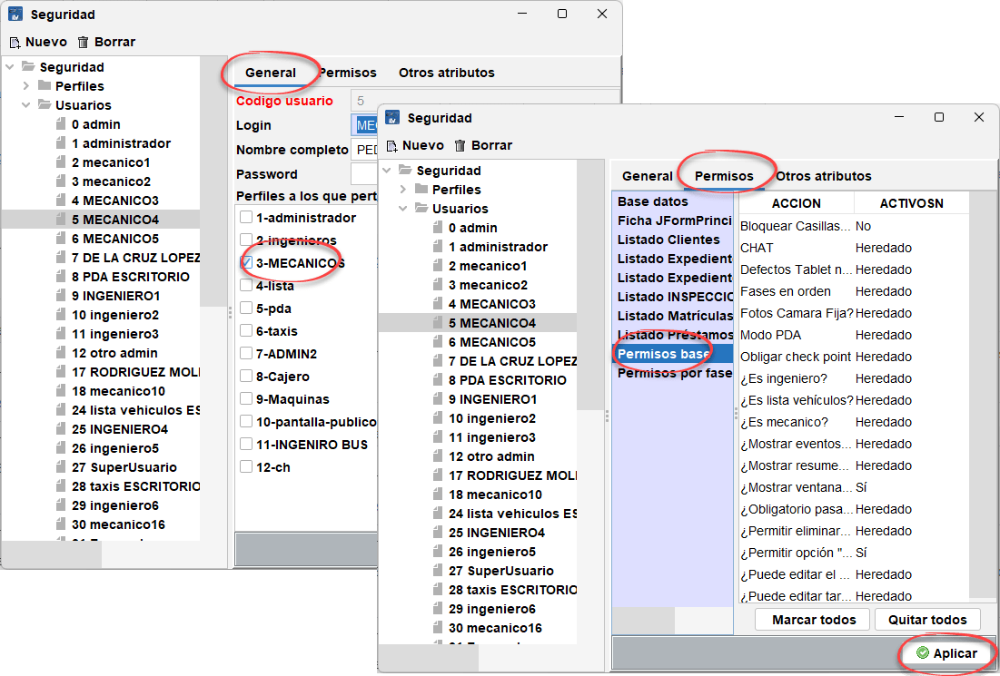

# Resolución de incidencias en ITVAndroid (app de inspectores)

## 1. El usuario no tiene permisos de mecánico

Como dice el mensaje, el usuario que se está intentando autenticar en la aplicación, carece de permisos de mecánico o los permisos no están correctamente asignados.

Para solucionarlo, un usuario con permisos para editar las opciones de seguridad, deberá acceder a `Archivo > Seguridad` y cambiar o ajustar correctamente los permisos.

<!-- https://github.com/eduardo-cd360/cd360-itv-manual/tree/main/docs/ITVAndroid/casos-de-uso/images/creativa3d-itvandroid-seguridad-permisos-mecanico.png -->

Cada usuario del programa dispone de una asignación de perfil que determina todos los permisos que le afectan, pero además de forma individual dispone de una pestaña que permite alterar los permisos heredados del perfil.

Lo primero es asegurarse que tiene en la pestaña "General" el perfil adecuado asignado, en este caso, **Mecánico**, y si esto no resuelve el problema, en la pestaña "Permisos" en la opción "permisos base", verificar que está marcada la casilla "¿es mecánico?".

A cada modificación el usuario de la aplicación ITVAndroid deberá cerrar su sesión de usuario y cargarla de nuevo para comprobar si ya funciona adecuadamente.