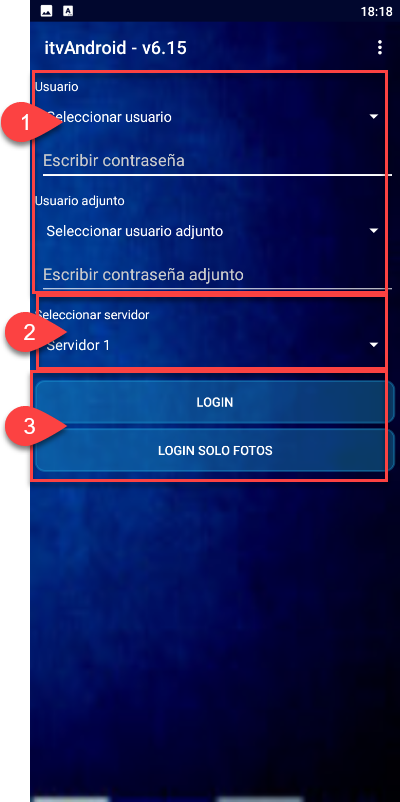
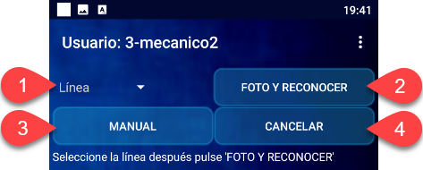
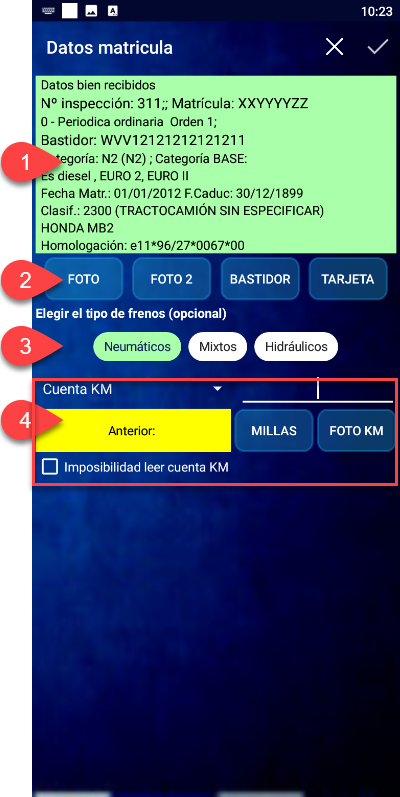
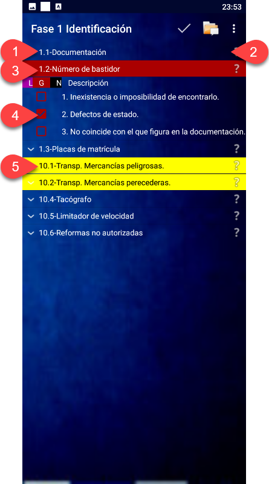
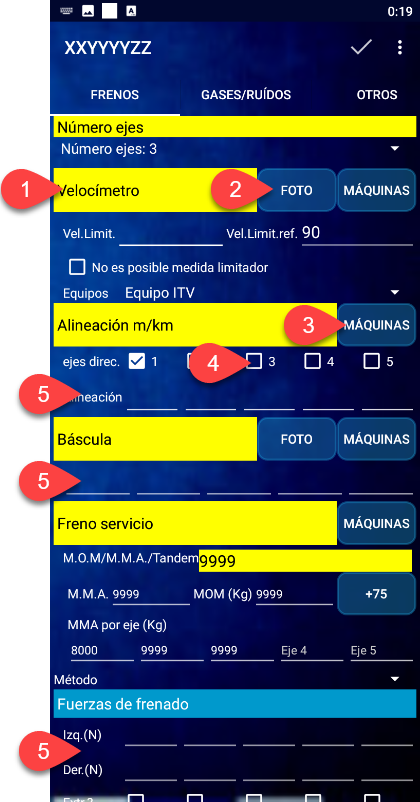
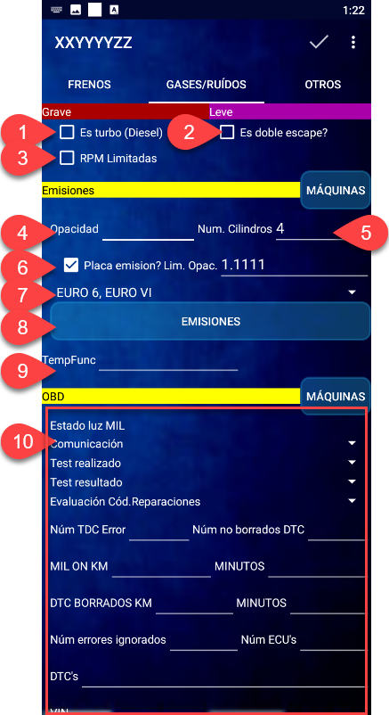
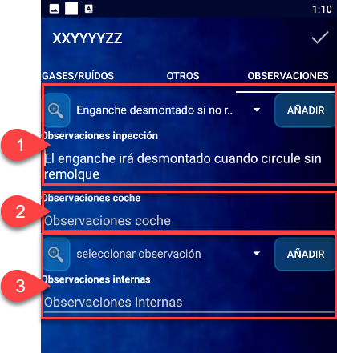
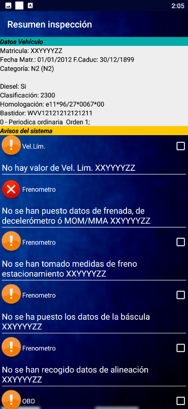

# Guía de uso de ITV Android

## Introducción

**ITV Android** es la aplicación que utilizan los inspectores para realizar la inspección de un vehículo. Está basada en Android, por lo que el smartphone o tablet utilizado debe contar con este sistema operativo.

---

## Proceso de inspección

El inspector debe iniciar la app ITV Android en su dispositivo antes de comenzar la inspección, autenticarse con su usuario y cargar una inspección.

Al introducir una matrícula (manualmente o por reconocimiento automático), se muestra una pantalla de validación de los datos del vehículo y de la inspección. Una vez verificada, se accede a la inspección propiamente dicha.

En la **pantalla principal de inspección**, el inspector dispone de las siguientes herramientas:

- Listado de defectos segmentados en **Fases**.
- Botones de acceso para:
    - Tomar **Foto** de matrícula.
    - Realizar **Mediciones** (datos de pruebas de máquinas).
    - Anotar **Medidas** realizadas durante la inspección.
    - Ver los **Defectos** detectados.
    - Editar la **Trazabilidad** de la inspección.
    - Mostrar los **Equipos** utilizados en la línea.
    - Introducir **Observaciones**.
- Botones **Conectar y enviar** (para finalizar la inspección) y **Limpiar matrícula** (si no procede realizarla).
- Posibilidad de tomar **Fotos adicionales del vehículo** o de otro vehículo mediante **Foto de otra matrícula**, sin abandonar la inspección en curso.

Mediante las **Fases**, el inspector puede repasar visualmente el vehículo, marcar los defectos encontrados y consultar en todo momento información descriptiva de cada defecto y el manual de ITV vigente con tablas e imágenes.

Desde la pantalla principal también se accede a los **datos objetivos** (mediante **Mediciones**) relativos a las pruebas del vehículo, con posibilidad de controlar las máquinas desde la tablet.

---

## Pantallas de la aplicación

### Pantalla de inicio

1. **Selección de usuario**: Usuario principal y usuario adjunto (en casos especiales) e introducción de la contraseña.
2. **Selección de servidor**: Si el dispositivo se usa en varias instalaciones de un grupo, aquí aparecerán todos los servidores disponibles.
3. **Botón LOGIN**: Da paso al comienzo del proceso de inspección, donde deberá indicar la línea, realizar "foto y reconocer" la matrícula o bien introducirla manualmente. **Botón LOGIN SOLO FOTOS**: Permite únicamente adjuntar fotos a las inspecciones (introduciendo matrícula y línea), sin realizar procesos de inspección.

---

### Pantalla de carga de inspección

1. **Línea**: Selección de la línea en la que se inspeccionará el vehículo.
2. **Foto y reconocer**: Reconocimiento de la matrícula mediante fotografía.
3. **Manual**: Introducción de matrícula de forma manual. Útil cuando el reconocimiento automático no funciona correctamente.
4. **Cancelar**: Anula cualquier introducción y vacía todos los campos para reiniciar la operación.

---

### Pantalla de información sobre la inspección

#### Datos de matrícula

Resumen de información sobre el vehículo procedente del alta de inspección. Permite comprobar que todo está correcto antes de comenzar.

El inspector puede verificar el tipo de inspección, los datos de identificación del vehículo y los datos sobre contaminantes. Si algo no coincide, puede comunicarlo o modificarlo (por ejemplo, el nivel de emisiones).

#### Fotografías del vehículo

Dependiendo de la comunidad y de las directrices de Industria, se tomarán distintas fotos con botones específicos:

| Botón        | Descripción                                                     |
|--------------|-----------------------------------------------------------------|
| **FOTO**     | Fotografía fronto-lateral del vehículo que muestre la matrícula |
| **FOTO 2**   | Fotografía trasero-lateral del vehículo                         |
| **BASTIDOR** | Fotografía del bastidor del vehículo                            |
| **TARJETA**  | Fotografía de la tarjeta de características                     |

#### Tipo de frenos

El inspector puede seleccionar el tipo de frenos del vehículo si es aplicable. Dependiendo de la opción elegida, se añadirán o quitarán defectos a la trazabilidad de la inspección (se muestra un mensaje emergente con los puntos afectados).

#### Kilómetros

En esta zona se pueden anotar los kilometrajes y tomar evidencias gráficas del marcador del vehículo:

- **Selector de Cuenta KM o Contador de Horas**: campo adyacente para anotar el valor mostrado durante la inspección.
- **Km anteriores**: en amarillo se muestra el valor anterior registrado en la DGT, que no podrá ser igual al valor anotado.
- **Botón MILLAS**: muestra una ventana de diálogo para introducir millas y convertirlas a kilómetros.
- **Botón FOTO KM**: abre la cámara para tomar la evidencia del cuentakilómetros, que se almacena como parte de la inspección.

---

### Pantalla de inspección

1. **Usuario**: Inspector o ingeniero que realiza la inspección. Se muestra el número de usuario y su nombre.
2. **Matrícula**: Matrícula cargada actualmente. Permite seleccionar entre varias si se han cargado dos o más. Al cambiar de matrícula, se actualizan los datos y el estado correspondientes.
3. **Tiempo de inspección**: Contador del tiempo empleado desde que se cargó la matrícula hasta el envío. Es solo informativo y no se registra.
4. **Menú de utilidades**: Herramientas útiles para el inspector.

#### Menú de utilidades

| Herramienta                          | Descripción                                                                                               |
|--------------------------------------|-----------------------------------------------------------------------------------------------------------|
| **Chat (beta)**                      | Chat con selector de usuarios.                                                                            |
| **Galería de fotos**                 | Todas las fotos tomadas en la inspección, etiquetadas en formato galería.                                 |
| **Cálculo neumáticos**              | Cálculo de equivalencia de neumáticos (europeos, ingleses y casos especiales).                            |
| **Ficha adicional**                  | Imprime una ficha adicional por la impresora configurada.                                                 |
| **Manual**                           | Manual vigente de ITV en formato PDF.                                                                     |
| **Perfil app**                       | Aplicación de perfil del inspector con estadísticas e información útil.                                   |
| **Trazabilidad**                     | Pantalla de trazabilidad para modificar la inspección.                                                    |
| **Datos Objetivos**                  | Pantalla de mediciones.                                                                                   |
| **Conectar y enviar**                | Envía los datos de la inspección al servidor para validación y firmado.                                   |
| **Borrar matrícula**                 | Elimina la inspección actual del dispositivo.                                                             |
| **Wiki preámbulo**                   | Preámbulo completo del manual de ITV.                                                                     |
| **Tabla clasificación construcción** | Tabla completa de clasificaciones por construcción del manual de ITV.                                     |
| **Tabla clasificación utilidad**     | Tabla completa de clasificaciones por utilidad del manual de ITV.                                         |

#### Botones de la pantalla principal

| Nº | Botón                            | Función                                                                                      |
|----|----------------------------------|----------------------------------------------------------------------------------------------|
| 5  | **Añadir matrícula**             | Carga otra matrícula en el dispositivo, seleccionable en el selector de matrícula (2).       |
| 6  | **Datos vehículo**               | Muestra la pantalla de información del vehículo y las opciones de kilómetros.                |
| 7  | **Fases de inspección**          | Agrupaciones de defectos organizadas según diferentes necesidades.                           |
| 8  | **Accesos directos a funciones** | Foto, Mediciones, Distancias, Defectos, Trazabilidad, Observaciones.                        |
| 9  | **Conectar y enviar**            | Envía la inspección finalizada.                                                              |
| 10 | **Limpiar matrícula**            | Elimina la matrícula cargada.                                                                |
| 11 | **Fotos adicionales vehículo**   | Toma fotos adicionales del vehículo en inspección.                                           |
| 12 | **Foto de otra matrícula**       | Toma fotos de otro vehículo sin abandonar la inspección en curso.                            |

---

### Pantalla de defectos (Fases de inspección)

Tras realizar la identificación del vehículo, la inspección visual es el siguiente paso. Una serie de fases preconfiguradas muestran un conjunto de defectos con sus descripciones.

1. **Defecto**: Nombre del defecto según el manual de ITV vigente.
2. **Ayuda**: Contenido del manual de ITV vigente para ese defecto.
3. **Defecto con hallazgo Grave**: Indicado con color rojo.
4. **Descripción de defecto marcada**: Al marcar un defecto, se colorea según la gravedad:
    - :material-circle:{ style="color: magenta" } **Leve** → Magenta
    - :material-circle:{ style="color: red" } **Grave** → Rojo
    - :material-circle:{ style="color: black" } **Muy Grave / Negativo** → Negro
5. **Defecto opcional**: Si se marca el check adicional, se incorpora a la trazabilidad y se pueden marcar defectos.

Cuando se marcan defectos en alguna fase, en la pantalla principal aparecen indicadores señalando que hay defectos registrados.

---

## Mediciones

Accesible desde el botón **Mediciones** de la pantalla principal, esta sección permite introducir todos los datos y valores necesarios para las pruebas de frenos, emisiones y otros parámetros, así como anotaciones de observaciones del inspector.

### Frenos

La pantalla de frenos es dinámica y cambia en función del tipo de vehículo y las pruebas requeridas.

De forma previa a las pruebas, hay ciertos campos que deben rellenarse para aportar la información necesaria. Tras completar la prueba, los campos restantes se rellenan automáticamente con los valores obtenidos de la máquina y no son editables.

1. **Nombre de la máquina o prueba**.
2. **Botón Foto**: Toma la fotografía evidencia de la realización de la prueba.
3. **Botón Máquinas**: Muestra la pantalla de botones para el manejo de la máquina. La configuración varía según caso/marca/modelo.
4. **Casillas de marcado**: Permiten modificar características del vehículo antes de la prueba.
5. **Campos de valores obtenidos**: Editables solo si la prueba se realiza en una máquina no conectada al sistema (sin volcado de datos), para que el inspector introduzca los valores manualmente acompañados de una foto.

### Gases / Ruidos

Al igual que en la pantalla de frenos, aquí se muestran las máquinas relacionadas con emisiones. En ciertos vehículos, algunas máquinas pueden no mostrarse según las características del vehículo o de la inspección.

**Opciones generales:**

1. **Casilla Es turbo (Diésel)**: Modifica las condiciones de la prueba según la característica del vehículo.
2. **Casilla Es doble escape**: Indica a la máquina que debe realizar una tanda de pruebas por cada escape.
3. **Casilla RPM Limitadas**: Indica que el vehículo corta antes de alcanzar las RPM necesarias para la prueba.

#### Emisiones Diésel

| Nº | Campo                | Descripción                                                                                  |
|----|----------------------|----------------------------------------------------------------------------------------------|
| 4  | **Opacidad**         | Resultado de opacidad de la prueba realizada.                                                |
| 5  | **Nº de cilindros**  | Permite modificar el número de cilindros del motor antes de iniciar la prueba.               |
| 6  | **¿Placa emisión?**  | Permite introducir el límite de opacidad reflejado en la placa para la prueba.               |
| 7  | **EURO 6 / EURO VI** | Campo desplegable con el nivel de emisiones EURO del vehículo. Modificable por el inspector. |
| 8  | **Emisiones**        | Tabla de resultados de la prueba de emisiones.                                               |
| 9  | **Temperatura**      | Valor de temperatura del motor (pirómetro o instrumento a bordo).                            |
| 10 | **OBD**              | Valores recibidos de la prueba OBD.                                                          |

#### Emisiones Gasolina

| Nº | Campo                      | Descripción                                                  |
|----|----------------------------|--------------------------------------------------------------|
| 1  | **CO Ralentí**             | Valor obtenido de CO en ralentí.                             |
| 2  | **CO2500**                 | Valor de CO obtenido a 2500 RPM.                             |
| 3  | **Lambda**                 | Valor de Lambda obtenido.                                    |
| 4  | **No usar Lambda**         | Si se marca, se omite el valor de Lambda.                    |
| 5  | **Nivel de emisiones**     | Permite seleccionar el valor EURO del vehículo.              |
| 6  | **Temperatura**            | Temperatura de funcionamiento del motor.                     |

#### OBD

Determinado por el nivel EURO del vehículo. Muestra un único botón **Máquina** para iniciar la prueba y una tabla de resultados, con indicación en rojo de los valores que no cumplen y generan defecto.

### Otros

En esta pantalla se introducen kilómetros, horas, millas, etc., así como la fotografía del cuentakilómetros. También está presente durante la identificación del vehículo.

1. **Selección de Km o Cuenta Horas**. Cuando se trate de una maquina de obras o similar se seleccionara la opción de cuenta horas.
2. **Botón Millas**: Muestra pantalla para introducir millas y convertirlas a kilómetros.
3. **Botón FOTO KM**: Captura la fotografía del cuentakilómetros. Es **obligatoria**; si no se realiza, no se podrá finalizar la inspección.
4. **Casilla Imposibilidad leer cuenta KM**: Se marca cuando es imposible leer los kilómetros. Se añade automáticamente el defecto correspondiente del manual de ITV.
5. **Casilla Enganche (2.3)**: Introduce el punto 2.3 en la trazabilidad. Hay que especificar en los desplegables los dispositivos comprobadores de enganche utilizados.
6. **Presión neumáticos**: Introducción manual de la presión de los neumáticos cuando sea necesario.

---

## Observaciones

La pantalla de observaciones permite completar con comentarios aquellas partes de la inspección que requieran aclaraciones. Existen varios tipos:

1. **Observaciones de inspección**: Notas o aclaraciones que se muestran en el informe de inspección. Se puede elegir un texto preestablecido con la lupa o el desplegable y agregarlo con el botón **Añadir**.
2. **Observaciones de coche/matrícula**: Observaciones internas asociadas permanentemente al vehículo. **No** se muestran en el informe.
3. **Observaciones internas**: Similares a las de inspección, pero **no** se muestran en el informe. Útiles para describir procedimientos, incidencias o comentarios relacionados con la inspección.

!!! Note "Métodos de escritura de observaciones"

    Los textos se pueden introducir de forma manual, seleccionarlos de un listado predefinido o utilizar el reconocimiento de voz para dictarlos.

---

## Distancias

Accesible desde el botón **Distancias** de la pantalla principal o desde el menú de utilidades (tres puntos en la esquina superior derecha).

Muestra secciones que pueden activarse cuando se requieren comprobaciones con registro de medidas o distancias. Las distancias introducidas se evalúan según el manual de ITV vigente, determinando si existe defecto y, en su caso, incorporándolo a la inspección.

Las secciones disponibles con los puntos a los que aplican son:

- **Datos medidos ITV** (Sección I, 1.1)
    - Alumbrado y señalización
    - Indicadores de dirección (Sección I, 4.3)
    - Luz de posición (Sección I, 4.7)
    - Luz de freno (Sección I, 4.5)
    - Luz de galibo (Sección I, 4.9)
    - Catadióptricos (Sección I, 4.10)
    - Luz de marcha atrás (Sección I, 4.2)
    - Luz antiniebla trasera (Sección I, 4.8)
    - Luz antiniebla delantera (Sección I, 4.8)
    - Matrícula trasera (Sección I, 1.3)
    - Anti proyección (Sección I, 2.4)

---

## Trazabilidad

Desde la pantalla principal de inspección, pulsando sobre el botón **Trazabilidad**, se accede a la pantalla con la trazabilidad de la inspección actual y la posibilidad de modificarla para adaptarla al vehículo inspeccionado.

---

## Equipos

El botón **Equipo** en la pantalla principal muestra el listado de equipos disponibles en la línea utilizada. Todos los equipos aparecen marcados excepto los considerados "opcionales".

El inspector decide en cada caso si debe seleccionar o deseleccionar alguno manualmente.

---

## Resumen de inspección

Al finalizar la inspección, aparece un resumen (módulo opcional contratable) que permite repasar y asegurar que la inspección cumple con todas las pruebas, defectos, opcionales y demás elementos correctamente.

Al final del resumen, el inspector puede pulsar de nuevo el botón **Enviar** para finalizar la inspección.

