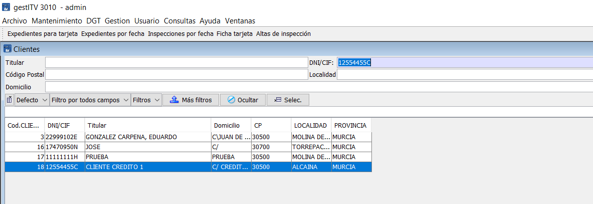

# Como bloquear un cliente

Dentro de las opciones de bloqueo existentes en el programa, está el bloqueo de matrícula o vehículo, el bloqueo de cliente y el bloqueo de cuenta de cobro/gestoria/terceros/etc.

En este caso se va a bloquear a un cliente, lo que incluye que no pueda pasar inspección a ninguno de los vehículos (matrículas) que tenga a su nombre.

Los clientes se bloquean mediante su NIF o CIF, detectando el sistema en el momento de dar de alta si el vehículo, relacionado con el cliente, está bloqueado o no. En caso de bloqueo, durante el alta se advierte de la situación.

## Bloquear a un cliente existente

Para bloquear un cliente accede al menú **```Mantenimiento/Clientes```**.

Busca el cliente por el titular, cif, nº de cliente, etc.. y pulsa refrescar.



Modifica el cliente haciendo doble clic sobre el registro o pulsando sobre el botón **Editar**.

Marca la casilla “**BLOQUEADOSN**”, y si lo deseas, un mensaje en el cuadro de texto "**AVISO**" con algúna nota al respecto.


A partir de ahora, cuando se dé de alta una nueva inspección en la que el vehículo pertenezca a algún cliente que está marcado como **bloqueado** saldrá una alerta y el texto introducido en AVISO.

## Comprobar cif de cliente bloqueado

Para comprobar el bloqueo de un cif de cliente, da de alta una nueva inspección, introduce una matrícula, cumplimenta el resto de datos e introduce en el campo **titular** uno que esté bloqueado.

