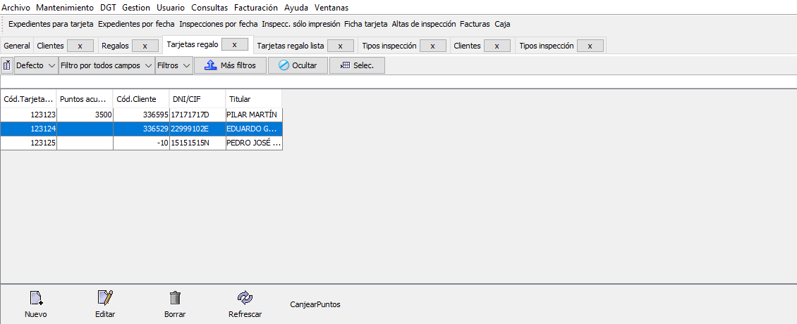
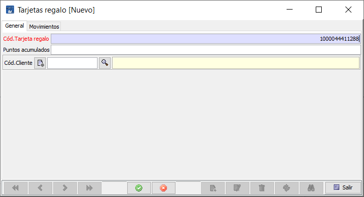

# Fidelización de clientes

Existen diferentes formas de fidelizar a los clientes en la estación. Una es mediante la realización de descuentos o cupones y la otra mediante puntos de fidelización.

Para fidelizar mediante descuentos se debe utilizar la función disponible en **```Facturación/Descuentos```** y generar descuentos genéricos o mediante reglas que seleccionarán a que clientes deben mostrarse o aplicarse.

Para fidelizar mediante cupones descuento, se debe tener contratado el servicio en una plataforma que permita el uso de cupones, como es el caso de DigitalServi, que además de estos servicios, provee citas previas, envío de SMS etc.

En este caso de uso, se trata el proceso de **fidelizar mediente acumulación de puntos**, para lo que será necesario que el cliente tenga asociada una tarjeta de fidelización y la empresa tenga una lista de regalos o productos canjeables por puntos.

La generación de los puntos solamente se consigue realizando inspecciones en la estación, estando basado el sistema únicamente en el tipo de inspección que se realice. Según el tipo de inspección, se acumulan más o menos puntos.

Solamente se acumulan puntos si el cliente tiene una tarjeta asociada.

## Características de la tarjeta de fidelización

Queda a elección de la empresa de ITV el tipo de tarjeta (Banda Magnetica, Proximidad, Codigo Barras, Bidi, etc) que quiera usar, siempre que se cumpla que el nº de tarjeta que hay que introducir en el programa sea accesible. Esto es, que se pueda leer de forma manual y escribir en el campo requerido de la misma forma, o  bien empleando cualquiera de los lectores acordes a la tecnología de la tarjeta, devuelvan por emulación teclado el nº de la tarjeta que deba introducirse en el campo correspondiente.

La ITV podrá personalizar y añadir cualquier elemento en la tarjeta (diseño, forma, etc..) siempre que se cumpla el requisito anterior, ya que creativa solamente necesita el nº de tarjeta para asociarlo al cliente.

Para configurar el sistema de fidelización por puntos y usarlo posteriormente, se deben realizar los siguientes procesos:

- Asignación de puntos a los tipos de inspección

- Añadir productos / regalos canjeables por puntos

- Asignar tarjeta de fidelización a clientes

- Posteriormente y a medida que se haya realizado la asignación de tarjetas:

- Realizar acumulación de puntos en tarjeta de cliente

- Canje de puntos por regalos

- Ver listado de movimientos de tarjetas

### Asignar puntos a los tipos de inspección

Para asignar los puntos de fidelización que se anotarán en la tarjeta del cliente cuando se pase una inspección hay que acceder a la tabla de tipos de inspección Mantenimiento > Maestras > Tipos Inspección.

En la tabla que se muestra de tipos de inspecciones disponibles, hay que modificar una por una todas las que se quiera añadir este dato.

<!-- https://github.com/eduardo-cd360/cd360-itv-manual/tree/main/docs/casos-de-uso/clientes/images/fidelizacon-clientes_image_1.png -->


Para añadir los puntos, se hace doble clic sobre el tipo de inspección o se selecciona esta y se pulsa el botón Editar.

<!-- https://github.com/eduardo-cd360/cd360-itv-manual/tree/main/docs/casos-de-uso/clientes/images/fidelizacon-clientes_image_2.png -->


Se introducen los puntos y se guarda pulsando el botón Aceptar.

El resto de campos deben dejarse tal como están, ya que son la configuración de este tipo de inspecciones para diferentes aspectos de la aplicación.

### Crear catálogo de productos

Para comenzar a crear el catálogo de productos de regalo para el sistema de fidelización de creativa, se debe acceder al menú Mantenimiento > Gestión regalos-puntos > Regalos.

Se muestra una tabla, con información de los productos existentes, si los hay, con un nombre corto, una descripción y la cantidad necesaria de puntos para conseguirlos.

<!-- https://github.com/eduardo-cd360/cd360-itv-manual/tree/main/docs/casos-de-uso/clientes/images/fidelizacon-clientes_image_3.png -->


Para añadir nuevos productos a la lista, se debe pulsar el botón Nuevo. Que mostrará el formulario de nuevo producto.

<!-- https://github.com/eduardo-cd360/cd360-itv-manual/tree/main/docs/casos-de-uso/clientes/images/fidelizacon-clientes_image_4.png -->


Se debe de especificar los siguientes datos:

Código del regalo: Es de asignación automática por el programa, pero se puede especificar uno personalizado si se desea.

Regalo: Nombre corto del producto.

Descripción: Nombre, características u otra información relevante que permita diferenciarlo de otros similares.

Puntos: Cantidad de puntos necesarios para su canje y que restará de la tarjeta de fidelización del cliente.

 El sistema de puntos que regirá el cambio de puntos por regalo será de elección por la ITV.

### Asignar tarjeta de fidelización a cliente

La tarjeta de fidelización es la base del sistema de puntos. Sin ella el cliente no puede acumular los puntos, y no puede beneficiarse de promociones especiales.

Para asignar una tarjeta de fidelización a un cliente, es necesario acceder al menú de clientes en Mantenimiento > Gestión regalos-puntos > Tarjetas regalo.

En la tabla que se muestra, se puede ver el listado de tarjetas asignadas a los clientes.

<!-- https://github.com/eduardo-cd360/cd360-itv-manual/tree/main/docs/casos-de-uso/clientes/images/fidelizacon-clientes_image_5.png -->


Para asociar una nueva tarjeta a un cliente se pulsa el botón Nuevo, y se mostrará el formulario de creación.

<!-- https://github.com/eduardo-cd360/cd360-itv-manual/tree/main/docs/casos-de-uso/clientes/images/fidelizacon-clientes_image_6.png -->


Se deberán especificar los siguientes datos:

Cód tarjeta regalo: Mediante introducción manual o bien por lector emulación teclado (dod. Barras, BMagnetica, Proximidad, etc..) se introduce le nº de tarjeta. Si se deja en blanco el programa asignará un nº de forma automática que posteriormente deberá ir en la tarjeta para usos próximos.

Puntos acumulados:

Para tarjetas nuevas, si no se especifica nada, se creará con 0 puntos, si se especifica una cantidad, (por promoción por ejemplo), quedará cargada con x puntos de inicio.

Para cambios de tarjeta por deterioro o sustracción (si las normas de la empresa lo permiten) se introducirán los puntos que contuviese la tarjeta anterior.