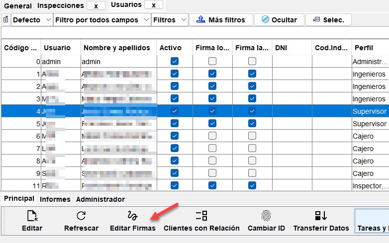
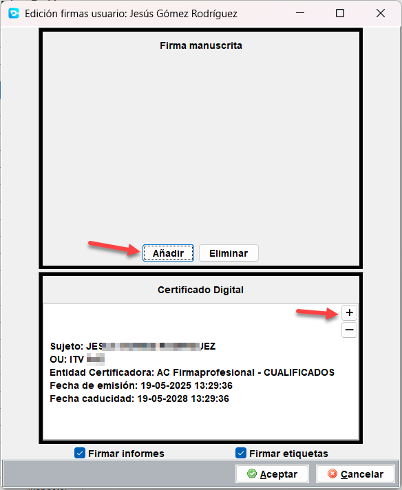

# Como añadir las firmas a usuario

Cualquier usuario de creativa tiene la posibilidad de tener asignada una firma digital o electrónica y una firma manuscrita. Pero solo en el caso de los usuarios de **tipo inspector con firma delegada** e ingenieros utilizarán esta característica.

Para poder firmar digitalmente los informes y las etiquetas, es necesario disponer de:

- Certificado electrónico (fichero descargado en formato .pfx o .p12)
- Firma manuscrita digitalizada (con fondo transparente en formato .png)

!!! note "Información de interés"

    La firma manuscrita no es necesaria, ya que los lectores de PDF's pueden validar la firma digital del documento PDF, y se puede especificar quien ha firmado el informe.

El certificado electrónico puede ser de **persona física** (como el de la FNMT) o **corporativo de persona física vinculado a empresa**, que en este ultimo caso, puede ser emitido por nuestra empresa.

!!! Info "Solicitar certificados electrónicos"

    Para solicitar uno o varios certificados electrónicos, accede a nuestro canal de soporte soporte.creativadigital360.com y selecciona "Abrir un nuevo ticket", donde deberás elegir el tema de ayuda "Solicitud de certificado".

Para cargar el certificado digital de un usuario se deberá acceder al menu **Mantenimiento > Gestión de usuarios > Propiedades de usuarios** y buscar al usuario para el que se va a cargar el certificado digital.

Una vez localizado, se debe usar el botón "Editar Firmas" para cargar el certificado digital y la firma manuscrita, si se dispone de ella.

Tanto el certificado digital como la firma manuscrita, se pueden cargar o cambiar en caso de que se haya caducado usando los botones [+] y [-]. En el caso del certificado digital, se solicitará la clave del certificado para poder cargarlo en el sistema.

Por ultimo, se marcará la casilla [] Firmar informes y [] Firmar etiquetas, dependiendo de si se desea que el usuario firme digitalmente los informes, las etiquetas o ambos.