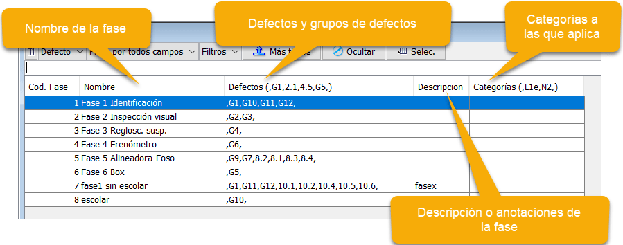
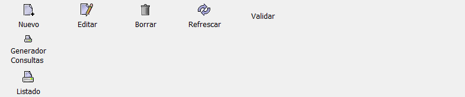
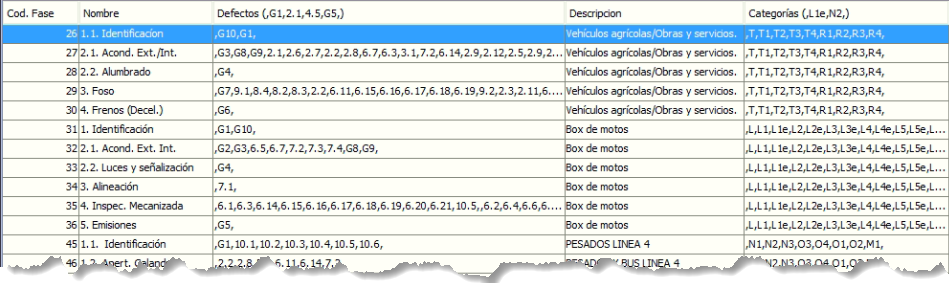

# Creación de Fases
Las fases permiten agrupar defectos y son utilizadas en los dispositivos portátiles de los inspectores, que estando bien definidas adaptan la presentación de los defectos al tipo de vehículo o línea en que están realizando la inspección.

La configuración que se realice en esta pantalla deberá ser empleada en la configuración de las líneas, en el mismo menú que este de las fases.

También se pueden utilizar en los perfiles de usuario, para hacer que se muestren todas o solo algunas dependiendo del usuario (generalmente inspectores). Por ejemplo, en el caso de autocares escolares, que son vistos por dos personas y cada uno debe visualizar una parte de los defectos.

## Vista general
En esta pantalla se define cada una de las fases que se utilizarán en las diferentes líneas de inspección.
<!-- https://github.com/eduardo-cd360/cd360-itv-manual/tree/main/docs/casos-de-uso/configuracion/lineas-y-fases/creacion-de-fases/images/creativa3d-itv-fases-descripcion.png -->

- **Código de fase**: Número id asignado de forma automática.
- **Nombre**: Es el nombre utilizado para denominar a la fase y será empleado en el dispositivo portátil del inspector.
- **Defectos**: Definición de los defectos o grupos de defectos que se utilizarán en la fase. Estará formado por defectos (1.1, 2.3, 6.3, etc.) y grupos de defectos (G3, G4). Siempre estarán entre comas ",G2,5.3,".
-**Descripción**: Texto explicativo de uso de esta fase. Se puede utilizar para identificar fases que tienen el mismo nombre pero se utilizan para categorías diferentes y/o líneas.
- **Categorías**: lista de categorías a las que afecta la fase. Cuando un vehículo coincide con la categoría, es mostrada la fase en el dispositivo portátil de los inspectores. Al igual que los defectos, se escribirán entre comas ", ,".

> Cuando se crean las fases, no hay que olvidar ningún punto del manual. Si se emplean un numero x de fases para una linea y falta algún defecto, no se podrá finalizar la inspección ya que ese defecto no ha sido *"chequeado"*.

En la imagen siguiente se ven los botones disponibles para trabajar con las fases.

<!-- https://github.com/eduardo-cd360/cd360-itv-manual/tree/main/docs/casos-de-uso/configuracion/lineas-y-fases/creacion-de-fases/images/creativa3d-itv-fases-botones.png -->

- **Nuevo**: Crea una nueva fila para una nueva fase.
- **Editar**: Permite modificar el contenido de una fila de fase.
- **Borrar**: Elimina una fase ya creada.
- **Refrescar**: Actualiza el contenido de la tabla de fases.
- **Validar**: Comprueba si están todos los defectos del manual. Hay que seleccionar primero todas las filas que pertenecen a una categoría o linea.
- **Generador de Consultas**: Solo visible en algunos perfiles de usuario. Permite realizar búsquedas complejas en la tabla. Útil cuando hay muchos registros o filas.
- **Listado**: Muestra la tabla en formato para imprimir. Se puede guardar en numerosos formatos.

> Cuando se elimina alguna fase, si está utilizada en alguna línea, será eliminada de esta, por lo que hay que asignar una diferente accediendo al menú *Mantenimiento > Equipos y Líneas > Líneas*.

Este es un ejemplo de fases organizadas por categorías.
<!-- https://github.com/eduardo-cd360/cd360-itv-manual/tree/main/docs/casos-de-uso/configuracion/lineas-y-fases/creacion-de-fases/images/creativa3d-itv-fases-ejemplo.png -->
