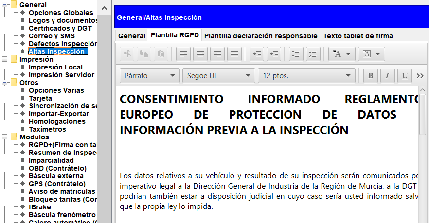
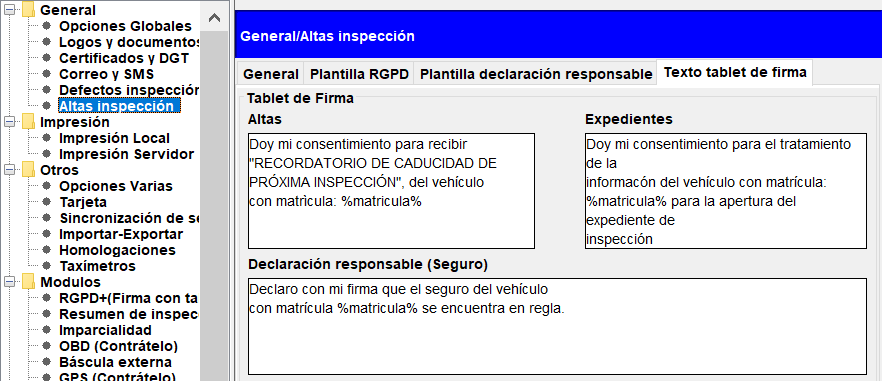

## gestión de proteccion de datos RGPD en creativa

Creativa3D ITV incorpora herramientas para que la gestión de la protección de datos de los clientes sea sencilla y permita mantener el registro digital de los consentimientos.

Para poder realizar de forma totalmente digital el procedimiento, es necesario disponer del módulo “TABLETA FIRMA” y de una tableta de firma WACOM, pero en caso de no disponer de esta, se imprime un documento con el contenido a ser firmado por el cliente.

En este documento se tratarán los siguientes temas:

Configuración de plantilla RGPD

Configuración de textos Tablet firma

Firmado de documento RGPD

Impresión de documento RGPD

### Configuración de plantilla RGPD

El documento RGPD que firma el cliente contiene un texto legal que debe especificarse antes de usar este procedimiento.

Para cambiar el contenido de dicho documento se debe acceder al menú Archivo/Opciones/Altas de inspección/Plantilla RGPD.

<!-- https://github.com/eduardo-cd360/cd360-itv-manual/tree/main/docs/casos-de-uso/configuracion/tableta-de-firma/personalizar_texto_tablet_firma/images/image_1.png -->

Dentro del editor se debe escribir todo el texto legal que se debe mostrar en el documento una vez firmado.

Adapta tus textos con las herramientas de título, ajuste de línea, tamaño etc para que se adapte a tus necesidades.

Para guardar el documento, termina pulsando “Aceptar”, y tras unos segundos se cerrará la ventana de edición, habiendo quedado guardada la modificación.

### Configuración de textos Tablet firma

Dentro de este menú, se permite la configuración de los textos para los diferentes documentos que necesitan ser firmados, y que informan al cliente en la propia pantalla de la Tablet de firma, que es lo que están firmando.

Los textos que se pueden configurar son:

Protección de datos en Altas de impresión para envío de recordatorios.

Solicitud de apertura de expediente y retirada.

Declaración responsable.

<!-- https://github.com/eduardo-cd360/cd360-itv-manual/tree/main/docs/casos-de-uso/configuracion/tableta-de-firma/personalizar_texto_tablet_firma/images/image_2.png -->

Este texto es personalizable dentro de la aplicación de creativa3D ITV y debe establecerse para cada uno de los equipos que tienen la tableta de firma.

La tableta de firma muestra por defecto el texto:

Doy mi consentimiento para recibir

"RECORDATORIO DE CADUCIDAD DE

PRÓXIMA INSPECCIÓN", del vehículo

con matrícula: %matricula%

Para realizar el cambio del texto que muestra la tableta de firma hay que acceder al panel de configuración.

Archivo > Opciones locales > [Altas inspección] > [Texto tablet firma]

Dentro del texto se puede utilizar la clave %matricula% que será sustituida por la matrícula correspondiente al vehículo del cliente que firma.