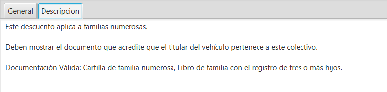
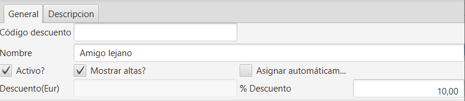

# Crear descuentos

El sistema de descuentos está pensado para poder aplicar una rebaja del precio sobre tarifa (antes de impuestos) directo o basado en reglas.

Está disponible en el menú de facturación.

### Descripción de la pantalla

Listado de descuentos disponibles. Se puede utilizar la búsqueda y los filtros para encontrar descuentos cuando es muy extenso.

Formulario de alta de descuento.

Pestaña general

Código Descuento: nº de orden automático asignado por el software.

Nombre: Nombre descriptivo del descuento que se está creando. Será mostrado en la pantalla de altas, en la sección de la tarifa aplicada.

Descuento (Eur) y Descuento (%): permite expresar la cantidad de descuento que se aplicará a la base de la tarifa de aplicación en las altas. No se pueden aplicar de forma conjunta.

Activo: habilita o deshabilita el descuento.

Mostrar Altas: establece si se mostrará en la pantalla de altas, junto a la tarifa aplicada.

Asignar automáticamente: Aplica directamente un descuento, sin necesidad de elegirlo en la pantalla de altas, pero, solo si sus reglas (si las tiene) son compatibles con su aplicación.

Los descuentos son reglas que se aplican sobre la base de la tarifa, por lo que tanto si se aplica un % o una cantidad fija, esta hay que expresarla sin IVA.

Reglas de aplicación

Cada descuento que se da de alta puede ser genérico o basado en reglas de aplicación. Hay tres grupos distintos de reglas.

Por las características de la inspección.

Por las características del vehículo.

Por las características del cliente.

Por Inspección

Tipo tarifa: Selecciona una de las tarifas disponibles (son las que se pueden seleccionar en la pantalla de altas de inspección).

Fecha desde y Fecha hasta: Rango de fechas entre las que se debe realizar la inspección.

Estación anterior: Permite seleccionar un nº de estación. Esta opción es útil para captar clientes de otras estaciones.

Por características del vehículo

Fecha de 1º matriculación: estos campos permiten establecer un rango de fechas para poder hacer un descuento para vehículos con cierta edad. Indica una fecha en cada uno.

Categorías: Permite especificar a qué categorías se aplicará el descuento. Para una categoría, se indica directamente, pero si son varias, se usa la siguiente forma: ,M1,N1, o ,L1,L2,L3,M1,N1,.

Motor: El descuento se aplicará según el tipo de motor o combustible que posea el vehículo de la inspección.

Por cliente

Código cliente: El descuento se aplica al cliente que se seleccione.

Provincia, localidad, C.P.: El descuento se aplica a clientes de una provincia, una localidad o por C.P.

Fecha nacimiento: Descuento para clientes que hayan nacido entre estas fechas. Para poder utilizar este campo, debe estar habilitada la opción de pedir fecha de nacimiento a los clientes.

Pestaña descripción

En esta zona de notas se puede describir de forma extensa cualquier información que permita interpretar la existencia de este descuento, normas de aplicación, fechas, condiciones, público objetivo, etc...

Cuando se tienen muchos descuentos, esto permite obtener información más extensa sobre cada descuento.

Es opcional utilizar este campo.

## Crear un descuento directo

Para crear un nuevo descuento, pulsa sobre el botón [Nuevo+] para abrir el formulario de creación de un descuento.

Escribe un nombre, que describa lo que es el descuento, indica la cantidad en % o una cantidad fija y marca la casilla  Activo, y opcionalmente  Aplicar automáticamente o  Mostrar en altas. El código descuento se genera de forma automática.

Escribe una descripción si lo deseas en la pestaña Descripción.

Finalmente pulsa el botón de guardado, y el descuento ya estará disponible en el alta de inspección.

Este descuento, que se ve en este ejemplo, es para seleccionarlo según aporten una documentación válida durante el alta de inspección y no debe tener marcada la casilla  Asignar automáticamente para que no se aplique a todos los clientes, ya que debe ser elección manual por parte del administrativo o recepcionista en base a que cumpla el cliente con los requisitos.

## Crear un descuento condicional

Para crear un descuento basado en condiciones o reglas, se procede de la misma forma que en el caso anterior, pero también hay que cumplimentar alguno de los campos de la sección Reglas de aplicación.

Ejemplo 1. Descuento del 10% para clientes titulares que sean de la provincia de alicante, que aparezca en el listado de descuentos a aplicar y que no se aplique de forma automática.

Rellenar los campos de Nombre, Descuento (Eur) o Descuento (%) y seleccionar las casillas  Activo y  Mostrar en Altas.

Rellenar algo de información sobre el descuento

Aplicar las reglas necesarias, en este caso, en la sección Cliente, el campo Provincia Cliente.

Aplicar y salir.

Ahora al dar de alta una inspección, cuando se seleccione un cliente titular y su provincia concuerde con la de este descuento, en la zona de la tarifa, en el listado de descuentos, aparecerá el descuento para seleccionarlo.

Ejemplo 2. Descuento directo del 10% a todas las inspecciones del mes de agosto de 2020 para todos los vehículos de un cliente titular que sean de categorías N1,N2,N3.

Rellenar los campos Nombre, Descuento (%) y selecciona las casillas Activo y Asignar automáticamente.

En la pestaña descripción, anotar lo que sea necesario para describir este descuento. Es opcional.

En las reglas del descuento, cumplimentar los campos que se muestran:

Esta configuración de descuento, asignará el descuento de forma automática a este cliente para los vehículos de esas categorías que presente en la estación entre las fechas indicadas.

Cuando se crean descuentos por cliente, hay que crear uno para cada cliente, aunque sean iguales, y si tiene descuentos diferentes el mismo cliente, también deben darse de alta por separado.