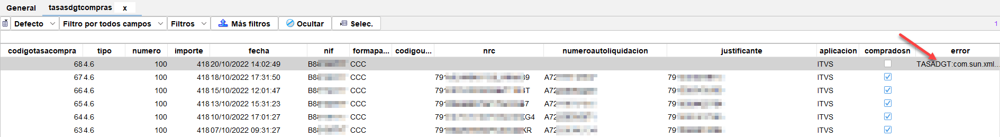

# Códigos de error DGT (ATRI, INDI)


<table>
<thead>
	<tr>
		<th>Versión</th>
		<th>Fecha</th>
		<th>Descripción</th>
	</tr>
</thead>
<tbody>
	<tr>
		<td>1.0</td>
		<td>16/04/2021</td>
		<td>Versión inicial</td>
	</tr>
	<tr>
		<td>1.1</td>
		<td>16/08/2022</td>
		<td>Actualización con varios códigos nuevos</td>
	</tr>
	<tr>
		<td>1.2</td>
		<td>29/08/2022</td>
		<td>Actualización. Se añade código ATRI0335.</td>
	</tr>
	<tr>
		<td>1.3</td>
		<td>24/10/2022</td>
		<td>Actualización. Se añade error conexión en compra de tasas</td>
	</tr>
	<tr>
		<td>1.4</td>
		<td>12/01/2023</td>
		<td>Actualización. Se añaden nuevos códigos</td>
	</tr>
	<tr>
		<td>1.5</td>
		<td>14/04/2023</td>
		<td>Actualización. Se añaden nuevos códigos publicados por AECA-DGT</td>
	</tr>
	<tr>
		<td>1.6</td>
		<td>18/07/2023</td>
		<td>Actualización. Se añaden nuevos códigos publicados en documento de DGT-AECA "manual tipos errores"</td>
	</tr>
</tbody>
</table>

En este documento se trata de dar una solución a los distintos errores que se producen en los procedimientos de compra de tasas, anotación de inspecciones y reformas y en el caso de no tener solución de forma local, cual es el procedimiento estándar que hay que usar cuando no queda otra que lo solucione la DGT.

- [Errores relacionados con subida de inspecciones (ATRI)](#errores-atri)
- [Errores relacionados con la compra de tasas de la DGT](#errores-tasas-dgt)
- [Errores relacionados con el uso de tasas (INDI)](#errores-indi)
- [Otros errores](#errores-varios)
- [Procedimiento estándar de resolución de incidencia de la DGT (EasyVista)](#procedimiento-estándar-de-resolución-de-incidencia-de-la-dgt-easyvista)

## Errores ATRI

### ATRI0100 - Vehículo sin antecedentes

El Vehículo no se encuentra informatizado en el registro de vehículos de la DGT.

**Solución:**

1. Comprobar en ATEX si el vehículo existe.
2. Si ATEX informa de vehículo sin antecedentes, solicitar a JEFATURA dar de alta el vehículo.

### ATRI0207 - El código de la estación ITV debe tener 4 caracteres alfanuméricos.

El código de la estación que incorpora la inspección es erróneo.

**Solución:**

Revisar el alta de inspección e introducir el código de la estación correcta.

### ATRI0225 - No se pudo aplicar la tasa a través del sistema INDI

Error de los sistemas de compra internos en la DGT, las tasas que se están tratando de usar para subir la inspección, están usadas/asignadas (para ellos).

**Solución**: Enviar una incidencia a la DGT siguiendo el <a href="#procedimiento-estándar-de-resolución-de-incidencia-de-la-dgt-easyvista" target="_blank">procedimiento estándar</a>. Antes de enviar una incidencia, comprobar que no se está usando una tasa ya asignada. Para comprobarlo, acceder a `Gestión>DGT>Tasas usadas` y buscar la tasa que tiene asignada la inspección que da este error. Si aparece más de una vez, bastará con eliminar de la inspección actual, la tasa usada.

> Para eliminar una tasa de una inspección que no se sube, editar la inspección, y en la pestaña 

En caso de estar todo bien, debe mandarse un correo electrónico a las direcciones siguientes y con copia a AECA.

<a href="mailto:sdi-integracion@dgt.es" target="_blank">sdi-integracion@dgt.es</a>

> Nota: Recientemente ya se muestran errores descriptivos del sistema INDI, por lo que se debe consultar más abajo la sección Errores INDI, para entender que es lo que ocurre y su posible solución. [Ver errores INDI](#errores-indi)

### ATRI0227 Los datos siguientes son incompatibles. Clasificación Industria = 3200, Servicio = B1B, Tipo matrícula = 0.

**Causa**: Este error se puede dar porque se trata de anotar una reforma a un vehículo que no se le puede hacer porque alguna de sus características no lo permiten. En este caso, es una camperización de un vehículo de uso comercial, que se supone que debe ser de uso particular. Para determinar esto, se ha mirado en la página de ATEX de la DGT.

**Solución**: Se debe compatibilizar el vehículo con la reforma a realizar.

### ATRI0228 - Es necesario informar la Clasificación de Industria para llevar a cabo la reforma.

Se presenta en reformas, dándose este problema cuando no se ha puesto clasificación del vehículo durante el alta o no está presente en el expediente o la tarjeta.

**Solución:**

Revisar la clasificación del vehículo en la inspección, el expediente y la tarjeta.

### ATRI0229 - Es necesario informar el Servicio para llevar a cabo la reforma.

Se presenta en reformas. No se ha establecido el servicio al que va destinado el vehículo.

**Solución:**

Corregir el dato referente al servicio al que va destinado el vehículo. Añadirlo si no se ha especificado.

### ATRI0231 - El tipo de anotación introducido no es correcto, debe ser una "I".

Se produce durante el "Borrado de anotación ITV" (solo disponible para inspecciones previamente anotadas con resultado FAVORABLE.

**Solución:** 

Revisar la solicitud de borrado y poner en <tipoAnotacion> el valor I. (Informar a Creativa de este error)

### ATRI0236 - No se pudo aplicar la tasa a través del sistema INDI. El código de error que ha devuelto INDI ha sido INDI1091 y la descripción INDI1091 - Número de tasa no existente en el sistema.

La tasa posiblemente sea erronea. En Creativa es dificil que ocurra, pues se compran de forma automática y el nº se recibe de forma electrónica.

**Solución:**

Comprobar que la tasa que se está usando es correcta. Solo en el caso de que se introduzcan tasas en el sistema de forma manual, tiene sentido.

Informar a la DGT mediante incidencia EasyVista siguiendo el procedimiento disponible en el menú de ayuda de Creativa.

### ATRI0236 - No se pudo aplicar la tasa a través del sistema INDI. El código de error que ha devuelto INDI ha sido INDI1092y la descripción INDI1092- El importe de la tasa recibida no coincide con el precio actual de la tasa.

La tasa que se ha usado en la inspección no tiene el precio actualizado. Posiblemente es una tasa del año anterior. Este problema se puede dar cuando se introducen tasas de forma manual o hay un cambio de precio de tasas y al comenzar el nuevo año no se han usado todas las del pasado (las que tenían precio antiguo).

**Solución:**

Ir a la web de tasas de trafico y actualizar todas las tasas no actualizadas.


### ATRI0236 No se pudo aplicar la tasa a través del sistema INDI. El código de error que ha devuelto INDI ha sido INDI3939 y la descripción INDI3939 - La tasa no es re-aplicable al trámite seleccionado, la tasa esta ya aplicada.

Problema relacionado con la tasa asociada a la inspección. Indica que ya está usada en otra inspección.

**Solución**: Notificar a la DGT (mediante incidencia EasyVista) de las tasas afectadas por este error. Una vez recepcionada la solución, actuar de la siguiente forma:

- Para las tasas recuperadas o reactivadas: Volver a intentar la subida.
- Para las tasas que no se han reactivado: Editar la inspección y eliminar la tasa que se está aplicando actualmente.

> Se puede comprobar antes de eliminarla si esta está ya usada buscándola en `Gestión > DGT > Tasas usadas` y contrastarla con la matrícula en el caso de que nos la hayan indicado en la respuesta.

> Este error se está dando también en la aplicación de tasa a 2º inspecciones, que su primera está anotada de forma correcta, en cambio la 2º no es admitida. <u>Igualmente hay que notificarlo a la DGT</u>, ya que no hay un problema en CREATIVA.

### ATRI0254 – El servicio A03 sólo es compatible para la clasificación de industria terminada en 05.

Referente a Reformas. El servicio del vehículo no es compatible con la clasificación.

**Solución**:

Anotar reforma 11.00 cambiando la clasificación de industria a XX05 y/o servicio a A03

### ATRI0255 - La clasificación industria [clasificación], sólo es compatible con el servicio A03.

Relativo a reformas. El servicio del vehículo no es compatible con la clasificación.

**Solución:** 

Anotar reforma 11.00 cambiando la clasificación de industria a XX05 y/o servicio a A03

### ATRI0256 - La clasificación industria [clasificación], sólo es compatible con el servicio A03. Puede cambiar el servicio realizando una reforma tipo  “11.00- Modificaciones de los datos que afectan a las tarjetas ITV”

Relativo a reformas. El servicio del vehículo no es compatible con la clasificación.

**Solución:**

Anotar reforma 11.00 cambiando la clasificación de industria a XX05 y/o servicio a A03.

### ATRI0302 - El vehículo [MATRICULA] tiene una inspección desfavorable, la subsanación de la misma caduca el [FECHA CADUCIDAD]. Puede realizar una inspección para su corrección siempre que la fecha de legalización sea previa a la caducidad. Puede revisar los defectos asociados.

Relativo a anotación en la DGT. La inspección de 2º orden o sucesivo, se intenta anotar "Fuera de plazo".

**Solución:**

Se ha pasado el plazo de 60 días** para la subsanación de la desfavorable. Debe anotar una inspección periódica pagando una tasa. Es decir, una nueva inspección.
 
**PENDIENTE DE MODIFICAR PLAZO A 2 MESES PARA CUMPLIR CON el RD 920/2017. SE AVISARÁ CUANDO SE REALICE LA MODIFICACIÓN Y SE ENVIARÁ DOCUMENTO ACTUALIZADO

### ATRI0324 Error, el bastidor introducido no coincide con el real del vehículo

Corregir el bastidor durante el alta o usar posteriormente la opción de corregir bastidor de la pantalla inspecciones por fecha.

### ATRI0326 - Error, no puede informar más de 100 defectos.

Se han enviado más de 100 unidades de defecto

**Solución:**

Por ahora, si hay más de 100 defectos, reducirlos a menos de 100 o repartirlos en más de una inspección periódica. Cada una con su tasa correspondiente.

### ATRI0329: La referencia a la tasa es obligatoria y no puede tener una longitud mayor de 12 dígitos

Existen varias causas que producen este error y en todos los casos son producidas porque la inspección no tiene un nº de tasa asignado.

1. La tasa no se ha asignado porque no quedan tasas en el banco de tasas.
2. La tasa no se ha aplicado porque el tipo de inspección no supone aplicación de tasa y ahora a DGT si la solicita.

### ATRI0333-Las anotaciones con calificación Desfavorable o Negativa deben informar al menos un defecto.

No ha informado unidad de defecto en inspección con resultado desfavorable.

**Solución:**

Modificar inspección y añadir unidad de defecto o cambiar resultado.

### ATRI0334 - Error, no puede informar más de 100 tipos de reforma.

Se han enviado más de 100 tipos de reforma.

**Solución:**

Reducir el número de unidades de defecto o anotar varias reformas.

### ATRI0335: Error, al menos debe informar de una reforma

La inspección que se está subiendo es de tipo reforma, pero no se ha indicado ninguna en el apartado del expediente. En el expediente debe figurar al menos un código de reforma y un máximo de 10. Si la inspección tiene más de 10 códigos, deberán realizarse dos inspecciones.

### ATRI0369: Error, ya fue anotada una inspección con estos datos en la fecha...

**Causa**:
1. Generalmente se ha modificado el alta de una inspección y se ha tratado de subir nuevamente, ya que la marca "DGTSN" (presente al editar una inspección en la pestaña "Subidas Online") se desactiva tras las modificaciones del alta de inspección.

**Solución:** No es un error como tal. Simplemente avisa que no se sube porque ya está subida.

### ATRI0376: La fecha de validez en caso favorable no puede ser igual o inferior a la fecha de inspección.

**Causa**: Hay un error en la introducción de la fecha de próxima inspección producido durante el alta de la inspección.

**Solución**: Modificar el alta de inspección y corregir la fecha de caducidad. Posteriormente volver a subir la inspección.

### ATRI00500: Error de sistema. null

**Causa**: Error interno de la DGT.

- Se da por ejemplo en Duplicados por rehabilitación cuyo tipo de subida a trafico es "B" (rehabilitación).

**Solución**: Reintentar la subida. Si no es posible subirlo, enviar incidencia a la DGT.

### ATRI0302: El vehículo R9085BCN tiene una inspección desfavorable, la subsanación de la misma caduca el 24/03/2020. Puede realizar una inspección para su corrección siempre que la fecha de legalización sea previa a la caducidad. Puede revisar los defectos asociados

**Causa:** Se da en 2º inspecciones que se intentan subir pero la 1º no está subida y la que hay en tráfico anterior es desfavorable.

**Solución**: Editar la inspección de 1º orden, desmarcar la casilla de "DGT Subido?" y reintentar la subida. TRas esto, volver a subir la de 2º orden.


### ATRI7005: Servicio de Consultar Tarjeta DGT EITV: See nested exception; nested exception is: java.lang.NullPointerException.

**Causa**: Error interno en los servicios de la DGT. Ha aparecido por primera vez a mediados del mes de abril, al parecer debido a una actualización de la DGT en su servicio de anotación ITICI.

**Solución**: Reintentar la subida en varias ocasiones y si no se consigue, mandar una incidencia mediante el <a href="#procedimiento-estándar-de-resolución-de-incidencia-de-la-dgt-easyvista" target="_blank">procedimiento estándar de resolución de incidencias de la DGT</a>.


### ATRI15031: Error de sistema. Error genérico capturado en el procesamiento EJB de intranet

Error interno de los servidores de la DGT. Solución: Enviar incidencia a la DGT. <a href="http://www.creativa3d.com/servidorITVReformas/dgtgestionincidencias.pdf">Pulsa aquí para ver un manual sobre como enviar las incidencias de forma correcta</a>.

### ATRI15040: Error de sistema. Error al realizar llamada a host

**Causa**: Error fortuito y temporal, por tiempo de espera cumplido o por colapso de sus servidores.

**Solución**: Reintentar la operación de subida

## Errores tasas DGT

Creativa3D ITV es capaz de gestionar la compra de tasas de forma automática. Basta con que esté configurada dicha sección en las opciones del programa.
En caso de no estar configurada la compra automática, se pueden realizar importaciones de [tasas obtenidas desde la web de la DGT](https://sedeclave.dgt.gob.es/WEB_Tasas7/).

Como en todos los servicios de la DGT, este también es proclive a los fallos. Por lo que a continuación se muestran los códigos de error habituales y como solucionarlos si es posible.

> En todos los casos se recomienda que sean revisado si se ha efectuado algún cargo en la cuenta bancaria asociada a la compra de tasas en la fecha que indica el pedido con error.

### ¿Como detecto un error en la compra de tasas?

Las inspecciones que no se han podido subir debido a un error en la compra de tasas generalmente tienen un error asociado del tipo "DGT TASAS". Los errores tipo "INDI" se producen al usar las tasas ya compradas.

> Por defecto, cuando se produce un error en la compra de tasas, mientras no se solucione el error, no se volverán a realizar compras de forma automática.

#### Error #1: Error técnico

Este error se produce en el momento del procesado del pago de las tasas. Se produce tanto en el programa (mediante el servicio API de compra de tasas) como en la web de la DGT para compra de tasas.

Solución:

1. Ir a `Gestión>DGT>Tasas compras` y comprobar que hay una compra con el error que se ha mostrado al subir la inspección y que no tiene código **NRC** y tampoco código **Autoliquidación**.

2. Comprobar que no hay cargos en la cuenta bancaria asociada a las tasas en la fecha que indica la línea que tiene el error.

3. Eliminar la línea con el error de compra

4. Subir una inspección a la DGT manualmente (Botón DGT en Inspecciones por fecha). EL programa antes de subir, intentará nuevamente realizar una compra de tasas.

> En caso de fallo, repetir los pasos anteriores de nuevo hasta que funcione o si no, enviar incidencia a la DGT (ver manual de incidencias DGT en el menú de ayuda de la aplicación).

#### Error #2: Se ha producido un problema al realizar la recuperación o el pago de las tasas en AEAT. Póngase en contacto con el 060.

Error interno del servicio de pagos de la DGT para las tasas.

Solución:

1. Comprobar si ha habido cargos en el banco en la fecha de la compra.

2. Ir a `Gestión>DGT>Tasas compras` y comprobar que hay una compra con el error que se ha mostrado al subir la inspección. Comprobar si tiene código **NRC** y código **Autoliquidación**.

3. Si tiene códigos de NRC y Autoiquidación, hay que ir a la web de tasas de la DGT y con estos datos comprobar el estado de la compra. En caso de que no los haya, se puede eliminar.

4. Subir una inspección de nuevo. Se intentará realizar la compra de nuevo. Si el propblema persiste, contactar con la DGT mediante incidencia.

#### Error #3: Error de conexión con la URL http://soap.apl.p3.trafico.es:94/WS_INDI7/GestionPagosWSService

Es un error temporal de sus servicios.

Solución: 

1. Acceder a `Gestión>DGT>Tasas Compras` y comprobar que no haya habido cargos en el banco en la fecha de la compra que indica la línea con el error.

2. Eliminar la línea de compra de tasas con el error.

3. Reintentar la subida de una inspección a la DGT (botón DGT en pantalla Inspecciones por fecha).

Si vuelve a mostrar el error, intentarlo más tarde. Si se pasa un día, contactar con la DGT mediante incidencia.

#### Error #4: Error por tiempo de conexión agotado.

El error que se muestra en Creativa es:

`TASADGT:com.sun.xml.ws.client.ClientTransportException: HTTP transport error: java.net.ConnectException: Connection timed out: connect`

Si se accede a `Gestión > DGT > Tasas compras`, se puede ver que hay una línea con error, y que dicha línea no tiene ninguno de los tres códigos: nrc, numeroautoliquidación y justificante.

<!-- https://github.com/eduardo-cd360/cd360-itv-manual/tree/main/docs/casos-de-uso/dgt/images/tasas-dgt-error-comunicacion-timeout.png -->


En este caso, se puede eliminar dicha línea para que se inicie de nuevo el proceso de compra con la siguiente inspección terminada. Si se desea, se puede forzar una subida a la DGT desde inspecciones por fecha.

## Errores relacionados con el uso de tasas compradas (INDI)

### INDI5000: Se ha producido un problema interno en la aplicación. Por favor, vuelva a intentarlo en unos minutos. Si el problema continua, avise a un administrador

Es un error al tratar de comprar tasas la aplicación de Creativa. Es devuelto por los sistemas de la DGT.

**Solución**: Envío de incidencia mediante el <a href="#procedimiento-estándar-de-resolución-de-incidencia-de-la-dgt-easyvista" target="_blank">procedimiento estándar de la DGT</a>. Si tras su resolución la inspección sigue sin subirse, hay que remitir el problema a la dirección <a href="mailto:sdi-integracion@dgt.es">sdi-integracion@dgt.es</a>


### INDI1031: Recibido un valor nulo no permitido en {numeroTasa}.
	

Cambiar la tasa para poner otra tasa válida e intentar de nuevo la anotación

### INDI1032: Se ha producido un error en la conexión con host.
	

Reintentar la anotación pasados 60 minutos. Si el problema persiste, ponerse en contacto con el equipo de Soporte de INDI (sdi-integracion@dgt.es)

### INDI1091: Número de tasa no existente en el sistema
	
La tasa asignada a la inspección no existe en trafico. Elimina la tasa asociada a la inspección para que el programa asigne otra tasa válida cuando se intente la subida de nuevo pulsando el botón DGT.

### INDI1092: El importe de la tasa recibida no coincide con el precio actual de la tasa.
	

Cambiar la tasa para poner otra tasa válida e intentar de nuevo la anotación

### INDI1093: Aplicación llamante no válida.
	

Ponerse en contacto con el equipo de Soporte de INDI (sdi-integracion@dgt.es)

### INDI1094: El identificador del comprador no coincide con el registrado previamente en INDI.
	

Ponerse en contacto con el equipo de Soporte de INDI (sdi-integracion@dgt.es)

### INDI1095: Trámite no autorizado para aplicar el tipo de tasa solicitado.
	

Cambiar la tasa para poner otra tasa válida e intentar de nuevo la anotación

### INDI1097: La tasa no es aplicable.
	

Cambiar la tasa para poner otra tasa válida e intentar de nuevo la anotación

### INDI1467: La fecha de aplicación no puede ser posterior a la fecha actual.
	

Cambiar la fecha para poner una fecha válida e intentar de nuevo la anotación

### INDI1468: El importe de la tasa no coincide con el precio de la tasa para la fecha de aplicación. Es necesaria una actualización de la tasa. Por favor, contacte con el equipo de soporte.

**Causa:** Esto ocurre porque hay alguna tasa devuelta por la DGT (mediante incidencia) que es de otro año al actual. Cualquier tasa que no sea del año actual tendrá que ser actualizada antes de poder volver a ser utilizada.	

**Solución:** Actualizar la tasa previamente a intentar de nuevo la anotación

### INDI1469: Error en la aplicación de la tasa. No se puede calcular el importe de la tasa para la fecha de aplicación. Por favor, contacte con el equipo de soporte.
	

Ponerse en contacto con el equipo de Soporte de INDI (sdi-integracion@dgt.es)

### INDI6107: No se ha podido aplicar la tasa porque no existe en HOST


### INDI3939: La tasa no es reaplicable al trámite seleccionado, la tasa esta ya aplicada.
	

Cambiar la tasa para poner otra tasa válida e intentar de nuevo la anotación

> No siempre el fallo es de la estación. Remitir las tasas afectadas a la DGT mediante una incidencia. Esperar contestación y realizar el cambio de tasa solo en las que no se hayan reactivado o podido subir.

### INDI5000 Se ha producido un problema interno en la aplicación. Póngase en contacto con el equipo de soporte
	

Reintentar la anotación pasados 60 minutos. Si el problema persiste, ponerse en contacto con el equipo de Soporte de INDI (sdi-integracion@dgt.es)

### INDI6017 Identificador del trámite no válido para aplicar la tasa ya que sobre la misma hay realizada una desaplicación parcial.
	

Utilizar la tasa para anotar la misma inspección para la que fue utilizada inicialmente o cambiar la tasa para poner otra tasa válida e intentar de nuevo la anotación

### INDI6113 Error en la aplicación de la tasa en HOST
	

Reintentar la anotación pasados 60 minutos. Si el problema persiste, ponerse en contacto con el equipo de Soporte de INDI (sdi-integracion@dgt.es)

### INDI6018 Identificador del trámite no válido para reaplicar la tasa, seleccione el identificador de la aplicación vigente, la tasa esta ya aplicada.
	

Ponerse en contacto con el equipo de Soporte de INDI (sdi-integracion@dgt.es)


## Errores varios

### HSTVAL08: Validación errónea al consultar el registro de vehículos

Este error es devuelto por la DGT y no da indicios sobre si hay datos no válidos, aunque la consulta de esta matrícula devuelve los mismos datos que son enviados posteriormente.

**Solución**: Reintentar varias veces, o enviar incidencia a la DGT si persiste.

### Error del servicio ATRI, no envía respuesta válida.

Si se muestra: `La anotacion ONLINE de la inspección inspección 22029063 tiene mensajes (-La DGT no ha enviado una respuesta correcta, no se puede saber si se ha subido correctamente, volverlo a intentar)`

Reintentar una o dos veces la subida a tráfico.


## Envio incidencia a la DGT

<del>Consiste en el envío de un email a <a href="mailto:soportecau@dgt.es" target="_blank">soportecau@dgt.es</a>, siguiendo las instrucciones que se detallan en la Guía de uso que desde su página web han publicado.</del>

La DGT ha creado un nuevo método para el envío de incidencias y además ha añadido un bot para chatear directamente con ellos en relación a alguna incidencia que exista.

Para el evío de incidencia, hay que acceder a la dirección:
[https://sede.dgt.gob.es/es/formularios/gestion-peticiones-e-incidencias/index.html](https://sede.dgt.gob.es/es/formularios/gestion-peticiones-e-incidencias/index.html)

Para saber como cumplimentar los diferentes campos puedes seguir las instrucciones que se muestran en creativa, en el menú ```Ayuda/Manual incidencias DGT```, suministrado por la propia DGT.

<del><a href="https://www.dgt.es/export/sites/web-DGT/.galleries/downloads/menu-secundario/recursos-para-proveedores/gestion-incidencias/Procedimiento-Gestion-Incidencias-ATRI-Canal-automatico-de-entrada-Guia-de-Usuario.pdf" target="_blank">Consultar guía de procedimiento estándar de incidencias del sistema ATRI</a></del>

### Procedimientos Recuperación Doble Pago de Tasas DGT:

Cuando se elimina una inspección en creativa, la tasa usada es recuperada cuando es posible.

1. Para el caso de anotaciones que por cualquier motivo hayan fallado, pero sin embargo haya quedado la tasa aplicada, y la estación ha tenido que utilizar una segunda tasa para realizar la anotación: debe mandarse un correo al buzón SDI Integración sdi-integracion@dgt.es , con la siguiente información:
 
   - Tasa
   - Estación ITV
   - NIF
   - Matrícula
   - Fecha aplicación de la tasa

2. En el caso en el que, la Estación ITV haya anotado una Inspección Técnica Periódica Favorable, antes del sistema de Pre-pago de tasas, y una vez integrado en el sistema de Pre-pago de tasas, necesite rectificar algún dato de esta inspección a través del sistema de Borrado de inspecciones, como esta nueva anotación requerirá una tasa nueva, se podrá solicitar la desaplicación de la tasa nueva siempre y cuando se justifique esta casuística enviando al buzón SDI Integración sdi-integracion@dgt.es los siguientes datos:

   - Borrado de la inspección anterior
   - Anotar la inspección corregida
   - Enviar la tasa de la nueva anotación para ser desaplicada, informando la siguiente información al buzón SDI Integración sdi-integracion@dgt.es:
     - Estación ITV
     - Fecha de la primera inspección   -  Referencia de la inspección
     - Fecha de la segunda anotación o corrección  -   tasa nueva aplicada.

3. En el caso de las inspecciones realizadas antes de la fecha de integración en el sistema de Pre-pago de tasas, que no se anotaron en su momento y se quieren anotar una vez integrados en el sistema de Pre-pago de tasas, DGT nos informa que no puede determinar si se ha pagado la tasa por el sistema antiguo o no. Por tanto, no pueden justificar que se han abonado dos tasas por una misma anotación.