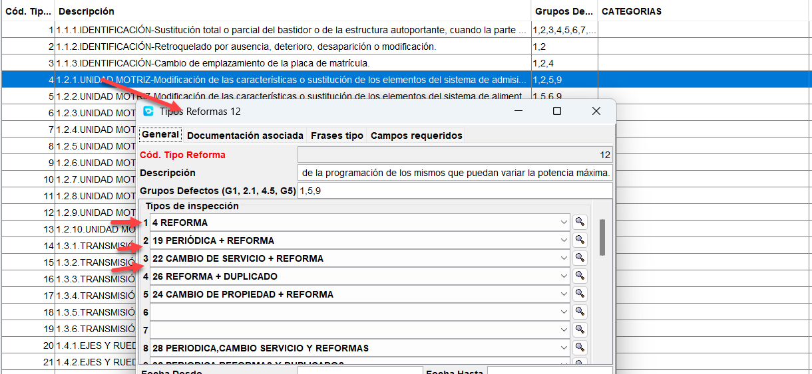
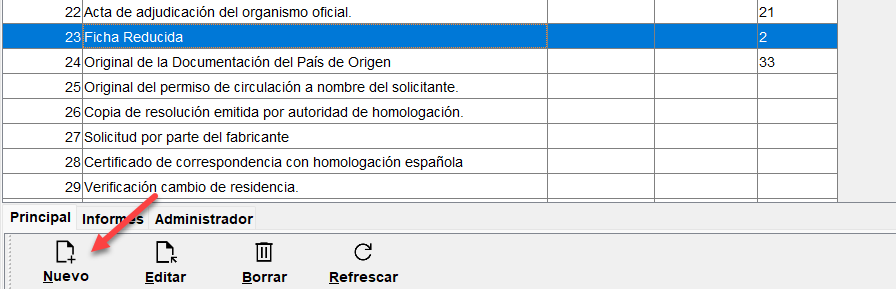

# Añadir nueva documentación a códigos de reforma

Opción de menú: `Mantenimiento > Maestras > Documentación`

En la tabla de documentación, se encuentran todas las posibles documentaciones que se pueden agregar a los diferentes códigos de reformas que se pueden dar en una inspección.

Si se desea añadir un nuevo tipo de documentación, se puede hacer desde esta tabla, añadiendo un nuevo registro con el nombre de la documentación que se quiera añadir.

Posteriormente, esa documentación se podrá añadir a los diferentes códigos de reforma que se desee o incluso a un tipo de inspección (sería documentación común a cualquier tipo de reforma), para que aparezca como una opción a elegir en durante el proceso de alta de inspección, y como documentación aportada en la solicitud de expediente.

---

## Añadir un tipo de documento existente a un código de reforma
Para realizar el proceso de añadir tipos de documentación a los códigos de reforma, sigue los siguientes pasos.

1. Ve a la opción de menú `Mantenimiento > Maestras > Tipos de reforma`.

2. Selecciona y edita la reforma a la que se desea incluir nueva documentación.

3. Ir a la pestaña **Documentación asociada** y añadir una o varias documentaciones adicionales usando el botón **Nuevo**.

<!-- https://github.com/eduardo-cd360/cd360-itv-manual/tree/main/docs/casos-de-uso/expedientes/anadir-documentacion-codigos-reforma/images/anadir-documentacion-codigos-reforma-1.png -->

4. En el formulario que se abre, elige, el tipo de inspección (que será una tipo reforma generalmente) y una de las documentaciones que se muestran.

<!-- https://github.com/eduardo-cd360/cd360-itv-manual/tree/main/docs/casos-de-uso/expedientes/anadir-documentacion-codigos-reforma/images/anadir-documentacion-codigos-reforma-2.png -->

Este proceso se puede repetir para añadir tantas documentaciones como se desee a cada código de reforma.

En el caso de que no exista la documentación que se desea añadir, se puede crear una nueva documentación siguiendo el proceso explicado en el siguiente apartado.

## Crear una nueva documentación y añadirla a un código de reforma
Si se desea crear una nueva documentación y añadirla a un código de reforma, se pueden seguir los siguientes pasos:

1. Ve a la opción de menú `Mantenimiento > Maestras > Documentación` y crea un nuevo tipo de documentación, con el nombre que se quiera.

1. Cumplimentar los campos Descripción e IDexterno unicamente. El numero de orden se asignará automáticamente al guardar el nuevo registro.
   

   IDexterno es utilizado para identificar la documentación con respecto a Industria, ya que será usado para subir al servicio cada documento con su tipo correcto.
   
2. Una vez creada la nueva documentación, se puede seguir el proceso explicado en el apartado anterior para añadir esa nueva documentación a los códigos de reforma que se desee.