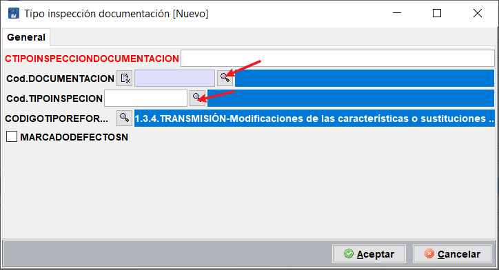

# Añadir nueva documentación a códigos de reforma

En la tabla Mantenimiento/maestras/documentación, se encuentran todas las posibles documentaciones que se pueden agregar a los diferentes códigos de reformas, pero es posible, que debido al gran número de documentos a aportar en algunos casos, sea necesario crear nuevos conceptos que incluyan varios documentos.

Para realizar el proceso de añadir tipos de documentación a los códigos de reforma, sigue los siguientes pasos.

1. En mantenimiento/maestras/documentación, añadir un registro que lleve en un solo concepto, varios elementos que suelen ir juntos.

2. En Mantenimiento/maestras/tipos reformas, editar la reforma que se desea incluirle esa documentación como opción.

3. Una vez editada la reforma, ir a la pestaña indicada en la captura, y añadir una nueva documentación.

<!-- https://github.com/eduardo-cd360/cd360-itv-manual/tree/main/docs/casos-de-uso/expedientes/anadir-documentacion-codigos-reforma/images/image_1.png -->

4. En el formulario que se abre, elige, el tipo de inspección (que sea una tipo reforma generalmente) y la documentación que se ha creado anteriormente.

<!-- https://github.com/eduardo-cd360/cd360-itv-manual/tree/main/docs/casos-de-uso/expedientes/anadir-documentacion-codigos-reforma/images/image_2.png -->

Este proceso se puede repetir para todas aquellas situación en las que se quiere meter varias documentación en un solo concepto. Es reutilizable para varios códigos de reforma.