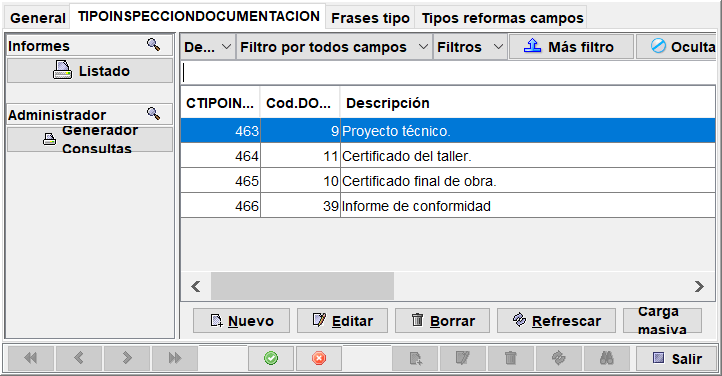
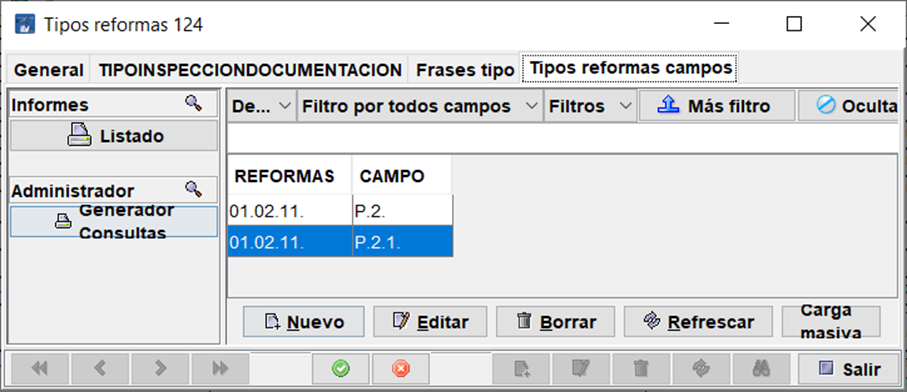
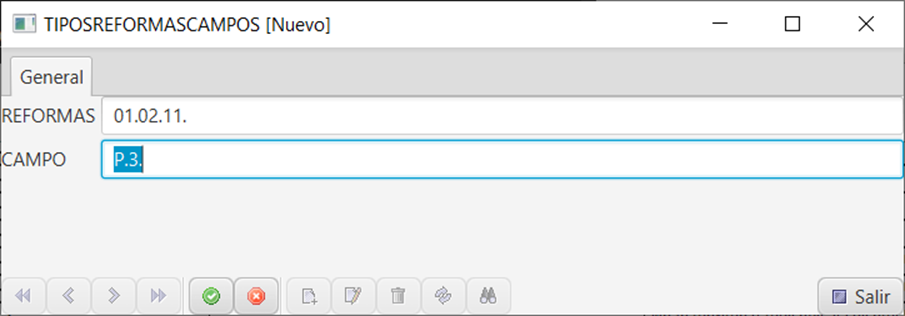

# Reformas: Añadir nuevo código de reforma CR

Los tipos de inspección reforma son inspecciones no periódicas que generan expediente al darlas de alta. Este tipo de inspecciones llevan asociados uno o más códigos de reforma.

Los códigos de reforma que aparecen en creativa para estos tipos de inspección (reformas con o sin proyecto) son los que aparecen en el manual de reformas de ITV en vigor publicado por el mincotur.

Cuando el código de reforma no está disponible para seleccionarlo durante el alta de la inspección, puede ser por dos motivos:

- No está dado de alta como código de reforma.
- No está asociado al tipo de inspección que se está dando de alta, aunque si está dado de alta el código.

!!! Nota

    Para la creación de nuevos códigos de reforma o actualización de existentes debido a cambios en el manual de reformas de ITV publicado por el mincotur, siempre se consultará el manual de reformas en vigor.
    En este manual en cada código de reforma hace referencia a la descripción, los grupos de defectos a inspeccionar y los textos plantilla a aplicar en la tarjeta.

En este caso de uso, se va a tratar lo siguiente:

- Crear nuevo código de reforma y grupos de defecto que aplican.
- Asociar documentación.
- Agregar frase tipo.
- Agregar los campos a cumplimentar en ficha.

## Crear nuevo código de reforma

Ir a *Mantenimiento>Maestras>Tipos de reform*a y cumplimentar los datos de la pestaña general según el CR del manual de reformas.

<!-- https://github.com/eduardo-cd360/cd360-itv-manual/tree/main/docs/casos-de-uso/expedientes/images/reformas-expedientes-tipos_de_reforma-nuevo_tipo_de_reforma.png -->

- **Cod. tiporeforma**: Código interno, es asignado de forma automática.
- **Descripción**: Descripción del CR que aparece en el manual de reformas. Importante poner tres dígitos
separados por . (punto).
- **Grupo de defectos**: Los capítulos del manual que afectan a este tipo de reforma, separado por comas , si
se deja en blanco aplican todos los capítulos.
Página 1 de 4
- **Tipo inspección (1,2,3,4)**: A que tipos de inspecciones afecta. Seleccionar con la lupa en cada caso.
- **Fecha desde/hasta**: A partir de que fecha empieza a aplicar el tipo de reforma (desde) o deja de aplicar
(hasta).
- **Fecha de actualización**: Fecha de actualización del CR. Es automático y cambia con cada edición.
- **Categorías**: Categorías del vehículo a las que aplica el tipo de reforma.

Terminar pulsando sobre el botón aceptar (aspa verde) antes de cambiar al siguiente paso.

## Asociar documentación a un código de reforma

En el formulario del tipo de reforma, seleccionar la pestaña TIPOINSPECCIÓNDOCUMENTACIÓN, que es donde se asociará toda la documentación exigible para el CR, ya sea de forma obligatoria u opcional.

Como primer paso hay que habilitar la modificación.

<!-- https://github.com/eduardo-cd360/cd360-itv-manual/tree/main/docs/casos-de-uso/expedientes/images/expedientes-tipos_de_reforma-editar_codigo_reforma.png -->

A continuación pulsar en "Nuevo" y cumplimentar todos los campos necesarios.

<!-- https://github.com/eduardo-cd360/cd360-itv-manual/tree/main/docs/casos-de-uso/expedientes/images/reformas-expedientes-tipos_de_reforma-agregar-documentacion.png -->

- **TipoInspecciónDocumentación**: Es un número automático, dejar vacío.
- **Código Documentación**: Seleccionar del listado (mediante la lupa) uno de los documentos a agregar.
- **Código Tipo Inspección**: Si el CR aplica a más de un tipo de inspección, se puede seleccionar y esta
documentación solo aparecerá en ese tipo de inspección. Si se deja en blanco, aplica a todos los tipos de
inspección a los que esta asociado el CR.
- **Código Tipo Reforma**: Es el CR para el que se está agregando la documentación. Es seleccionado
automáticamente, por lo que no es necesario modificarlo.
- **Marcado por Defecto S/N**: Permite especificar si aparecerá esta documentación marcada por defecto
como aportada por el cliente, o por el contrario, si es opcional. La marcará el administrativo durante el alta,
si debe aportarse o no.

Repetir este paso tantas veces como documentaciones haya que agregar al CR.

<!-- https://github.com/eduardo-cd360/cd360-itv-manual/tree/main/docs/casos-de-uso/expedientes/images/reformas-expedientes-tipos_de_reforma-documentacion-agregada.png -->

## Agregar frases tipo a un código de reforma

Para agregar la frase tipo, que será mostrada en la pantalla de la tarjeta, en las pestañas de Descripción Reformas,
hay que seleccionar la pestaña "Frases tipo".

Se deberá pulsar sobre "Nuevo", y agregar la frase que aparece en el manual de reformas, o bien una propia o personalizada.

<!-- https://github.com/eduardo-cd360/cd360-itv-manual/tree/main/docs/casos-de-uso/expedientes/images/reformas-expedientes-tipos_de_reforma-agregar_frases_tipo.png -->

- **Nombre**: Nombre Descriptivo de la frase tipo. Por defecto se pone el mismo nombre del CR.
- **Código tipo Reforma**: Seleccionar del listado el CR al que aplicará el texto modelo.
- **Campo de texto**: Espacio para escribir el texto que servirá como modelo para la descripción de la reforma realizada.

## Agregar a un código de reforma los campos a cumplimentar en tarjeta

Por último, y de forma opcional se pueden agregar los campos que se deben cumplimentar en la tarjeta para este CR.

Para ello, acceder a la pestaña "Tipos reformas campos" y agregar tantos registros como campos haya que cumplimentar. Si la reforma no modifica ningún campo, no es necesario este paso.

<!-- https://github.com/eduardo-cd360/cd360-itv-manual/tree/main/docs/casos-de-uso/expedientes/images/reformas-expedientes-tipos_de_reforma-añadir_campos_de_tarjeta.png -->

Para agregar un campo nuevo, pulsar sobre "Nuevo", e introducir el nombre del campo.

<!-- https://github.com/eduardo-cd360/cd360-itv-manual/tree/main/docs/casos-de-uso/expedientes/images/reformas-expedientes-tipos_de_reforma-nuevo_campo.png -->

- **Reformas**: El código de reforma para el que se está dando de alta el código de campo. Lo asigna de forma automática el programa.
- **Campo**: Es el código de la tarjeta que se resaltará. Se usará el formato x.y.z., es decir letras y números separados por puntos.

!!! Nota

    Se puede ver un listado completo de todos los campos y su descripción cuando se está visualizando una tarjeta de inspección, ya sea desde un expediente o desde el botón del menú "Ficha Técnica"

A continuación se muestra un ejemplo de tarjeta en los que se destacan los campos a rellenar.

<!-- https://github.com/eduardo-cd360/cd360-itv-manual/tree/main/docs/casos-de-uso/expedientes/images/reformas-expedientes-tipos_de_reforma-vista_campos_a_rellenar_en_tarjeta.png -->
