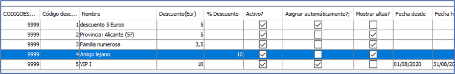

# Crear un descuento

Accedediendo al menú *```Facturación/Descuentos```* se visualiza el listado de descuentos disponibles actual.



En esta pantalla hay una serie de botónes para realiar diferentes operaciones.


**Nuevo**: Crear un nuevo descuento.
**Editar**: Modificar un descuento existente.
**Borrar**: Eliminar un descuento existente.
**Refrescar**: Actualizar el listado de descuentos.
**Ayuda**: Acceso a documentos relacionados con el uso de descuentos.