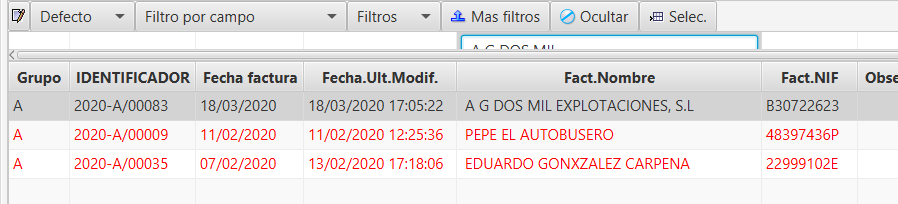

## Facturación mensual

El proceso de la facturación mensual permite la emisión de facturas agrupadas a clientes con cuentas de cobro o crédito, pudiéndose realizar de forma automática mediante un proceso específico o de forma manual.

En este documento se tratan los siguientes temas:

Facturación mensual de albaranes entre periodos

Facturación manual

### Facturación mensual de albaranes entre periodos

Selecciona el rango de fechas de albaranes a facturar. Selecciona mediante la lupa una cuenta de cobro para facturar solo a esta cuenta sus albaranes o déjalo vacío para facturar todos los que haya.

Una vez realizado el proceso, se mostrará un mensaje de confirmación “Proceso terminado”.

Para ver las facturas correspondientes al periodo facturado anteriormente hay que acceder al menú Facturación > Facturas.

### Facturación Manual

Desde el menú Facturación > Albaranes se puede ver el listado de albaranes emitidos por el programa, que se corresponden con las inspecciones realizadas a los clientes con cuentas de cobro o a alguno que se haya creado manualmente. Las inspecciones que se pagan en el acto (contado y tarjeta de crédito) no generan albaranes, porque generan facturas directamente.

Realizar la facturación manual de albaranes permite facturar a un cliente en concreto y todos o algunos de los albaranes que interesen.

Para facturar los albaranes se procederá se la siguiente forma:

Seleccionar el rango de fechas entre los que deseamos realizar la facturación de albaranes.

Filtrar por alguno de los campos que se muestran en la tabla, si es el caso que queremos dejar solamente los albaranes de algún cliente por ejemplo.

Seleccionar los albaranes que se quieren facturar (Ctrl o Mayus + Clic derecho del ratón) y pulsar Facturar.

Indicar la fecha de la factura, el grupo o serie (se muestra automáticamente el correcto) y si se desea agrupar los albaranes facturados en una sola factura o hacer facturas independientes.

Un mensaje informará del proceso terminado.

