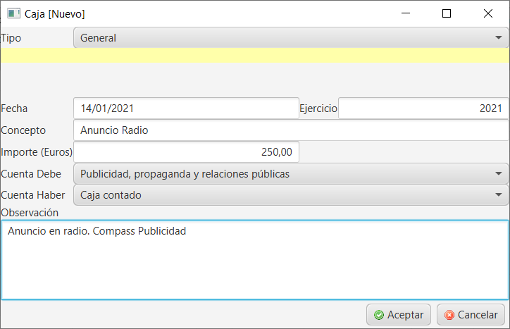

## Gestión de gastos

La gestión de gastos en Creativa requiere de cuentas contables de tipo gasto para poder realizar anotaciones de gastos desde el menú de caja y que luego queden reflejados en la caja del día.

En este documento se tratarán los siguientes temas:

Creación de cuenta contable de gastos

Anotación de un gasto en caja

Sacar un resumen de caja

### Creación de cuenta contable de gastos

Para crear una nueva cuenta contable de tipo gasto, se accede mediante el menú Facturación/Cuentas contables.

Crear una nueva cuenta contable

Cumplimentar los campos

Cuenta contable: descripción del gasto

Subcuenta: Cumplimentar con subcuentas siguiendo el PGC de tipo gasto.

Tipo: Elegir de la lista el tipo GASTO.

Exportar: Marcado se tendrá en cuanta para la exportación de la facturación para la contabilidad

Desactivar: Si está marcado, no aparecerá este gasto en caja para poder asignar movimiento de este tipo.

Para finalizar, pulsar Aceptar.

### Anotación de un gasto en caja

Para anotar gastos en caja, se accede al menú Facturación/Caja y se pulsa en nuevo.

Tipo: General

Fecha y ejercicio: la fecha y año actuales. Automático

Concepto: la descripción del gasto

Importe: Monto del gasto efectuado a anotar en caja.

Cuenta Debe: elegir la cuenta contable creada para gastos

Cuenta haber: Dejar en blanco o asignar una cuenta de pago.

Observaciones: Cualquier aclaración que ayude a la comprensión del gasto.

Una vez cumplimentados los campos, pulsar en Aceptar.

El gasto aparecerá junto a los demás movimientos de caja del día.

### Sacar un resumen de caja

Para sacar el resumen de caja donde se pueden ver todos los movimientos de caja, incluidos los gastos recién introducidos, ir a Facturación/Resumen Caja y se

