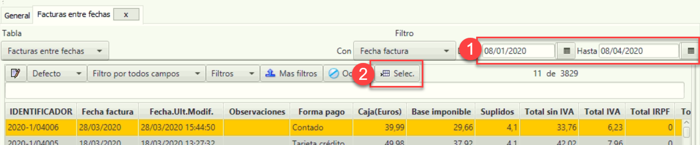
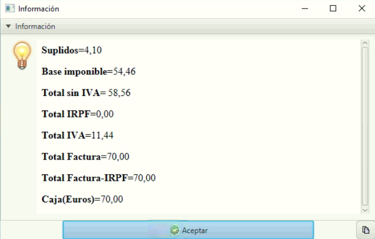

# mostrar subtotales acumulados

En este caso de uso, se va a mostrar cómo trabajar con la función SUMA, que está disponible en la barra de botones inferior, en la pestaña informes de la pantalla de facturas.

Esta función muestra un resumen por conceptos (Base, IVA, IRPF, etc.) en base a la información seleccionada en la pantalla.

Nota. En este tutorial, se trabajará con facturas, la selección entre fechas para acotar un rango de tiempo, el filtro por columnas y el botón SUMA.

### Subtotales acumulados entre un periodo determinado

Accede al menú Facturación > Facturas.

Selecciona un rango de fechas entre las que mostrar todas las facturas.

Selecciona todas las facturas del listado.

Acceder a la pestaña Informes.

Pulsar sobre el botón Suma.

Se muestra una pantalla con información. Se puede ver la suma de todos los conceptos de las facturas seleccionadas.

### Subtotales acumulados entre periodos para un cliente determinado

Accede al menú Facturación > Facturas.

Selecciona un rango de fechas

Activa el filtro por campo

En la columna por la que se quiera filtrar, realizar la búsqueda (en este caso, Fact. Nombre).

Pulsa sobre el botón Seleccionar todo.

Pulsa sobre el botón Suma de la pestaña Informes de la zona inferior.

Se muestra una pantalla con información. Se puede ver la suma de todos los conceptos de las facturas seleccionadas.