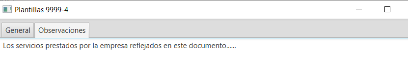

# Plantillas de facturas o albaranes

### Que son las plantillas

Las plantillas son modelos de facturas o albaranes que se pueden utilizar para agilizar la creación de una factura o albarán cuando se realizan de forma manual.

Según la utilidad que le vayamos a dar se pueden generar dos tipos de plantilla; de documento completo y de documento parcial.

Una plantilla de documento completo cuando es utilizada en una factura o albarán, sustituye el contenido que hubiese, pero se puede modificar posteriormente. Si la plantilla contiene

Una plantilla parcial solo contiene líneas de conceptos, que al utilizarlos en una factura o albarán añaden  su contenido a las líneas existentes.

### Descripción de la pantalla

Al entrar en esta pantalla, se puede ver el listado de plantillas disponibles, donde se pueden observar los siguientes campos:

Cód. Empresa: El nº de estación de ITV. Como siempre es el mismo, se puede ocultar si se desea este campo.

Cód. Tipo Gestión: Nº incremental de plantilla. Asignado de forma automática durante la creación de la plantilla.

Nombre: El nombre que se le da a la plantilla, que será usado al cargar la plantilla durante la creación de una factura o albarán.

TipoDocumento: Nº que identifica si es un albarán o una factura.

10 – Factura

20 – Albarán

Modo: Si es plantilla de documento completo o solo líneas.

Las acciones disponibles mediante los botones son:

Nuevo: Crear nueva plantilla. Completa o solo líneas.

Editar: Modificar una plantilla existente.

Borrar: Elimina una plantilla existente.

Refrescar: Actualiza la vista.

Duplicar: Genera una nueva plantilla a partir de una existente. A continuación puede editarse para personalizarla.

Generar Doc.: Generar Albarán o Factura basado en plantilla. En el caso de plantillas completas y que tienen asignado un cliente, se podrá utilizar este botón para generar el documento desde aquí.

Listado: Genera un documento para imprimir (A4) con el listado de lo que se ve en pantalla.

Generador de consultas: Consultas avanzadas para obtener información. Solo disponible con usuarios avanzados.

### Crear plantilla de documento completo

Accede al menú Facturación > Plantillas y añade una nueva. Se muestra un cuadro de diálogo preguntando por el tipo de documento que se va a realizar. Contesta Sí para crear una plantilla completa.

Rellena los datos que creas conveniente y añade conceptos como en la captura.

Escribe un nombre, el tipo de documento (Albarán o Factura), Grupo o Serie (1, A, M, R, etc..), forma de pago, etc..

Asigna un cliente si es exclusiva para este cliente. De esta forma se puede utilizar el botón Generar Doc.

Agrega los conceptos necesarios.

Agrega observaciones si es necesario.

Guarda la plantilla y ya se puede utilizar al crear facturas o albaranes.

### Crear plantilla de líneas de concepto

Accede al menú Facturación > Plantillas y añade una nueva. Se muestra un cuadro de diálogo preguntando por el tipo de documento que se va a realizar. Contesta No para crear una plantilla completa.

### Usar las plantillas

Para usar las plantillas, accede a Facturación > Albaranes o Facturación > Facturas.

En cualquiera de estos menús, cuando se crea un nuevo documento de tipo albarán o factura, se puede seleccionar una plantilla.

Primero se selecciona una de las plantillas disponibles y a continuación se pulsa el botón Añadir plantilla. El contenido de la plantilla se añade al documento existente.

