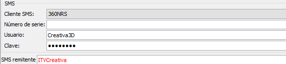
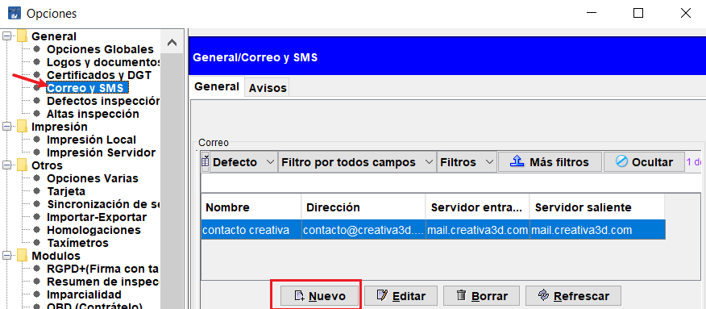
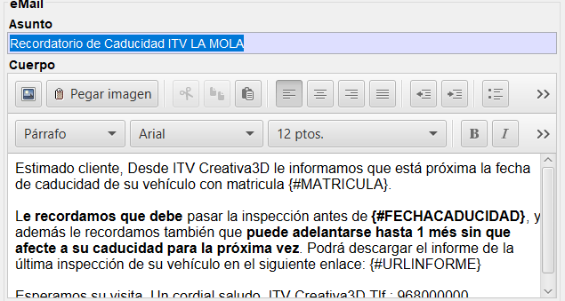

# Configuración envío de recordatorios por SMS y Email

La configuración de los proveedores de envío de recordatorios por SMS y por email se encuentran en `Archivo/Opciones/General/Correo y SMS`.

La configuración de las plantillas utilizadas para el envío de los recordatorios a través de SMS, EMAIL o Correo ordinario, se encuentra en `Archivo/Opciones/Comunicaciones/Recordatorios`.

## Configuración de proveedor de SMS

>Para el envío de recordatorios SMS con Creativa Digital 360 ITV es necesario tener previamente configurado un proveedor de envío de SMS's.

**Alta de proveedor de SMS**

Actualmente Creativa3D ITV soporta cuatro proveedores diferentes. Puedes hacer clic para visitar sus páginas y saber más.

- [Mensario][1]
- [Mensamundi][2]
- [360NRS][3]
- [Digital Servi][4]

Para la configuración de los diferentes servicios son necesarios los datos siguientes:

360NRS

    - Nombre de usuario
    - Clave de acceso (API)
    - Nombre de remitente (max. 11 caracteres)
 
Mensario

    - Nombre de usuario
    - Nº de serie
    - Usuario
    - Clave
    - Nombre de remitente (max. 11 caracteres)
    
Mensamundi

    - Nombre de usuario
    - Nº de serie
    - Usuario
    - Clave
    - Nombre de remitente (max. 11 caracteres)

Todos estos datos son obtenidos una vez se ha contratado el servicio correspondiente.

En la sección SMS, hay que rellenar los campos que aparecen, teniendo especial cuidado con el nombre del remitente, que será por el que los clientes sabrán que es la estación la que remite los SMS.
    
<!-- https://github.com/eduardo-cd360/cd360-itv-manual/tree/main/docs/casos-de-uso/recordatorios/images/creativa3d-recordatorios-configuracion-sms-anadir-proveedor.png -->

En la imagen superior se debe seleccionar el proveedor de la lista y cumplimentar los campos con la información suministrada por este.

> Para trabajar con SMS es necesario que se disponga de paquetes de SMS adquiridos o bien de saldo (360nrs) que se irá consumiendo conforme se vayan enviando SMS.

## Configuración de cuenta de Email

> El envío de recordatorios siempre utilizará la primera cuenta de correo configurada.

**Alta de cuenta de correo**
Una vez en la pantalla de configuración de correo y SMS (`Archivo > Opciones > General > Correo y SMS`), pulsar sobre el botón Nuevo.
<!-- https://github.com/eduardo-cd360/cd360-itv-manual/tree/main/docs/casos-de-uso/recordatorios/images/menu-archivo-configuracion-general-correoysms.png -->

En la pantalla de alta de la cuenta de correo rellenar los campos de correo saliente

<!-- https://github.com/eduardo-cd360/cd360-itv-manual/tree/main/docs/casos-de-uso/recordatorios/images/menu-archivo-opciones-general-correoysms-alta-cuenta.png -->

* Servidor correo saliente
* Tipo de seguridad: SSL/TLS/Ninguna
* Puerto de salida: 0 para detección automática según el tipo de seguridad elegida.
* Usuario y contraseña de la cuenta.

> Los valores de configuración de las cuentas de correo deben solicitarse al administrador de la web o dominio de la empresa o a la apersona responsable de la estación.

Para finalizar, se puede pulsar sobre el correo de prueba para verificar el funcionamiento de la nueva cuenta de correo.

## Personalizar los envíos

Una vez configurado el proveedor de SMS y la cuenta de correo, es posible personalizar los mensajes que se envían a los clientes.

**Plantilla de SMS**

En la misma pantalla de configuración se encuentra una sección para personalizar el mensaje enviado por SMS a los clientes.

<!-- https://github.com/eduardo-cd360/cd360-itv-manual/tree/main/docs/casos-de-uso/recordatorios/images/creativa3d-recordatorios-configuracion-sms-personalizar-mensaje.png -->

La configuración de los mensajes tienen las siguientes características:

- No puede superarse el límite de 160 caracteres ya combinados o se produciría un error en el envío (360Nrs) porque no está permitido, o bien se enviarían dos mensajes o más hasta enviar todo el texto (resto de proveedores de SMS).
- No pueden utilizarse caracteres especiales ni letras acentuadas salvo los de la lista siguiente.

      Caracteres válidos
      ABCDEFGHIJKLMNÑOPQRSTUVWXYZ
      abcdefghijklmnñopqrstuvwxyz
      1234567890
      ()#&%><=?/*+-.,:;@ '

**Plantilla de Email**

Los email que recibe el cliente también se pueden personalizar, gracias al editor visual que hay ahora.

<!-- https://github.com/eduardo-cd360/cd360-itv-manual/tree/main/docs/casos-de-uso/recordatorios/images/creativa3d-recordatorios-configuracion-plantilla-email.png -->

En la imagen superior se puede ver un ejemplo del mensaje que se envía, en donde aparecen una serie de campos encerrados entre {} (llaves). Estos códigos serán sustituidos durante el envío por la matrícula y por la fecha de caducidad respectivamente.

Se pueden utilizar todos los recursos disponibles en el configurador para hacer el mensaje visualmente atractivo.

> **Importante:**
>
> Los elementos cargados en la plantilla, como imágenes, permanecen en el equipo del usuario que ha creado la plantilla, por lo que si se efectúa el envío de recordatorios en otro equipo diferente, es posible que el email no muestre los gráficos.

## Configuración envío postal
El envío de recordatorios postales actualmente no se utiliza mucho, pues prácticamente todos los usuario disponen de teléfono móvil en el que recibir SMS o Email.

Para poder enviar recordatorios mediante el correo ordinario, es necesario generar una serie de documentos con una plantilla especial, con formato tarjetón, en la que unicamente se trasladan los datos de nombre del cliente y dirección, población y código postal. Este envío carece de sobre y necesita de personalización de imprenta.

<!-- https://github.com/eduardo-cd360/cd360-itv-manual/tree/main/docs/casos-de-uso/recordatorios/images/creativa3d-recordatorios-configuracion-correo-ordinario.png -->

Las únicas opciones de configuración son:
- Impresión PDF: Se obtiene una vista previa antes de la impresión definitiva.

  [1]: https://www.mensario.com/
  [2]: http://www.mensamundi.com
  [3]: https://www.360nrs.com/
  [4]: https://digitalservi.es/servicios-sms-digital
