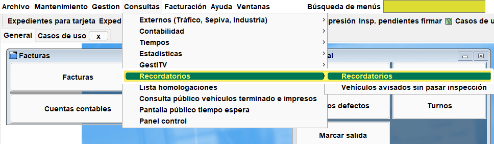
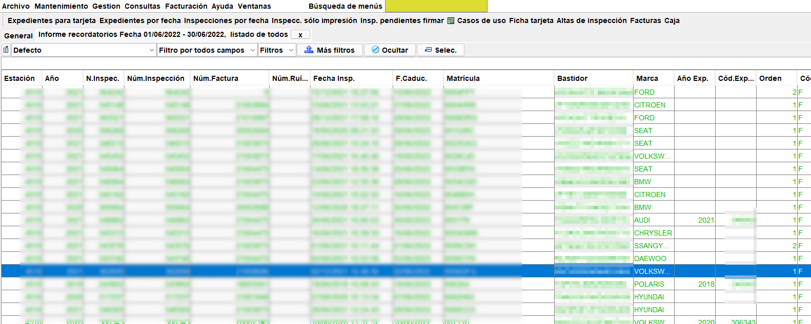
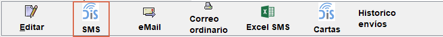

<!-- https://github.com/eduardo-cd360/cd360-itv-manual/tree/main/docs/casos-de-uso/recordatorios/images/header.jpg -->

# Envío de recordatorios con Digital Servi
Creativa3D ITV dispone de un módulo de envío de recordatorios que está integrado con los servicios que ofrece [Digital Servi](https://digitalservi.es/) (envío de SMS y Cartas recordatorio entre otros servicios).

Una vez se tienen contratados los servicios con Digital Servi, el envío de los recordatorios para su procesado es muy sencillo, dependiendo del tipo de servicio a utilizar.

## Envío unicamente de recordatorios por SMS

Si se tiene solamente contratado el envío de SMS, se deberá realizar una consulta de recordatorios

`Menú: Consultas > Recordatorios > Recordatorios`

<!-- https://github.com/eduardo-cd360/cd360-itv-manual/tree/main/docs/casos-de-uso/recordatorios/images/creativa3d-recordatorios-formulario.png -->

En el formulario, seleccionar todos los contactos, dejando la opción de descartar recordatorios con inspección pasada recientemente marcada (por defecto).

<!-- https://github.com/eduardo-cd360/cd360-itv-manual/tree/main/docs/casos-de-uso/recordatorios/images/creativa3d-recordatorios-formulario2.png -->

En el listado, aparecen todos los vehículos a los que hay que notificar su caducidad.

<!-- https://github.com/eduardo-cd360/cd360-itv-manual/tree/main/docs/casos-de-uso/recordatorios/images/creativa3d-recordatorios-listado.png -->

Para terminar se pulsa sobre el botón SMS con el logo DS.

<!-- https://github.com/eduardo-cd360/cd360-itv-manual/tree/main/docs/casos-de-uso/recordatorios/images/creativa3d-recordatorios-botonSMS-ds.png -->

Un Email con el listado de los recordatorios, será enviado a Digital Servi.

> Creativa3D ITV deberá tener configurada una cuenta de Email (Archivo > Opciones > Correo y SMS) para poder realizar este envío. Ver este caso de uso: <a href="http://server.creativa3d.com:8080/servidorcrm/documento.ctrl?GRUPO=CASOSUSOPROYECTOS&GRUPOIDENT=1-&CODIGODOCUMENTO=8011" target="_blank">Configurar cuenta de correo en Creativa3D ITV</a>

## Envío de SMS y Cartas

En este caso, se realiza un solo envío, que es procesado por Digital Serví directamente, tanto para realizar envíos de SMS como de Correspondencia.

Los pasos son los mismos, salvo que se usa el botón Cartas con el logo de Digital Servi.

Este es el proceso:

Se realiza la consulta de recordatorios

`Menú: Consultas > Recordatorios > Recordatorios`

<!-- https://github.com/eduardo-cd360/cd360-itv-manual/tree/main/docs/casos-de-uso/recordatorios/images/creativa3d-recordatorios-formulario.png -->

En el formulario, seleccionar todos los contactos, dejando la opción de descartar recordatorios con inspección pasada recientemente marcada (por defecto).

<!-- https://github.com/eduardo-cd360/cd360-itv-manual/tree/main/docs/casos-de-uso/recordatorios/images/creativa3d-recordatorios-formulario2.png -->

En el listado, aparecen todos los vehículos a los que hay que notificar su caducidad.

<!-- https://github.com/eduardo-cd360/cd360-itv-manual/tree/main/docs/casos-de-uso/recordatorios/images/creativa3d-recordatorios-listado.png -->

Para terminar se pulsa sobre el botón "Cartas" con el logo <mark>DiS</mark>.

<!-- https://github.com/eduardo-cd360/cd360-itv-manual/tree/main/docs/casos-de-uso/recordatorios/images/creativa3d-recordatorios-botonCartas-ds.png -->

> Creativa3D ITV deberá tener configurada una cuenta de Email (Archivo > Opciones > Correo y SMS) para poder realizar este envío. Ver este caso de uso: <a href="http://server.creativa3d.com:8080/servidorcrm/documento.ctrl?GRUPO=CASOSUSOPROYECTOS&GRUPOIDENT=1-&CODIGODOCUMENTO=8011" target="_blank">Configurar cuenta de correo en Creativa3D ITV</a>