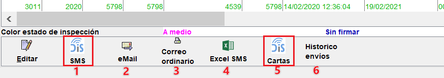

# Envío de recordatorios

En Creativa3D ITV está disponible el envío de recordatorios a clientes, pudiéndose realizar por tres métodos distintos.

* Email
* SMS
* Correo postal

Existen varios proveedores para realizar el envío de recordatorios según el método elegido. En ocasiones, será necesario utilizar más de un método para poder "recordar" a todos los usuarios la caducidad.

Cada método de envío, dispone de una plantilla o texto maestro que debe adaptarse a la estación antes de realizar el primer envío.

Todos los envíos de recordatorios, sean del tipo que sean se pueden emitir accediendo al menú `Consultas > Recordatorios > Recordatorios`.

<!-- https://github.com/eduardo-cd360/cd360-itv-manual/tree/main/docs/casos-de-uso/recordatorios/images/menu-recordatorios.png -->

Desde la pantalla de la consulta, especificar el rango entre fechas (en que les caducará la ITV) y elegir una de las opciones según sea el caso.

<!-- https://github.com/eduardo-cd360/cd360-itv-manual/tree/main/docs/casos-de-uso/recordatorios/images/menu-recordatorios-consulta.png -->

* **Todos**: En el listado se mostrarán todos los vehículos y es válido para emitir recordatorios por correo postal.
* **Solo los que tengan eMail**: para realizar envíos solamente a los que dispongan de este dato, o bien se está realizando un envío por varios métodos.
* **Solo los que tienen teléfono**: para realizar envíos mediante el método de SMS.
* **Todos los que no tienen tlf. y email**: permite obtener el listado de los clientes a los que no se les puede comunicar ni por SMS ni por email.

> Para el correcto funcionamiento de cada uno de los métodos de envío, el software dispone de una configuración específica, que se detalla al final del documento.

Una vez obtenido el listado de vehículos (con los respectivos datos del titular),se procederá al envío por los métodos elegidos.

> **Info**
>
> El listado resultante, puede ser filtrado, de la misma forma que en cualquier pantalla de tabla mostrada en la aplicación.

<!-- https://github.com/eduardo-cd360/cd360-itv-manual/tree/main/docs/casos-de-uso/recordatorios/images/menu-recordatorios-botones-envio.png -->

**Envío de recordatorios por SMS o Email**

Pulsando sobre el botón SMS(1) o Email(2) se enviarán de forma automática los recordatorios.

**Generación de recordatorios impresos**

Pulsando sobre el botón Correo ordinario se genera un documento multipágina con todos los recordatorios del listado. Los campos de cliente y de matricula se combinan con el texto de plantilla.

**Generar fichero para enviar de forma externa a la aplicación**

Listado Excel combinado (nº teléfono + mensaje) para envío de recordatorios con herramientas externas.

**Histórico de envíos**

Existe la posibilidad de ver un histórico de los envíos realizados para la comprobación por parte del usuario.
