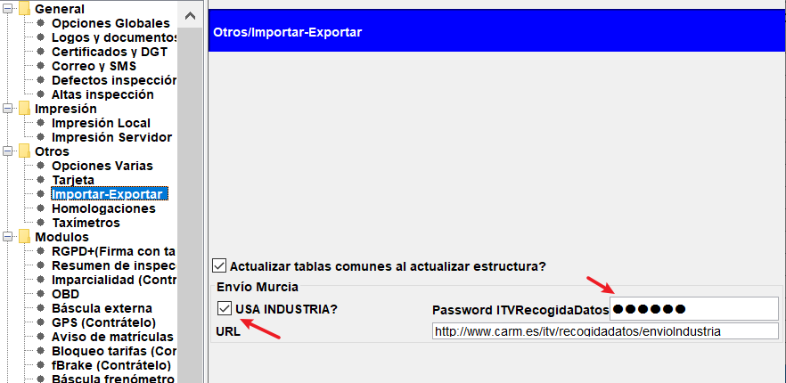
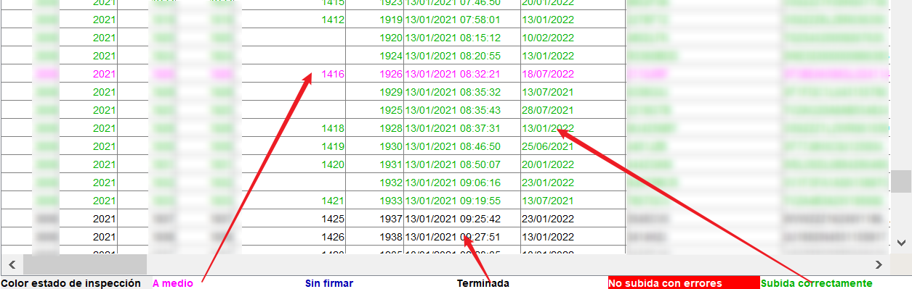
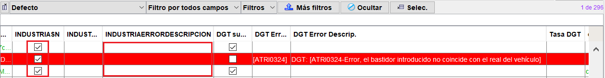

## Subida automática de inspecciones a industria (SOLO MURCIA)

En este documento se tratan los siguientes temas, todos relacionados solamente con los servicios de Industria para la Región de Murcia.

Activación del servicio de subida de inspecciones a Industria

Comprobación de subida correcta de inspecciones a Industria

Consulta de datos sobre inspecciones en el portal de Industria

### Activación del servicio de subida de inspecciones a Industria

Desde el 2 de Enero, en la Comunidad Autónoma de Murcia, es obligatorio realizar la subida de las inspecciones realizadas de forma automática e inmediata a los servidores de Industria.

Todas las estaciones deben de tener un usuario (que es el nº de estación) y una contraseña asignados, mediante el cual, se subían los ficheros mensuales por el sistema antiguo (anterior al 02 de enero de 2021)

Para realizar la activación del servicio ir a Archivo / opciones / otros / Importar-Exportar.

<!-- https://github.com/eduardo-cd360/cd360-itv-manual/tree/main/docs/casos-de-uso/subida-de-inspecciones/subida-industria-murcia/images/image_1.png -->

Introducir el password del servicio de recogida de datos de Industria, y en caso de no estarlo, marcar la casilla “USA INDUSTRIA?”.

La dirección o URL del servicio es:  y debe estar colocado para el correcto funcionamiento del servicio en el programa.

Nota.
El usuario y contraseña de la estación o estación móvil ya debe conocerse del procedimiento anterior de subida por ficheros mensuales, al portal de recogida de datos del servicio de Industria Murcia.

### Comprobación de subida correcta de inspecciones a Industria

Para comprobar desde el programa que se han subido correctamente las inspecciones, solo hay que ver el listado de “Inspecciones por fecha” y los estados por código de colores.

<!-- https://github.com/eduardo-cd360/cd360-itv-manual/tree/main/docs/casos-de-uso/subida-de-inspecciones/subida-industria-murcia/images/image_2.png -->

Solamente en el caso de que la inspección esté en color rojo, es cuando ha habido alguna incidencia durante la subida. Que puede ser de la DGT o de Industria.

Si se detecta un error, hay que buscar las columnas INDUSTRIASN, INDUSTRIAERRORDESCRIPCION (si no están visibles, activarlas).

<!-- https://github.com/eduardo-cd360/cd360-itv-manual/tree/main/docs/casos-de-uso/subida-de-inspecciones/subida-industria-murcia/images/image_3.png -->

En el caso de que la inspección no esté subida a industria, la casilla INDUSTRIASN no estará marcada, en cuyo caso, se deberá leer el mensaje de error e intentar subir de nuevo la inspección.

### Consulta de datos sobre inspecciones en el portal de Industria

La dirección de consulta y ahora de gestión de informes personalizados del servicio de recogida de datos de industria es:

En la nueva Web se pueden ver una serie de informes públicos generados de forma periódica por Industria, y a la vez, se pueden generar informes concernientes a la estación personalizados.

Para generar estos informes personalizados, en la izquierda se dispone de un menú de opciones visible una vez se ha autentificado la estación en la web.

Vista publica de la web

<!-- https://github.com/eduardo-cd360/cd360-itv-manual/tree/main/docs/casos-de-uso/subida-de-inspecciones/subida-industria-murcia/images/image_4.png -->
