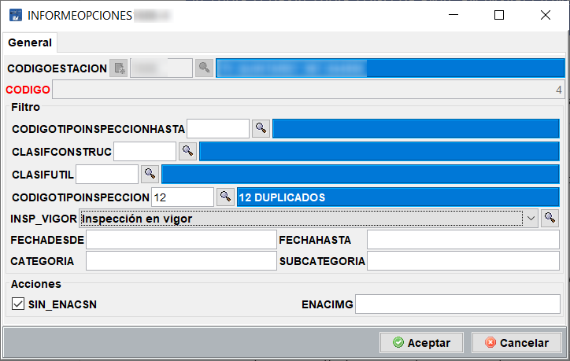

## Activar o desactivar Logo de ENAC en los informes de inspección

El logo de ENAC puede ser desactivado en inspecciones que no lo requieren o para las que no se está certificado.

En este documento encontrarás:

Descripción de la pantalla

El proceso para activar o desactivar que aparezca este logo, entre otras funciones, se encuentra en:

<!-- https://github.com/eduardo-cd360/cd360-itv-manual/tree/main/docs/casos-de-uso/varios/activar-logo-enac-informes/images/image_1.png -->

Ilustración 1- Listado de reglas

En la tabla se muestran las reglas existentes

<!-- https://github.com/eduardo-cd360/cd360-itv-manual/tree/main/docs/casos-de-uso/varios/activar-logo-enac-informes/images/image_2.png -->

Ilustración 2- El logo de ENAC no se imprime si es tipo de inspección 12-Duplicado y está marcado el check de inspección en vigor, puesto que no se comporta como periódica.

Esta opción de menú permite realizar acciones concretas sobre el informe, en base a unos criterios de aplicación de filtrado.

Los criterios de filtro son:

Código de Tipo de Inspección (CODIGOTIPOINSPECCION): El tipo de inspección al que se quiere aplicar una acción.

Código de Tipo de Inspección (CODIGOTIPOINSPECCIONHASTA): Si se quiere crear una regla que abarque más de un tipo de inspección, especificar hasta que número. Dejar vacío para aplicar solamente al tipo establecido en el campo anterior.

Clasificación por construcción.

Clasificación utilidad:

Inspección en Vigor (INSP_VIGOR): Si el botón Inspección  en vigor de Altas de inspección está en alguno de los estados siguientes.

Inspección en vigor: check pulsado.

No aplica: Si no se debe tener en cuenta si está pulsado o no.

Sin inspección en vigor: check sin pulsar.

Fecha desde: Desde que fecha se quiere que aplique la regla. Por defecto vacío.

Fecha hasta: Hasta que fecha debe aplicarse la regla. Por defecto vacío.

Categoría: Categoría del vehículo. M,N,O,L

Subcategoria: Subcategoría del vehículo. 1,2,3

Las acciones disponibles son:

Sin logo de ENAC (SIN_ENACSN): Deshabilita la aparición en el informe del logo de ENAC para las condiciones expresadas en el filtro.

Ruta alternativa al logo de ENAC (ENACIMG): Indicar ruta hacia el logo de ENAC. Invalida el logo seleccionado en Opciones/General/Logos y Documentos.

### Como eliminar el logo de ENAC de un tipo de inspección no periódica

Para este caso, se va a crear una regla que elimine el logo de ENAC de los informes que sean de una inspección de tipo DUPLICADO y que tengan pulsado el check Inspección en Vigor cuando se dan de alta (Si no estuviese checado, se consideraría una periódica).

Accede al menú Mantenimiento/Auxiliares/Informe Opciones.

<!-- https://github.com/eduardo-cd360/cd360-itv-manual/tree/main/docs/casos-de-uso/varios/activar-logo-enac-informes/images/image_3.png -->

Se muestran las reglas existentes. Añade una nueva o edita una existente para activar o desactivar el logo de ENAC.

<!-- https://github.com/eduardo-cd360/cd360-itv-manual/tree/main/docs/casos-de-uso/varios/activar-logo-enac-informes/images/image_4.png -->

Al pulsar en Nuevo, aparece el formulario de creación de la regla nueva o existente.

<!-- https://github.com/eduardo-cd360/cd360-itv-manual/tree/main/docs/casos-de-uso/varios/activar-logo-enac-informes/images/image_5.png -->

Rellena los campos CODIGOTIPOINSPECCIÓN con el número de tipo de inspección o búscalo con la lupa, INSP_VIGOR con el valor Inspección en vigor, y por ultimo marca el check SIN_ENACSN para que sea desactivado el logo, ya que por defecto los informes llevan todos ENAC.

Si se quiere establecer alguna regla más, solo hace falta especificarla. Son reglas de tipo Y (AND) y se deben cumplir todas para que se realice la acción.