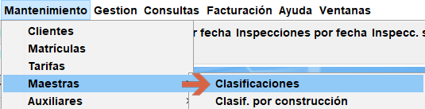

# Cambiar la periodicidad de una clasificación

Los vehículos de ciertas clasificaciones como 1040,1041 y 1042, no responden a la misma periodicidad que el resto de vehículos de la serie 10xx, por lo que hay que crear una excepción que aplique una periodicidad distinta.

La creación de reglas permite establecer para una o varias clasificaciones:

* Una periodicidad distinta de la habitual
* Una categoría distinta a la habitual (a la que daría el programa sin esta regla)
* Un aviso en pantalla durante el alta al introducir esta clasificación.

## Creación de una regla de cambio de periodicidad

Para crear una regla accede a *`Mantenimiento/Maestras/Clasificaciones`*

<!-- https://github.com/eduardo-cd360/cd360-itv-manual/tree/main/docs/casos-de-uso/varios/cambiar-periodicidad-a-una-clasificación-en-concreto/images/creativa3d-menu-mantenimiento-maestras-clasificaciones.png -->

En esta pantalla se muestran las reglas ya creadas (que afectan a alguna clasificación o a varias) y se pueden editar las existentes o crear nuevas.

<!-- https://github.com/eduardo-cd360/cd360-itv-manual/tree/main/docs/casos-de-uso/varios/cambiar-periodicidad-a-una-clasificación-en-concreto/images/creativa3d-tabla-clasificaciones.png -->

Pulsa sobre el botón [+ Nuevo] y cumplimenta los datos del formulario como sigue:

<!-- https://github.com/eduardo-cd360/cd360-itv-manual/tree/main/docs/casos-de-uso/varios/cambiar-periodicidad-a-una-clasificación-en-concreto/images/creativa3d-tabla-clasificaciones-nuevo.png -->

En la sección de filtro, selecciona una clasificación por construcción, una clasificación por utilidad y opcionalmente una categoría si es que esa clasificación pudiese ser varias.

En la sección Acciones, se puede seleccionar un cambio de periodicidad, seleccionándolo desde el listado con la lupa, cambiar la categoría por defecto que aplica a esa clasificación elegida en la parte de los filtros, establecer un mensaje de advertencia en altas cuando sea empleada dicha clasificación o bien una combinación de los tres campos, ya que no son excluyentes.

Guarda la información pulsando sobre [Aceptar] y ya está creada la regla.

