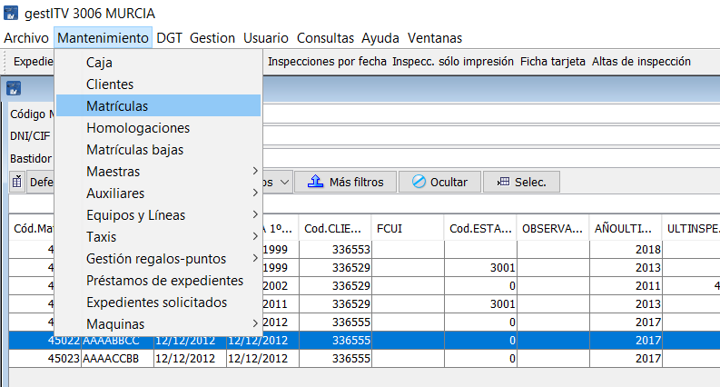
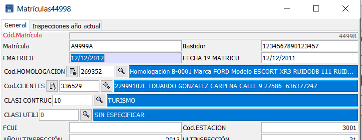

## Cambio de fecha de matriculación de un vehículo

Cuando se introduce la fecha de matriculación incorrectamente, esta queda asociada a la matrícula del vehículo.

Para corregir este problema ocasionado durante el alta de inspección es necesario seguir los siguientes pasos.

Conocer la matrícula o algún dato del titular del vehículo afectado.

Acceder a Menú / Mantenimiento / Matricula.

Introducir matricula o parte de ella en el campo Matricula, o algún dato del titular en los campos específicos y pulsar en el botón Refrescar.

Seleccionar del listado resultante la fila que se desea modificar su fecha de matriculación.

Hacer doble clic sobre la fila seleccionada o pulsar sobre el botón Modificar.

En el formulario que aparece, modificar las fechas de los campos FMATRICU y FECHA 1º MATRICU con las fechas correctas.

<!-- https://github.com/eduardo-cd360/cd360-itv-manual/tree/main/docs/casos-de-uso/varios/cambio-fecha-matriculacion/images/image_1.png -->

Ilustración . Acceder al menú Mantenimiento / Matrículas

<!-- https://github.com/eduardo-cd360/cd360-itv-manual/tree/main/docs/casos-de-uso/varios/cambio-fecha-matriculacion/images/image_2.png -->

Ilustración . Escribir la matricula u otro dato que posibilite encontrar el vehículo.

<!-- https://github.com/eduardo-cd360/cd360-itv-manual/tree/main/docs/casos-de-uso/varios/cambio-fecha-matriculacion/images/image_3.png -->

Ilustración . Editar el registro seleccionado de la tabla de matrículas.

<!-- https://github.com/eduardo-cd360/cd360-itv-manual/tree/main/docs/casos-de-uso/varios/cambio-fecha-matriculacion/images/image_4.png -->

Ilustración . Editar los campos referentes a la fecha de matriculación, FMATRICU y FECHA 1º MATRICU y guardar.