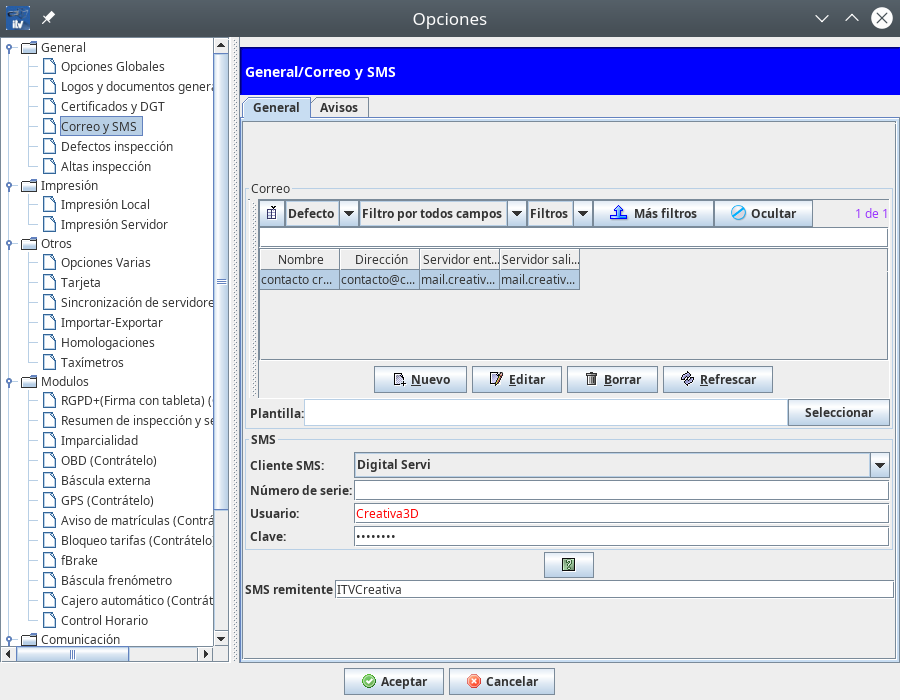
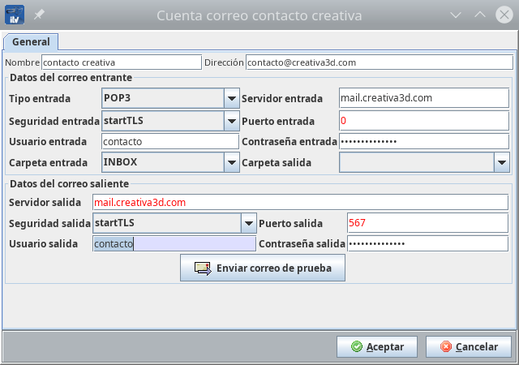
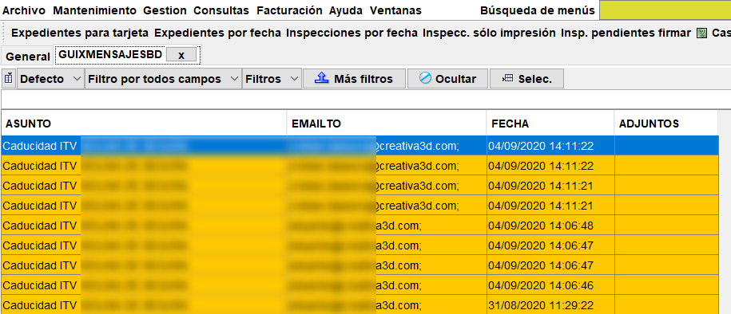

## configuración de correo electrónico

Creativa3D ITV puede manejar correoelectronico para enviar recordatorios, facturas, o comunicarse con los clientes mediante el CRM integrado.

Para poder usar esta función es necesario configurar primero el correo electrónico, y posteriormente emplearlo en las diferentes situaciones que se requiera.

En este documento encontrarás:

Configurar una cuenta de correo electrónico

Consultar y enviar correo de forma genérica

Comunicarse con el cliente por correo electrónico

Enviar recordatorios por correo electrónico

### Configurar una cuenta de correo electrónico

Acceder a la configuración de Correo y SMS

<!-- https://github.com/eduardo-cd360/cd360-itv-manual/tree/main/docs/casos-de-uso/varios/configuracion-correo-electronico/images/image_1.png -->

Pulsar sobre “Nuevo” si no existe ningún correo o “Editar” para modificar la configuración de una cuenta nueva.

<!-- https://github.com/eduardo-cd360/cd360-itv-manual/tree/main/docs/casos-de-uso/varios/configuracion-correo-electronico/images/image_2.png -->

Cumplimentar los campos de correo entrante y saliente si se quiere usar Creativa3D para ver gestionar la cuenta de correo completamente, o solamente el correo saliente, si solo se quiere enviar correos.

Nombre: Nombre del remitente que aparecerá en los correos enviados a los clientes.

Dirección: Es la dirección que aparecerá al cliente como del remitente.

Datos de correo entrante

Tipo entrada:

POP3: El correo se almacena de modo local, en el equipo. Si se usa este tipo de entrada, cada vez que sea recogido el correo por el programa, desaparecerá del servidor y en caso de estar configurada esta cuenta en otros equipos, ya no aparecerá.

IMAP: El correo permanece en el servidor de correo, y se muestran solo los encabezados. En esta modalidad, se consulta el correo en el servidor pero no se descarga. Es la opción recomendada.

Servidor de entrada: El servidor de entrada de correo.

Seguridad entrada: Elegir el tipo de seguridad según la configuración suministrada

Puerto de entrada: Especificar el puerto acorde al tipo de seguridad.

Usuario y contraseña: Introducir los suministrados en la configuración de cuenta.

Carpeta entrada: Si los demás datos suministrados son correctos, se podrá elegir entre una o varias carpetas, de las cuales una de ellas tiene el correo.

Carpeta de salida: es la carpeta donde se quedará una copia  de los correos que envía el programa.

Datos de correo saliente

Servidor de salida: Especificar el nombre del servidor de salida indicado en la configuración suministrada.

Seguridad salida: Elegir el tipo de seguridad que indica la configuración suministrada.

Puerto salida: En base al tipo de seguridad de salida, usar el puerto de la configuración suministrada.

Usuario y contraseña: especificar el usuario y contraseña de la configuración pasada.

Nota.
En el caso de que se produzcan errores con los tipos de seguridad o los puertos, se pueden dejar los valores de los puertos a 0, que es autodetección.

### Consultar y enviar correo de forma genérica

Para recibir y enviar correos de forma genérica se puede comprobar mediante el cliente de correo que incorpora el programa.

<!-- https://github.com/eduardo-cd360/cd360-itv-manual/tree/main/docs/casos-de-uso/varios/configuracion-correo-electronico/images/image_3.png -->

Desde esta pantalla se puede enviar y recibir correo (si el correo entrante se ha configurado)

<!-- https://github.com/eduardo-cd360/cd360-itv-manual/tree/main/docs/casos-de-uso/varios/configuracion-correo-electronico/images/image_4.png -->

Pulsando sobre el botón “Nuevo”, aparece la pantalla de composición de mensajes, en donde se puede redactar como si de cualquier otro gestor de correo electrónico se tratase.

### Comunicarse con el cliente por correo electrónico CRM

Para utilizar las funciones de CRM de Creativa, en especial el correo para comunicarse con los clientes y mantener el registro, se debe acceder a las fichas de cliente.

Primeramente, localizamos al cliente a enviar el correo

<!-- https://github.com/eduardo-cd360/cd360-itv-manual/tree/main/docs/casos-de-uso/varios/configuracion-correo-electronico/images/image_5.png -->

Se puede iniciar el cliente desde el botón “Mail”.

<!-- https://github.com/eduardo-cd360/cd360-itv-manual/tree/main/docs/casos-de-uso/varios/configuracion-correo-electronico/images/image_6.png -->

Y redactar el correo como en cualquier cliente de correo.

<!-- https://github.com/eduardo-cd360/cd360-itv-manual/tree/main/docs/casos-de-uso/varios/configuracion-correo-electronico/images/image_7.png -->

O bien, se puede editar el cliente y acceder al CRM.

<!-- https://github.com/eduardo-cd360/cd360-itv-manual/tree/main/docs/casos-de-uso/varios/configuracion-correo-electronico/images/image_8.png -->

Y tomar notas, enviarle emails, crear tareas relacionadas o incluso asociarle documentos.

Todo quedará asociado a su ficha.