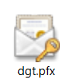

## Consulta de antecedentes en DGT

### Introducción

La consulta de antecedentes de un cliente en la DGT es un proceso normal en el funcionamiento normal de la ITV, y en especial cuando la conexión usada durante el alta de inspección está fallando.

Mediante esta consulta se pueden obtener todos los datos de los antecedentes del titular del vehículo incluido es estado del seguro.

### Configuración del sistema

#### Elementos Necesarios

Para realizar la consulta de antecedentes y demás procesos permitidos en la web de la DGT, es necesario disponer de:

Navegador web: Microsoft Edge o Google Chrome (Firefox no soportado)

Certificado digital de DGT instalado en el equipo que realiza la consulta

La dirección de consulta:

#### instalación del certificado digital

Localiza el fichero del certificado, que tendrá este aspecto, y su clave para poder instalarlo.

<!-- https://github.com/eduardo-cd360/cd360-itv-manual/tree/main/docs/casos-de-uso/varios/consulta-antecedentes-dgt/images/image_1.png -->

Ilustración 1. Certificado digital

Haz doble clic sobre él y selecciona Usuario actual, para que sea instalado únicamente en la cuenta del usuario actual de Windows.

<!-- https://github.com/eduardo-cd360/cd360-itv-manual/tree/main/docs/casos-de-uso/varios/consulta-antecedentes-dgt/images/image_2.png -->

A continuación selecciona el archivo a importar en el sistema. Ya estará seleccionado, por lo que hay que pulsar nuevamente siguiente.

<!-- https://github.com/eduardo-cd360/cd360-itv-manual/tree/main/docs/casos-de-uso/varios/consulta-antecedentes-dgt/images/image_3.png -->

Ahora introduce la clave de este certificado para poder continuar con la instalación.

<!-- https://github.com/eduardo-cd360/cd360-itv-manual/tree/main/docs/casos-de-uso/varios/consulta-antecedentes-dgt/images/image_4.png -->

En la siguiente pantalla deja la opción actual y pulsa siguiente. Es el lugar donde se almacenará el certificado una vez instalado.

<!-- https://github.com/eduardo-cd360/cd360-itv-manual/tree/main/docs/casos-de-uso/varios/consulta-antecedentes-dgt/images/image_5.png -->

Pulsa finalizar en la pantalla resumen que se muestra ahora, y aparecerá un mensaje de confirmación, que informa de que se ha realizado correctamente la instalación.

### Consultar datos en la página de la DGT

Acceder a la dirección  desde un navegador válido.

<!-- https://github.com/eduardo-cd360/cd360-itv-manual/tree/main/docs/casos-de-uso/varios/consulta-antecedentes-dgt/images/image_6.png -->

Al seleccionar una opción de consulta, si es la primera vez se muestra una pantalla adicional.

<!-- https://github.com/eduardo-cd360/cd360-itv-manual/tree/main/docs/casos-de-uso/varios/consulta-antecedentes-dgt/images/image_7.png -->

En ella debes seleccionar el certificado de la DGT de entre los que se muestren, en el caso de tener varios instalados.

A partir de aquí, ya permite realizar las consultas que sean necesarias en este equipo.

<!-- https://github.com/eduardo-cd360/cd360-itv-manual/tree/main/docs/casos-de-uso/varios/consulta-antecedentes-dgt/images/image_8.png -->

Obteniéndose los resultados correctamente.

<!-- https://github.com/eduardo-cd360/cd360-itv-manual/tree/main/docs/casos-de-uso/varios/consulta-antecedentes-dgt/images/image_9.png -->
