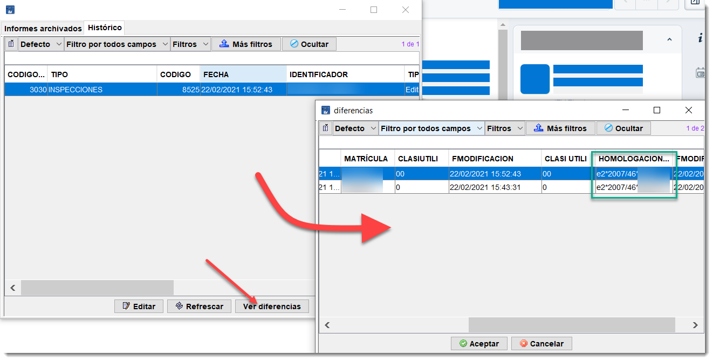

## Consultar histórico de una inspección o motivos de repetición

Para consultar los motivos de repetición de alguna inspección o el histórico completo de esta, ahora es muy fácil.

Basta con señalar la inspección que se desea consultar su histórico y pulsar sobre el botón Informes archivados.

<!-- https://github.com/eduardo-cd360/cd360-itv-manual/tree/main/docs/casos-de-uso/varios/consultar-historico-inspeccion/images/image_1.png -->

Se mostrará junto a las diferentes versiones del informe, una nueva pestaña llamada HISTORICO. Donde se muestran todos los cambios que ha sufrido la inspección.

Cada línea de este histórico supone una modificación de la inspección.

Pulsando sobre uno de los cambios, y a continuación sobre el botón Ver diferencias, se obtienen los elementos que han sido cambiados entre la versión marcada y su anterior estado.
