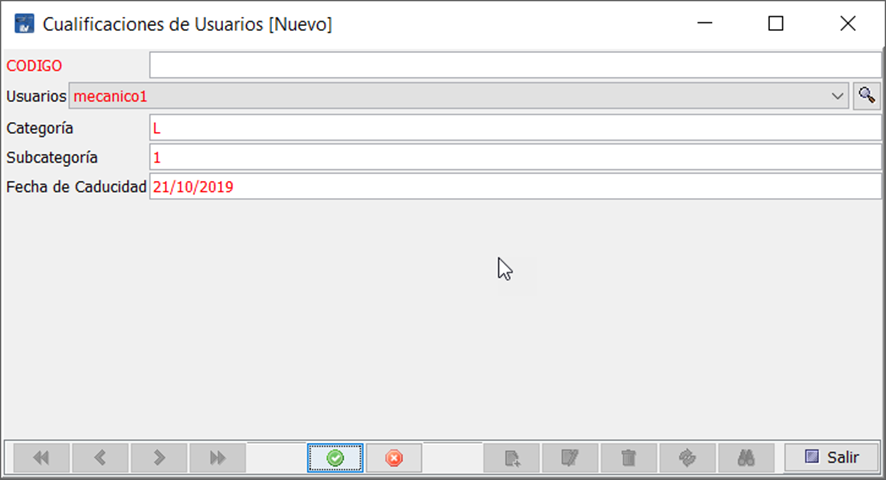
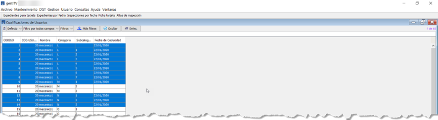

# Sistema de cualificación de inspectores

## Introducción

El sistema de cualificación de inspectores que incorpora Creativa Digital 360 ITV permite a la ITV llevar el control de inspectores y sus cualificaciones, bloqueando a cada inspector la realización de inspecciones de las categorías de las que no tenga una cualificación o no ésta no esté vigente.

Cuando un inspector no está cualificado para realizar una inspección a un vehículo de cierta categoría, tanto en el PC como en la Tablet, recibe un mensaje por pantalla de alerta, indicándole que no está cualificado para la realización de ésta.

Para poder trabajar con esta característica, es necesario dar de alta a todos los inspectores en una tabla de cualificaciones, agregándoles a cada uno de ellos, la categoría y la caducidad de la cualificación.

!!! Nota

    Por defecto, si se agrega un inspector y una categoría, pero no se le asigna una caducidad, tiene permiso para realizar la inspección de esta categoría. Para bloquear la categoría debe tener una fecha de caducidad.

## Alta de inspectores en la tabla de cualificaciones

Para asignar a los inspectores sus correspondientes cualificaciones, se debe acceder a la tabla de cualificación de inspectores, disponible en *`Mantenimiento/Maestras/Cualificación de usuarios`*.

<!-- https://github.com/eduardo-cd360/cd360-itv-manual/tree/main/docs/casos-de-uso/varios/cualificacion-de-inspectores/images/tabla-cualificaciones-de-usuarios.png -->

Desde esta pantalla se pueden realizar las acciones:

- Altas de inspector y categorías de forma manual
- Altas de inspectores y todas las categorías de forma automática
- Asignar caducidades a las diferentes categorías de cada inspector
- Modificar la caducidad

## Alta manual de inspectores y categorias
Para dar de alta un nuevo inspector, pulsa sobre Nuevo, selecciona a que usuario (de tipo inspector) se le asigna una cualificación, categoría y subcategoría y la fecha de caducidad de esta.

<!-- https://github.com/eduardo-cd360/cd360-itv-manual/tree/main/docs/casos-de-uso/varios/cualificacion-de-inspectores/images/formulario-alta-cualificacion-usuario.png -->

Repite este paso para cada una de las categorías que se quieran dar de alta, para cada uno de los inspectores.

ALTA DE FORMA AUTOMÁTICA DE INSPECTORES Y SUS CATEGORIAS
Para realizar de forma automática el alta de varios inspectores y sus categorías, pulsa Añadir categorías.

<!-- https://github.com/eduardo-cd360/cd360-itv-manual/tree/main/docs/casos-de-uso/varios/cualificacion-de-inspectores/images/tabla-de-seleccion-usuarios-cualificacion-automatica.png -->

Selecciona las filas correspondientes a los inspectores y pulsa Aceptar.

<!-- https://github.com/eduardo-cd360/cd360-itv-manual/tree/main/docs/casos-de-uso/varios/cualificacion-de-inspectores/images/tabla-cualificaciones-de-usuario-categorias.png -->

Para finalizar, introducir la fecha de caducidad de las cualificaciones de cada categoría para cada inspector pulsando sobre Actualizar Fecha.

!!! Nota

    Se pueden seleccionar tantas filas como se desee, si tienen la misma fecha de caducidad, ahorrando tiempo en el proceso. Para seleccionar varias filas, May + Clic con el botón izquierdo en cada fila.

Quedando introducidas todas las fechas iguales de una sola vez.

<!-- https://github.com/eduardo-cd360/cd360-itv-manual/tree/main/docs/casos-de-uso/varios/cualificacion-de-inspectores/images/tabla-cualificaciones-actualizacion-fecha.png -->
