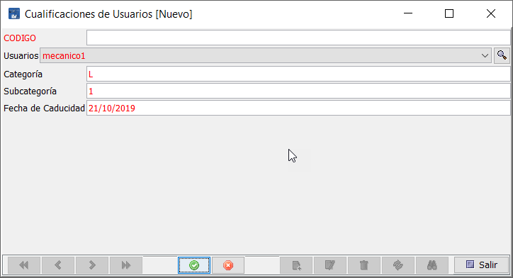
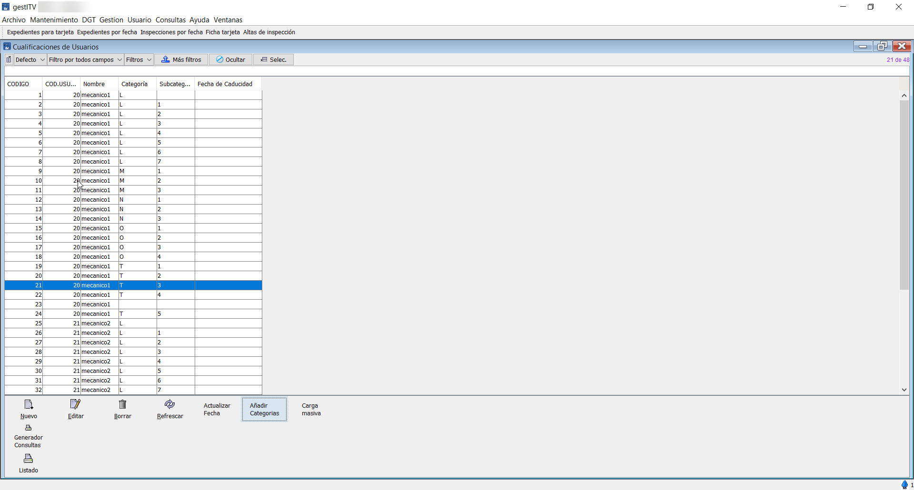
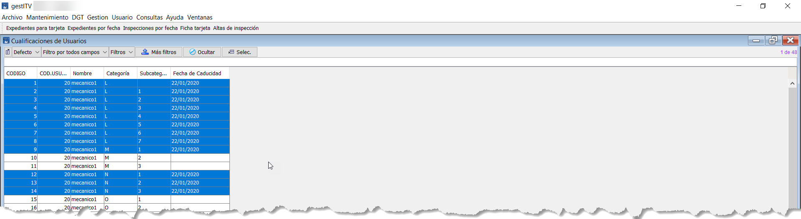
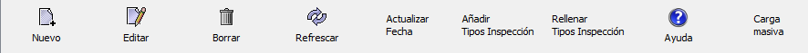
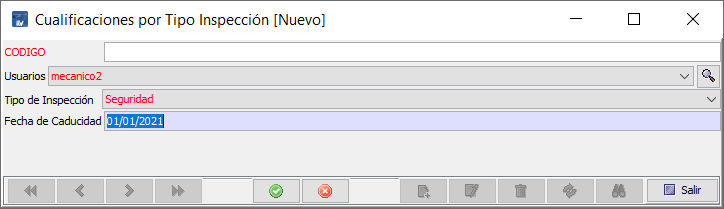
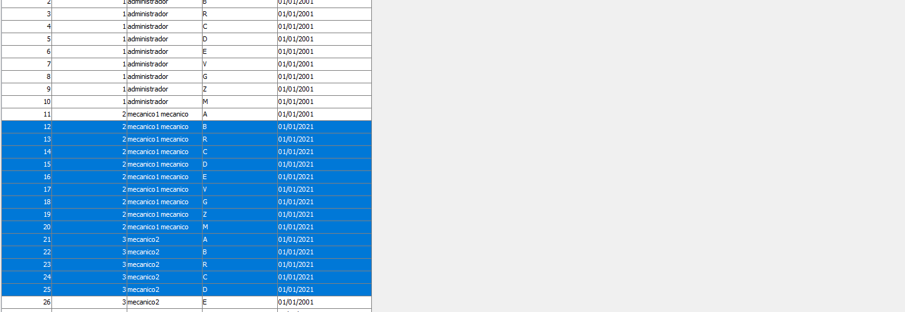

# cualificación de usuarios

### Introducción

El sistema de cualificación de usuarios (inspectores) que incorpora Creativa3D ITV permite a la ITV llevar el control de inspectores y sus cualificaciones, bloqueando a cada inspector la realización de inspecciones de los tipos de inspección y categorías de las que no tenga una cualificación o no esté vigente.

Cuando un inspector no está cualificado para realizar una inspección a un vehículo de cierta categoría, tanto en el PC como en la Tablet, recibe un mensaje por pantalla de alerta, indicándole que no está cualificado para la realización de ésta.

Para poder trabajar con esta característica, se deberán de dar de alta a los inspectores en dos tablas. Las tablas son cualificaciones de usuarios y cualificación por tipo de inspección.

### Cualificaciones de usuarios por categorias

En esta tabla deberán de estar todos los inspectores de la estación. Si no aparece en esta tabla, no estará controlado por el sistema de cualificaciones y podrá realizar inspecciones de todas las categorías.

Para asignar a los inspectores sus correspondientes cualificaciones basadas en categorías, se debe acceder a la tabla de cualificación de inspectores, disponible en Mantenimiento > Maestras > Cualificación de usuarios.

<!-- https://github.com/eduardo-cd360/cd360-itv-manual/tree/main/docs/casos-de-uso/varios/cualificacion-de-usuarios/images/image_1.png -->

<!-- https://github.com/eduardo-cd360/cd360-itv-manual/tree/main/docs/casos-de-uso/varios/cualificacion-de-usuarios/images/image_2.png -->

Desde esta pantalla se pueden realizar las acciones:

Nuevo: Agrega un nuevo registro a la tabla de cualificaciones de usuario.

Editar: Permite modificar un registro de la tabla de cualificaciones existente.

Borrar: Eliminar un registro de la tabla de cualificaciones de usuario.

Refrescar: Actualiza el listado de cualificaciones.

Actualizar Fecha: Permite actualizar la fecha de caducidad de los registros de cualificaciones seleccionados.

Añadir categorías: Permite agregar todas las categorías existentes para cada uno de los usuarios elegidos durante el proceso.

Rellenar categorías: Agrega todas las cualificaciones posibles para todos los usuarios con la fecha solicitada durante el proceso. Este proceso puede tardar tiempo en completarse.

#### Nuevo registro de cualificación de usuario

Para dar de alta una nueva cualificación a un usuario, se pulsa sobre Nuevo y se cumplimentan los campos: Usuario eligiendo uno de la lista, Categoría escribiendo L,M,N,O etc., Subcategoría con valores 1,2,3,etc. y Fecha de caducidad.

<!-- https://github.com/eduardo-cd360/cd360-itv-manual/tree/main/docs/casos-de-uso/varios/cualificacion-de-usuarios/images/image_3.png -->

Repite este paso para cada cualificación de cada categoría y usuario que se quiera añadir.

#### Registro por lotes de inspectores y sus categorias

Para realizar de forma automática el alta de cualificaciones de uno o varios usuario para todas sus categorías se usa el botón Añadir categorías. Al pulsar este botón, se muestra la pantalla con el listado de usuario, donde se puede seleccionar uno o varios registros.

<!-- https://github.com/eduardo-cd360/cd360-itv-manual/tree/main/docs/casos-de-uso/varios/cualificacion-de-usuarios/images/image_4.png -->

Una vez se han seleccionado uno o varios registros de usuario, se pulsa Aceptar.

Para seleccionar varios elementos consecutivos, utiliza Mayus. + Clic en el último elemento a seleccionar. Para seleccionar varios elementos no consecutivos, utiliza Ctrl + Clic en cada uno de los elementos a seleccionar.

<!-- https://github.com/eduardo-cd360/cd360-itv-manual/tree/main/docs/casos-de-uso/varios/cualificacion-de-usuarios/images/image_5.png -->

Para finalizar, introducir la fecha de caducidad de uno o varios registros a la vez usando el botón Actualizar Fecha.

<!-- https://github.com/eduardo-cd360/cd360-itv-manual/tree/main/docs/casos-de-uso/varios/cualificacion-de-usuarios/images/image_6.png -->

Quedando introducidas todas las fechas iguales de una sola vez.

<!-- https://github.com/eduardo-cd360/cd360-itv-manual/tree/main/docs/casos-de-uso/varios/cualificacion-de-usuarios/images/image_7.png -->

### Cualificaciones por tipo de inspección

En esta tabla deberán de estar todos los inspectores de la estación. Si no aparece en esta tabla, no estará controlado por el sistema de cualificaciones y podrá realizar inspecciones de todas las categorías.

<!-- https://github.com/eduardo-cd360/cd360-itv-manual/tree/main/docs/casos-de-uso/varios/cualificacion-de-usuarios/images/image_9.png -->

<!-- https://github.com/eduardo-cd360/cd360-itv-manual/tree/main/docs/casos-de-uso/varios/cualificacion-de-usuarios/images/image_10.png -->

Desde esta pantalla se pueden realizar las acciones:

Nuevo: Agrega un nuevo registro a la tabla de cualificaciones de usuario.

Editar: Permite modificar un registro de la tabla de cualificaciones existente.

Borrar: Eliminar un registro de la tabla de cualificaciones de usuario.

Refrescar: Actualiza el listado de cualificaciones.

Actualizar Fecha: Permite actualizar la fecha de caducidad de los registros de cualificaciones seleccionados.

Añadir Tipos Inspección: Permite agregar todas los tipos de inspección existentes para cada uno de los usuarios elegidos durante el proceso.

Rellenar Tipos Inspección: Especificando la fecha de caducidad, agrega todas las cualificaciones posibles para todos los usuarios. Este proceso puede tardar tiempo en completarse.

#### Nuevo registro de cualificación de usuario por categoria

Para dar de alta una nueva cualificación a un usuario para una categoría concreta, se pulsa sobre Nuevo y se cumplimentan los campos: Usuario eligiendo uno de la lista, Tipo de Inspección seleccionado de la lista también, y Fecha de caducidad.

<!-- https://github.com/eduardo-cd360/cd360-itv-manual/tree/main/docs/casos-de-uso/varios/cualificacion-de-usuarios/images/image_11.png -->

Se pulsa sobre el aspa verde para guardar el registro y a continuación si no se quieren crear más, en Salir.

#### Registro por lotes de cualificaciones por tipo de inspección

Para realizar de forma automática el alta de cualificaciones de uno o varios usuarios para todas los tipos de inspección se usa el botón Añadir Tipos Inspección. Al pulsar este botón, se muestra la pantalla con el listado de usuario, donde se puede seleccionar uno o varios registros.

<!-- https://github.com/eduardo-cd360/cd360-itv-manual/tree/main/docs/casos-de-uso/varios/cualificacion-de-usuarios/images/image_12.png -->

Una vez se han seleccionado uno o varios registros de usuario, se pulsa Aceptar.

Para seleccionar varios elementos consecutivos, utiliza Mayus. + Clic en el último elemento a seleccionar. Para seleccionar varios elementos no consecutivos, utiliza Ctrl + Clic en cada uno de los elementos a seleccionar.

<!-- https://github.com/eduardo-cd360/cd360-itv-manual/tree/main/docs/casos-de-uso/varios/cualificacion-de-usuarios/images/image_13.png -->

Para finalizar, introducir la fecha de caducidad de uno o varios registros a la vez usando el botón Actualizar Fecha.

<!-- https://github.com/eduardo-cd360/cd360-itv-manual/tree/main/docs/casos-de-uso/varios/cualificacion-de-usuarios/images/image_14.png -->

Se pueden seleccionar tantas filas como se desee, si tienen la misma fecha de caducidad, ahorrando tiempo en el proceso. Para seleccionar varias filas, May + Clic con el botón izquierdo en cada fila.

Quedando introducidas todas las fechas iguales de una sola vez.

<!-- https://github.com/eduardo-cd360/cd360-itv-manual/tree/main/docs/casos-de-uso/varios/cualificacion-de-usuarios/images/image_15.png -->
