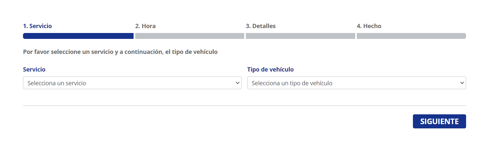
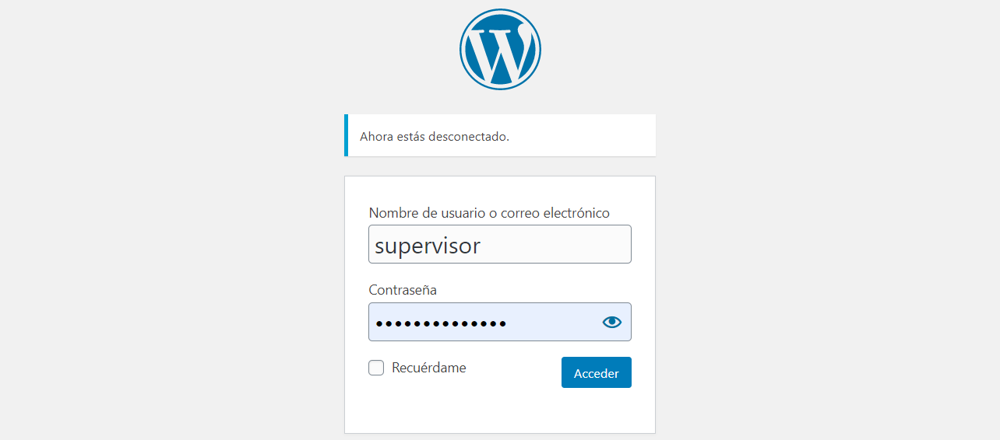
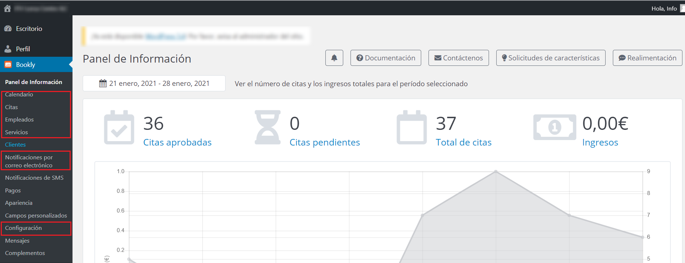
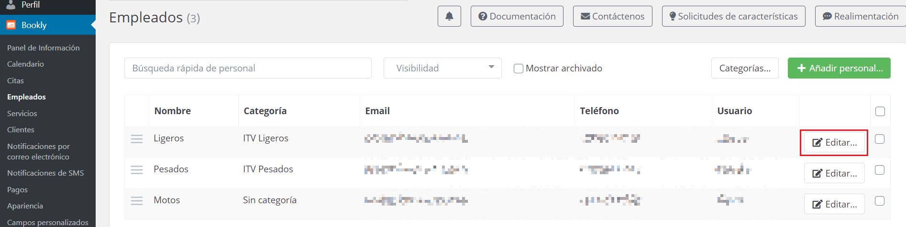
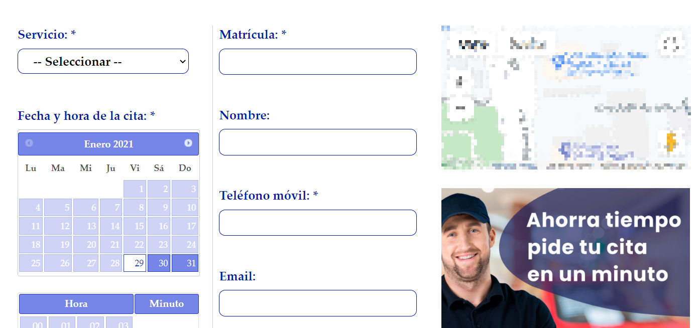

## Gestión de citas previas

Desde nuestro software de gestión CREATIVA3D ITV, se puede gestionar la cita previa de tres formas o mediante tres métodos:

Manual

Cita previa CREATIVA

Cita Previa DigitalServi

### Gestión de citas previas manuales

Este tipo de cita previa, se utiliza cuando no se dispone de integración entre el sistema de citas WEB y nuestra aplicación y las citas se toman de forma externa (web no vinculada, Excel, etc..).

Para asignar una cita previa a una inspección, se procede de la siguiente forma:

En la pantalla de altas de inspección, marcar la casilla Cita Previa?.

<!-- https://github.com/eduardo-cd360/cd360-itv-manual/tree/main/docs/casos-de-uso/varios/gestion-citas-previas/images/image_1.png -->

### Gestión de citas previas con CREATIVA3D

Cuando se tienen las citas contratadas (mediante un módulo) con nosotros, el cliente ve un portal similar al siguiente:

<!-- https://github.com/eduardo-cd360/cd360-itv-manual/tree/main/docs/casos-de-uso/varios/gestion-citas-previas/images/image_2.png -->

#### Inspección con cita previa online

Si el cliente coge una cita previa desde la web, en el programa queda asignada al vehículo mediante la matrícula, de forma que al dar de alta la inspección, se comprueba la matrícula y si tiene cita, se marca automáticamente la opción y aparece la fecha y hora de esta.

<!-- https://github.com/eduardo-cd360/cd360-itv-manual/tree/main/docs/casos-de-uso/varios/gestion-citas-previas/images/image_3.png -->

En el caso de no disponer de cita, acceder a la sección de citas previas de la web de la estación y crear una nueva cita, siguiendo los pasos del asistente y cumplimentando todos los campos necesarios. Si no fuese posible crearla de forma online, seguir el .

#### Obtener listado de citas previas para una fecha o un rango de fechas

Para obtener un listado por pantalla o para imprimir de todas las citas previas que los clientes han registrado mediante la web, acceder al menú:

En el asistente dejar la fecha que hay para el listado del día actual, o elegir un rango si se quiere obtener para varios días.

<!-- https://github.com/eduardo-cd360/cd360-itv-manual/tree/main/docs/casos-de-uso/varios/gestion-citas-previas/images/image_4.png -->

Consultar o imprimir el listado de citas previas

<!-- https://github.com/eduardo-cd360/cd360-itv-manual/tree/main/docs/casos-de-uso/varios/gestion-citas-previas/images/image_5.png -->

#### Acceder al panel de gestión WEB de las citas

Para acceder al panel de control o gestión del sistema de reservas web de CREATIVA3D, debes visitar el siguiente enlace:

Debes autentificarte con el usuario y contraseña suministrados por CREATIVA3D en la ventana de autenticación:

<!-- https://github.com/eduardo-cd360/cd360-itv-manual/tree/main/docs/casos-de-uso/varios/gestion-citas-previas/images/image_6.png -->

Se accede al portal de usuario para la gestión del sistema de citas previas.

<!-- https://github.com/eduardo-cd360/cd360-itv-manual/tree/main/docs/casos-de-uso/varios/gestion-citas-previas/images/image_7.png -->

Nota.
Si no se dispone de usuario y contraseña para realizar gestiones en el panel de cita previa online (solo si se tiene la Cita previa contratada con nosotros), nos lo podéis solicitar por email a , indicándonos, un nombre de usuario, un correo electrónico, el nº de estación y una persona de contacto.

<!-- https://github.com/eduardo-cd360/cd360-itv-manual/tree/main/docs/casos-de-uso/varios/gestion-citas-previas/images/image_8.png -->

#### Modificación de días hábiles

Accede a configuración / feriados

<!-- https://github.com/eduardo-cd360/cd360-itv-manual/tree/main/docs/casos-de-uso/varios/gestion-citas-previas/images/image_9.png -->

Actuar sobre el día deseado o rango de días y seleccionar si es solo una vez o se repite todos los años.

<!-- https://github.com/eduardo-cd360/cd360-itv-manual/tree/main/docs/casos-de-uso/varios/gestion-citas-previas/images/image_10.png -->

Los días marcados, no aparecerán en el calendario de selección de citas del cliente.

#### Módificación de horarios

Para modificar el horario de reservas, se debe acceder al menú Bookly / Empleados (Los empleados son Servicios principales), pulsando sobre Editar del “Empleado” o Servicio principal a modificar.

<!-- https://github.com/eduardo-cd360/cd360-itv-manual/tree/main/docs/casos-de-uso/varios/gestion-citas-previas/images/image_11.png -->

En la pestaña “Programar”, alterar el horario disponible para cada día de la semana.

<!-- https://github.com/eduardo-cd360/cd360-itv-manual/tree/main/docs/casos-de-uso/varios/gestion-citas-previas/images/image_12.png -->

Si la estación hace una pausa al medio día o se quiere crear una franja entre medias en la que no haya reservas, se especifica aquí como descanso.

En la pestaña “Días libres”, se muestra el calendario aplicable a este “Empleado” o Servicio principal, donde se puede añadir o quitar solo para este algún día.

Los elementos que no se explican en este documento, no deben modificarse sin consultar antes con Creativa.

#### Modificar duración de cada servicio de reserva

Para aumentar o disminuir la duración de las reservas y por lo tanto modificar la capacidad de reservas del calendario, se debe acceder a Bookly / Servicios.

<!-- https://github.com/eduardo-cd360/cd360-itv-manual/tree/main/docs/casos-de-uso/varios/gestion-citas-previas/images/image_13.png -->

Cada servicio, en la pestaña “Hora”, entre sus propiedades tiene la duración de la reserva, y la frecuencia con la que se puede elegir en el calendario.

<!-- https://github.com/eduardo-cd360/cd360-itv-manual/tree/main/docs/casos-de-uso/varios/gestion-citas-previas/images/image_14.png -->

Duración: Establece el espacio de tiempo que va a ocupar en el calendario cada una de las citas que solicite el cliente.

Longitud del intervalo de tiempo: Establece cada cuanto tiempo se puede solicitar una reserva dentro de cada hora mostrada en el calendario. Por ejemplo, seleccionando 10min. La reserva se muestra disponible cada 10 min, pero si es reservada, bloqueará todo el tiempo que esté configurado en Duración (en el ejemplo, también 10 min.).

Para aumentar la cantidad de reservas disponibles, se debe modificar reduciendo la duración de la cita, y si es necesario la de la longitud del intervalo, reducirla.

### Gestión de citas previas con DigitalServi (DigitalJob)

Si se dispone de este servicio de citas previas, en la web del cliente el aspecto que muestra el calendario es el siguiente:

<!-- https://github.com/eduardo-cd360/cd360-itv-manual/tree/main/docs/casos-de-uso/varios/gestion-citas-previas/images/image_15.png -->

#### Inspección con cita previa online

Si el cliente coge una cita previa desde la web, en el programa queda asignada al vehículo mediante la matrícula, de forma que al dar de alta la inspección, se comprueba la matrícula y si tiene cita, se marca automáticamente la opción y aparece la fecha y hora de esta.

<!-- https://github.com/eduardo-cd360/cd360-itv-manual/tree/main/docs/casos-de-uso/varios/gestion-citas-previas/images/image_16.png -->

En el caso de no disponer de cita, acceder a la sección de citas previas de la web de la estación y crear una nueva cita, siguiendo los pasos del asistente y cumplimentando todos los campos necesarios. Si no fuese posible crearla de forma online, seguir el .

#### Obtener listado de citas previas para una fecha o un rango de fechas

Para obtener un listado por pantalla o para imprimir de todas las citas previas que los clientes han registrado mediante la web, acceder al menú:

En el asistente dejar la fecha que hay para el listado del día actual, o elegir un rango si se quiere obtener para varios días.

<!-- https://github.com/eduardo-cd360/cd360-itv-manual/tree/main/docs/casos-de-uso/varios/gestion-citas-previas/images/image_17.png -->

Consultar o imprimir el listado de citas previas

<!-- https://github.com/eduardo-cd360/cd360-itv-manual/tree/main/docs/casos-de-uso/varios/gestion-citas-previas/images/image_18.png -->

#### Modificaciones de horarios, días hábiles, etc

Al tratarse de un panel de control gestionado por DigitalServi, se debe poner en contacto con ellos si no dispone información al respecto sobre estos procedimientos.