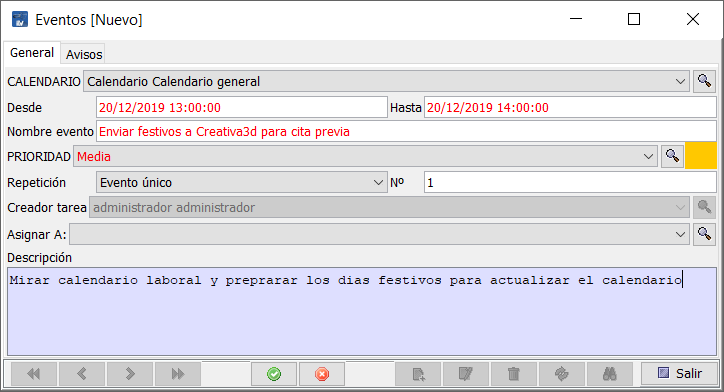

## Gestión de tareas

La gestión de tareas está disponible al iniciar la aplicación, como una ventana flotante, donde se muestran las diferentes tareas activas o realizadas.

Ilustración 1 - Lista de eventos de tarea

En caso de que se cierre la ventana de tareas, siempre se puede volver a mostrar mediante el menú Gestión > Tareas.

Este sistema permite:

Crear una tarea

Asignar una tarea

Crear diferentes avisos para esa tarea

Marcar la tarea como completada

### Crear una tarea

Situado en la ventana de Tareas, pulsar sobre el botón +Nuevo y cumplimentar los campos que aparecen.

Ilustración 2 - Crear evento nuevo

Primero se cumplimentan los datos de la pestaña General

Elegir entre que fechas estará vigente la tarea

Dar nombre al evento

Asignar prioridad entre Baja, Media y Urgente. Cada prioridad tiene un color asignado.

Elegir el tipo de repetición entre Evento único, semanal, mensual y anual. Implica que en Nº haya un número superior a 1. Se crearan tantos eventos como indiquemos, con el intervalo elegido a partir de la fecha Desde.

Creador de la tarea, es el usuario que la ha creado, estando todos los usuarios del sistema listados.

Asignar a, permite referenciar a quien pertenece la tarea que se está creando.

Descripción permite escribir otros datos necesarios para poder completar la tarea asignada en el evento.

A continuación tras guardar se añaden Avisos si es necesario.

Ilustración 3 - Pantalla de avisos del evento

Se pulsa sobre Nuevo o Editar si se quiere modificar uno existente.

Ilustración 4 - Nuevo aviso

Se establece la fecha y hora del aviso y si se desea que se muestre el aviso en pantalla. Cuando se haya mostrado el aviso, estará marcada la casilla ¿Avisado?.

### Completar la tarea

Cuando se ha realizado la tarea, se accede a ella haciendo doble clic sobre el evento y se marca la casilla completado.

Ilustración 5 - Marcar tarea como terminada