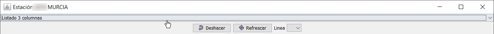
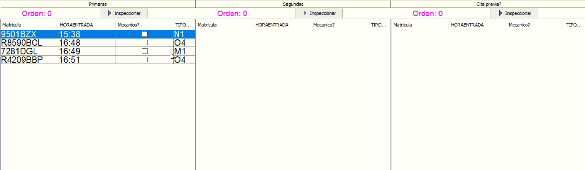

# uso de la lista de vehiculos a inspeccionar

## Introducción

La opción presente en el menú de Creativa3D ITV, Gestión / Lista de vehículos a inspeccionar, es una pantalla de información sobre el estado actual en el que se encuentran los vehículos que han realizado el pago en caja.

Está dividida en varias columnas, que se pueden ver con mayor o menos información según la vista que se elija de entre las tres disponibles: 3 columnas, 2 columnas y listado completo.

Ilustración 1. Vista 3 columnas

En el uso de esta pantalla con información relativa a las inspecciones pendientes, intervienen en su buen funcionamiento el cajero, que da de alta las inspecciones y el inspector, usando la información que ve en esta pantalla para gestionar la cola de vehículos según su criterio.

A continuación, se explican los procesos que deben seguir cada uno de las personas intervinientes en este proceso.

## PROCESO DEL CAJERO EN ADMISIÓN

EL cajero, que da de alta una inspección, debe prestar atención a los siguientes elementos durante el proceso de alta.

Nº Orden

Cita Previa

¿Mecánico?

### Nº Orden

El nº de orden de la inspección se muestra en la pantalla de listado de vehículos a inspeccionar, por lo que hay que verificar que el orden que se indica sea el correcto.

Verificar que el nº de orden es el correcto (sobre todo si se hacen 2º inspecciones de vehículos rechazados en otras estaciones de ITV).

### Cita Previa

El campo de cita previa, se marcar de forma automática si la matrícula del vehículo coincide con la matrícula que el cliente ingresó en la web de cita previa.

En el caso de que la cita no este correcta, verificar si debe estar o no marcado, a que los inspectores pueden ver en el listado que vehículos disponen de cita previa y a qué hora la tenían.

### ¿Mecanico?

Si el cliente es un taller, se dispone de la casilla ¿Mecánico? en la pantalla de alta de inspección. Para que los inspectores pueden diferenciar los vehículos que son de un taller de los que no lo son, debe marcarse esta casilla.

Ilustración 2. Opción a marcar si es un taller

## Proceso para el inspector

El inspector, mediante una de las vistas disponibles en la pantalla del listado de vehículos a inspeccionar, puede observar la información relativa a cada vehículo.

Ilustración 3. Selector de vista

Según la vista elegida, en cada sección se mostrará el listado de vehículos correspondiente, que entre otras columnas, muestra la fecha y hora de la cita previa y si el vehículo lo trae un taller (mecánico).

Ilustración 4. Vista 3 columnas

Ilustración 5. Vista 2 Columnas

Ilustración 6.Vista completa