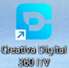

# Iniciar sesión y cambiar contraseña

La primera pantalla que se muestra cuando se ejecuta la aplicación Creativa Digital 360 ITV es la de inicio de sesión.

Cada usuario de creativa digital 360 ITV dispone de un usuario y una contraseña preestablecidas.

!!! Nota
    
    En la versión demo, los usuarios no tienen contraseña.

Es recomendable realizar el cambio de contraseña por una más segura y que no sea conocida más que por el usuario al que pertenece.

## Iniciar sesión

Para iniciar Creativa Digital 360 ITV , haga clic en el acceso directo del programa 

o en el menú Inicio escriba "Creativa Digital" o "360" en el campo de búsqueda. Aparecerá el icono de creativa.

## Cambio de la contraseña

Debes cambiar tu contraseña cuando creas que haya sido compartida, la tengas demasiado tiempo o desees tener otra diferente por cualquier motivo.

Desde la pantalla de autenticación de usuario se puede cambiar la contraseña. Utiliza el botón *`Cambiar`* que hay justo a continuación del campo de introducción de la contraseña.

Para cambiar tu contraseña, selecciona previamente tu usuario del listado e introduce la contraseña actual y pulsa *`Cambiar`*.

!!! Nota    

    La contraseña debe contener 6 o más caracteres y solamente letras (A-Z a-z) o números.

