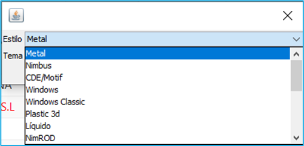
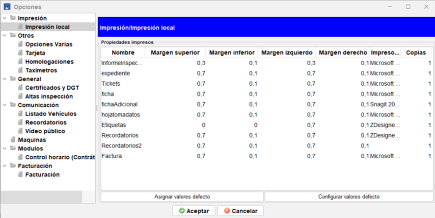

# Menú Archivo

En este menú podrás encontrar las siguientes opciones:

- **Salir:** La forma elegante de salir del programa, además de la X.
- **Estilo:** Opciones para cambiar el aspecto del programa
- **Login:** Opciones para abrir una nueva instancia del programa o cambiar de usuario sin salir (preferimos cerrar y abrir de nuevo el programa para cambiar de usuario).
- **Base Datos:** Opciones de utilidad para los usuarios más expertos. Uso por administradores.
- **Seguridad:** Configuración de perfiles de usuario, usuarios y los permisos relacionados con las distintas partes de la aplicación. Visible solo para administradores
- **Opciones locales:** Opciones de configuración y personalización para el equipo donde se ejecuta el programa. Son opciones para el usuario.
- **Opciones:** Opciones de configuración y personalización general para la estación. Son opciones para el servidor y el comportamiento general de la estación.
- **Diseño informes:** Opciones para retocar algunas plantillas de documentos.
- **Posiciones tarjetas:** Opciones para gestionar la posición de los diferentes campos de las tarjetas de ITV (reformas, duplicados, matriculaciones) antiguas a la hora de imprimirlas. Se trata de una opción local, es decir, afecta solo al equipo en el que se modifican los valores.

## Salir

Cierra la aplicación.
En el caso de que se esté ejecutando algún servicio, mostrará un aviso antes de continuar con el cierre.

!!! note "Nota"
    Los servicios que pueden impedir el cierre de la aplicación son:

    - Control horario
    - Maquinas
    - Panel de avisos

## Estilo

Al seleccionar esta opción del menú Archivo, se muestra una ventana que permite cambiar el aspecto de la aplicación.

Seleccionando un estilo cambia el aspecto en general. Los temas son variaciones como cambios de color disponibles solo en algún estilo.

!!! note "Nota"
    En algunos casos es necesario reiniciar la aplicación para que los cambios de tema o estilo surtan efecto.

## Login

Realiza un nuevo inicio de sesión o Login en la aplicación sin cerrar la sesión actual.
Aunque está permitido, es preferible cerrar la aplicación y abrir con nuevo usuario. Manteniendo en todo momento al usuario actual como único usuario.

!!! note "Nota"
    La aplicación al realizar operaciones de alta y cobro, asigna al usuario actual a dichas operaciones. Tener más de un usuario a la vez puede tener consecuencias inesperadas al realizar un arqueo de caja.

## Base Datos (administradores)

Contiene opciones para realizar operaciones de mantenimiento con la base de datos del programa.

- Configurar conexión BD
- Actualizar estructura y datos

### Config. Conexión BD (Configurar conexión a Base de Datos)

Muestra un listado de conexiones con servidores de Creativa Digital 360 ITV.

Desde este menú se puede crear una nueva conexión con el servidor de Creativa, modificar una existente o eliminar conexiones.

El programa de gestión cliente de Creativa necesita de al menos una conexión para funcionar. Esta conexión puede ser a una DEMO, la estación de ITV u otras estaciones de ITV dentro de un grupo o empresa.

Elementos de la pantalla de conexiones

- Filtro
- Listado de conexiones
- Botones
  - **Nuevo**: Añade una nueva conexión.
  - **Editar**: Edita una conexión existente del listado.
  - **Borrar**: Elimina una o varias conexiones seleccionadas del listado.
  - **Refrescar**: Actualiza la tabla de conexiones.
  - **Probar**: realiza un test de la conexión con los parámetros guardados.
  - **Local** automático: Estando el equipo dentro de la red local, busca al servidor y crea automáticamente la conexión. Por defecto llama a la conexión Server.

!!! Nota

    El uso de varias conexiones permite conectarse además de la estación, por ejemplo, al entorno de pruebas de Creativa Digital 360 y realizar inspecciones de prueba.

**Añadir una conexión**

Para añadir una nueva conexión pulsa el botón Nuevo. Se abre el formulario que se ve en la imagen siguiente.

Proporciona los siguientes datos:

- **Nombre de la conexión**: Nombre que se da a la conexión que se está creando.
- **Base de datos**: Tipo de conexión de BB.DD (por defecto Internet Comprimido).
- **URL**: Dirección del servidor de BBDD de la estación de ITV.
- **Token**: Palabra o código para autorizar la conexión. Solicítala si no la conoces.

Una vez creada la conexión, cierra el programa y ábrelo nuevamente para verla en el listado de conexiones.

**Editar conexión**

Selecciona una conexión del listado y pulsa el botón Editar, se mostrará la ventana con la información sobre la conexión seleccionada.
 

A continuación, modifica los datos a tu gusto o según indicaciones y pulsa sobre Aceptar para guardar los cambios.

**Crear conexión de forma automática**

Utiliza el botón llamado Local automático para crear una conexión al servidor de la estación.

Se mostrará una ventana preguntándote si deseas hacerlo.

 

Responde Si y espera a que termine.

Si todo ha ido bien, se habrá creado una nueva conexión, pero si por el contrario, no se ha podido localizar al servidor de la ITV, un mensaje alertará de ello.
 

En este caso, solicita los datos de conexión o pide ayuda.

<!-- TODO: Enlace a casos de uso ==> Añadir conexión a demo creativa para practicar
. -->
### Actualizar estructura y datos (administradores e ingenieros)

En determinadas ocasiones, cuando ha habido una actualización, es necesario usar esta opción para que funciones nuevas estén disponibles (seguir instrucciones de Creativa) o se actualicen las tablas comunes (solo si son mantenidas por creativa digital).

<!-- TODO: Poner opción de menú que lleva al check de tablas comunes -->

!!! Nota

    Se pueden marcar si se actualizan o no las tablas comunes de forma automática configurándolo en Archivo > Opciones > Importar / Exportar. Opción [  ] Actualizar tablas comunes al actualizar estructura.

    Las tablas comunes, si se decide no actualizarlas con creativa, deberán ser mantenidas por la propia estación.

### Seguridad (administradores)

El menú seguridad permite gestionar usuarios, perfiles y permisos que permitiendo dar de alta nuevos usuarios, asignarles perfiles y modificar el acceso a los menús y botones de las diferentes pantallas.

También contiene otras propiedades extendidas de los usuarios.

!!! Nota

    Ciertos elementos que forman también parte de los usuarios se pueden encontrar en el menú Mantenimiento > Gestión de usuarios > Propiedades de usuario, como firmas electrónicas, permisos para usarlas, etc..

#### Perfiles

Los perfiles son un conjunto de permisos y características que pueden asignarse a un conjunto de usuarios, de forma que todos los usuarios implicados, tengan los mismos permisos.

La modificación de los diferentes permisos de un perfil afectará a cada usuario que pertenezca a él.

 
Cuando se selecciona un perfil, este tiene unas propiedades generales como su código, su nombre y un listado de usuarios que están asignados a este perfil.

Además, dispone de una pestaña de permisos que permiten modificar a que zonas del programa o que acciones puede realizar cualquier usuario que herede de este perfil. 

#### Usuarios

Los usuarios son las cuentas con las que se identifican los trabajadores de la estación en el sistema. Por norma general cada trabajador dispondrá de una cuenta de usuario.

Cada cuenta de usuario tendrá un perfil asignado que asignará los permisos preestablecidos por este como si de una plantilla se tratase.

Además, puede contener otros datos o atributos que son usados en diferentes zonas de la aplicación o mostrarse en documentos.

 
!!! Nota

    Existe una gestión de usuarios para cuestiones de firma, imparcialidad y otras gestiones. Puedes saber más accediendo a Gestión de Usuarios.

#### Permisos

Los permisos son opciones que habilitan o deshabilitan el acceso del usuario a ciertas opciones de menú, ciertas opciones o botones de pantallas o también de ciertas funcionalidades.

Si a un usuario que tiene asignado un cierto perfil, se le modifican los permisos, estos prevalecerán sobre los del perfil.

| Permiso | Descripción |
|---------|-------------|
| Ficha Jform principal | Permisos de acceso a los menús del programa |
| Listado Clientes | Botones disponibles en la pantalla de Clientes |
| Listado Cuentas contables | Botones disponibles en la pantalla la pantalla Cuentas Contables |
| Listado Cuentas de cobros | Botones disponibles en la pantalla de Cuentas de Cobros |
| Listado Expedientes Archivos | Botones disponibles en la pantalla Expedientes Archivos |
| Listado FACTDOCUMENTOS | Botones disponibles en la pantalla de Facturas |
| Listado Inspecciones | Botones disponibles en la pantalla de Inspecciones por fecha |
| Listado Inspecciones Atributos | Botones disponibles en la pantalla de Atributos de una inspección Editada |
| Listado Inspmediciones | Botones disponibles en la pantalla de mediciones de una inspección editada |
| Listado Matriculas | Botones disponibles en la pantalla de Matrículas |
| Listado Prestamos de expedientes | Botones disponibles en la pantalla de Prestamos de expedientes |
| Permisos base | Permisos relacionados con el usuario (generalmente inspector) y acciones disponibles en la Tablet |
| Permisos por fase | Permisos especiales para controlar que fases puede ver o usar un inspector en su tablet. Trabaja con la tabla de Fases de líneas |

#### Otros atributos

Bajo la sección o pestaña de atributos se encuentran otras propiedades del usuario que son empleadas por ejemplo en la impresión del informe o la etiqueta, para que aparezca alguna referencia relacionada con él, o bien para guardar otra información relaciona con el usuario, como por ejemplo la disposición de la pantalla de “panel de control” y los elementos que en ella se encuentran.

### Opciones locales (opciones de usuario)
Esta opción de menú muestra el panel de configuración del programa para el usuario. Estas configuraciones son locales y solo afectan al equipo y a todos los usuarios que lo utilicen en él.

!!! Nota "Tip avanzado"

    Si vas a cambiar de equipo o te van a actualizar o formatear el equipo, pue-des conservar las configuraciones y las personalizaciones de los filtros de las diferentes pantallas guardando los ficheros ConfigurationParameters.xml y ConfigurationLongITVReformas.xml que se encuentran en la carpeta de la aplicación de creativa, situada en *C:\Users\[tu-usuario]\listDatos*. Copiando los archivos en el mismo lugar en el equipo nuevo o restaurado, volverás a tener la misma configuración.

#### Impresión

Opciones de configuración de impresoras que se utilizarán para cada tipo de documento usado en el programa y los márgenes y números de copias.

**Impresión local/Propiedades impresora**

Para cada tipo de documento se dispone de los siguientes ajustes:

- **Nombre**: Tipo de documento impreso.
- **Margen superior, inferior, izquierdo, derecho**: Ajuste del documento a la hoja contenedora. En el caso de hojas pre-impresas, permite el ajuste del contenido al hueco disponible para que encaje todo. Medidas en centímetros.
- **Impresora**: La impresora por la que será impreso el documento. El listado se ob-tiene del listado de impresoras de Windows. Si no se elige ninguna impresora o la que había elegida no está disponible, el programa imprimirá por la que Windows tenga por defecto en ese momento.
- **Nº Copias**: copias que se imprimirán por cada impresión que se ordene en el programa. Útil por ejemplo en los tickets o facturas o imprimir dos copias del informe que envía el inspector.

**Asignar valores por defecto**: Establece los valores configurados por defecto en las columnas de márgenes para uno o más registros seleccionados.

**Configurar valores defecto**: Permite establecer el valor para cada uno de los cuatro márgenes.

#### Otros

##### Opciones varias

###### Formato de pantalla

Permite seleccionar el tipo de pantalla o dispositivo donde se está ejecutando la aplicación, con el fin de adaptar el tamaño de la letra para que sea más fácil leerlo en pantallas de alta resolución.

###### Desactivar mensajes emergentes

Oculta los mensajes que aparecen cuando sucede algo en el programa. Un error, un archivo recibido al anotar una inspección en la DGT, etc.

##### Tarjeta

Las tarjetas de ITV contienen una serie de logos y textos que pueden configurarse dependiendo de si se han adquirido pre-impresas en su totalidad, solo con la cuadricula o vacías.

- Comunidad autónoma: Texto a rellenar con el nombre de la comunidad.
- Consejeria1, Consejeria2: Campos para escribir el nombre de la consejería completo. Se dejarán vacíos si la ficha o el logo ya los incluye.
- Desactivar logo fichas: En caso de que las fichas ya incluyan el gráfico, logo de la comunidad o elemento gráfico, se desmarca para que no se imprima con el que se ha especificado en la sección Logos y Documentos del menú de Opciones globales.
- Tarjetas con nombres de campos: Se marcará si la tarjeta tiene los nombres de los campos pre-impresos. Estando marcado, no se imprimirán al imprimir los datos de esta y se usarán los que ya vienen impresos.

##### Homologaciones

Permite establecer una conexión con el sistema de fichas reducidas incorporado en Creativa Digital 360 ITV.

Si está disponible, se rellenará con los datos provistos por Creativa con respecto a la estación.

##### Taxímetros

Opciones relativas a la inspección de taxímetros.

!!! Nota

    Esta opción solo tiene aplicación en la Comunidad Valenciana.

  
#### General

#### Altas inspección

Permite modificar eventos que se producen durante el alta de una inspección.

**General**

En cada equipo, se podrán activar o desactivar las siguientes opciones

- **Ver detalle factura:** Al imprimirse la factura (de forma manual o automática), se desglosan los conceptos. Si no se marca, solo incluirá un detalle mínimo.
- **Si la inspección está en vigor cerrar automáticamente:** <!-- TODO: Para que sirve?? -->
- **No presentar pantalla de anulación y otros avisos al empezar la inspección:** No muestra una pantalla de aviso con alternativas para evitar errores que provoquen la sobre-escritura de una inspección.

**Impresión**

- **Imprimir factura al dar de alta:** Marcado siempre emite la factura de forma automática. Si está configurada en Impresión local, se imprime por la impresora, pero si no está configurada saldrá por pantalla.
- **Imprimir expediente al dar de alta:** Imprime de forma automática la solicitud de expediente. Si no se marca, preguntará si se imprime.
- **Imprimir inspección al dar de alta:** En casos concretos es necesario que se imprima el informe vacío al cobrar la inspección.

**Listas cuando hay mas de uno**

- **Presentar CP:** Muestra al introducir el Código postal durante el alta una lista de poblaciones que comparten el mismo. Si no se marca, se elige el primero de la lista, teniendo que corregirlo si es distinto.
- **Presentar titulares:** Sin un NIF los titulares pueden estar repetidos. Marcada esta opción muestra la lista de los coincidentes. (Es una opción que no tiene utilidad en estaciones nuevas porque siempre se recoge el DNI/NIF).
- **Presentar homologaciones:** Si la homologación está compartida con varios modelos / series de coche se muestra la lista para elegir.

**Etiquetas**
- **Mostrar etiquetas en alta:** El listado de etiquetas (ver Uso de etiquetas) se muestra en la pantalla de altas para seleccionar un valor de los disponibles.
- **Etiqueta obligatoria:** La inspección no se puede dar de alta si no se elige una etiqueta de la lista..
- **Mantener valor entre inspecciones:** El valor de la etiqueta seleccionada en la última inspección se mantiene para la siguiente.

!!! Nota
    
    Las dos opciones últimas son usadas generalmente por las ITV's móviles para etiquetar ubicaciones.

**Avisos opcionales**

- **Mensaje aviso si no hay motor**: Muestra una alerta al guardar la inspección porque no se ha puesto un tipo de motor. Esto provocaría un error al aplicar la tarifa si no se corrige.
- **Mensaje aviso en voluntarias**: 
- **Aviso si no hay telf. o email en cliente**: Muestra alerta por haber dejado sin rellenar alguno de los campos indicados. Indica que no se podrá contactar con el cliente de ninguna forma si no se rellena al menos uno de los campos.

- **Dias a fecha caducidad AVISO**: Muestra alerta de que aún faltan más de x días para pasar la ITV nuevamente. Los días se toman de la consulta realizada a la DGT previamente.
- **Numero inspecciones mismo titular AVISO**: Muestra una alerta informando que el cliente ha superado el umbral establecido en cuanto a inspecciones. Un valor **0** desactiva la alerta/aviso.

**Datos opcionales**

- **Presentar fecha nacimiento en cliente**: Habilita el campo de "fecha nacimiento" en la sección de datos de alta del cliente, que en caso de rellenarse se almacena en la ficha del cliente.

Posteriormente puede ser usada la opción para mandar recordatorios de cumpleaños (solo recordatorios enviados desde creativa).
- **Presentar teléfono en cliente**: Muestra el campo de teléfono si no se ha introducido este durante el proceso de rellenado de campos. Evita que se quede vacío por olvido. 
- **Presentar cliente cuando no hay DNI**: Muestra un dialogo para introducir los datos de un nuevo cliente si en el campo DNI/CIF no hay ninguno.

**Caja y cuentas de cobro**

- **Pantalla de Euros al dar de alta:** Después de dar el alta, se muestra la pantalla de cobro, con información sobre el coste y diferentes utilidades, como sacar ticket.
- **Presentar fecha de nacimiento en cliente:** Por defecto en la pantalla de alta no se muestra un campo para la fecha de nacimiento. Si se marca, se muestra el campo. Dicho campo está en la ficha del cliente y tiene utilidad para el envío de recordatorios o para su uso con descuentos.

- **Fecha caducidad obligatoria:** Cuando está marcado, si no se ha introducido la fecha de caducidad, muestra un mensaje alertando de ello.
- **Caja por defecto:** Especifica que caja se asigna al equipo por defecto. Se pueden dar de alta las cajas en Mantenimiento > Auxiliares > Cajas.
- **Ruta cajero automático:** Campo específico para el módulo opcional “Cajero automático”, que funciona con cajeros de la marca CashDro.
- **Fecha estado de alarma COVID19:** Campos específicos durante la etapa de COVID, que permitían establecer los diferentes periodos para realizar cálculos durante el alta.

#### Comunicación

##### Listado vehículos

Configuración de la pantalla que muestra el listado de vehículos pendientes de realizar inspección a los inspectores.
 
Ilustración 34 - Opciones locales/Lista de vehículos

Se pueden configurar el tamaño de la fuente de letra y si se muestran todos los datos del vehículo o solo la matricula, para cada una de las tres vistas que tiene la pantalla de información.

##### Recordatorios

Gestión de las plantillas para el envío de recordatorio. Estos recordatorios son nativos del programa.

Ilustración 36 - Configuración/Comunicación/Recordatorios
Son dos las plantillas que se pueden configurar/personalizar para el envío de recordatorios.

##### SMS

Un texto de hasta 160 caracteres (sin caracteres acentuados ni símbolos), que puede combinarse usando los campos de combinación que se muestra más abajo.
Email
Se puede personalizar el asunto y mediante el editor el cuerpo del mensaje, aprovechan-do también la combinación de los campos de combinación.

##### Correo ordinario

Marcando el check [ ] Impresión en PDF, en vez de imprimirse las cartas de recordatorios, se generara un PDF multi-página con todas las cartas.

!!! Nota "Servicios adicionales de marketing"

    Creativa Digital 360 provee de un servicio complementario e integrado totalmente con el programa, que permite realizar envíos personalizados con seguimiento y ofertas incluidas para atraer al cliente.

    Más información: https://creativadigital360.com 

##### Vídeo público

Es una característica especial de Creativa. Correctamente configurado, permite reproducir un video con sobreimpresión de algunos datos útiles sobreimpresos.
Se debe seleccionar la ruta del fichero a reproducir y especificar un código de usuario y contraseña.
Se puede mostrar información sobreimpresa sobre:

- **Tiempos de espera**: Informa sobre el tiempo medio de espera.
- **Vehículos terminados**: Muestra las matrículas de los vehículos que van terminándose.

Otras configuraciones relacionadas.