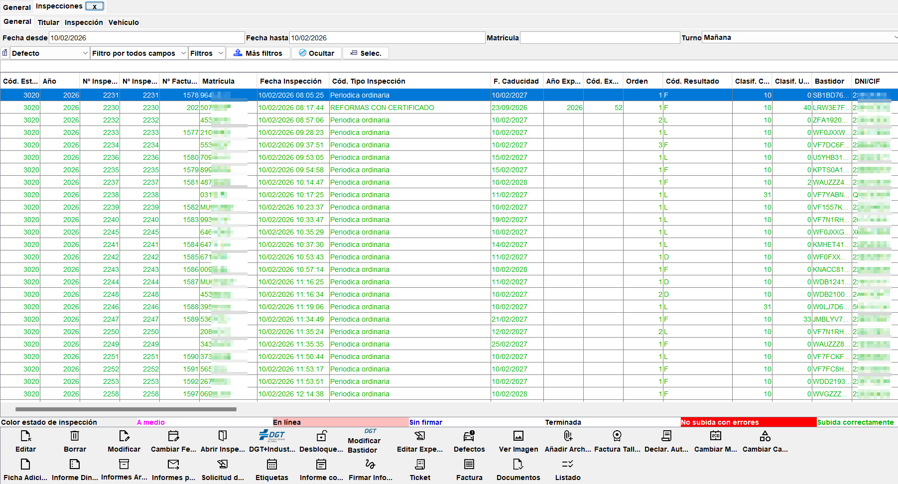

# Menú Gestión

En este menú se accede a las diferentes pantallas de gestión de la aplicación. El listado de opciones del menú es:

- Expedientes por fecha
- Inspecciones por matrícula y fecha
- Inspecciones pendientes de firmar
- Inspecciones sólo impresión
- Tareas
- Calendario de tareas
- Errores online
- Subir inspecciones online pendientes
- DGT
- Ficha Tarjeta
- Defectos Mecánico
- PDA Recibir
- PDA Enviar
- Lista de Vehículos a inspeccionar
- Altas Principal
- Altas de inspección
- Capturar Foto
- Capturar Foto m
- Cita Previa
- Manual de Calidad

## Expedientes por fecha

Opción de menú **Gestión > Expedientes por fecha**.

Muestra un listado de expedientes entre dos fechas (por defecto el día actual), con la posibilidad de buscar por año y código de expediente o matrícula.

Cada expediente se muestra con su año, código, matrícula, fecha de inspección, tipo de inspección, resultado y estado. Otros campos que se muestran son los hitos (fechas de cada fase del expediente) y las reformas.

Desde esta pantalla se pueden realizar las siguientes acciones repartidas en pestañas según su funcionalidad:

### Pestaña Principal

- **Crear expediente:** Crea un nuevo expediente que hay que rellenar de forma manual. Posteriormente se puede asociar a una inspección este expediente.
- **Editar expediente:** Modifica un expediente.
- **Borrar expediente:** Borra un expediente o un conjunto de expedientes.
- **Ver/crear Tarjeta ITV:** Muestra la tarjeta ITV del expediente seleccionado. Si no existe, se muestra un formulario en blanco para crearla.
- **Datos objetivos:** Muestra los datos de las pruebas y los defectos de la inspección asociada al expediente seleccionado.
- **Seleccionar ficha técnica:** Permite adjuntar la ficha técnica del vehículo involucrado en la inspección asociada al expediente seleccionado.
- **Añadir archivo:** Permite adjuntar uno o varios archivos al expediente seleccionado. Se pueden adjuntar archivos de cualquier tipo, como fotos, documentos, etc. Estos archivos son de tipo genérico, es decir, no se asocian a ningún tipo de documento concreto.
- **Ver imagen**:** Muestra las imágenes adjuntas al expediente seleccionado. Si no hay ninguna imagen, se muestra un mensaje indicando que no hay imágenes o un icono con la forma de una hoja rota.
- **Documentos asociados:** Muestra los documentos asociados al expediente seleccionado. Estos documentos tienen relación con las diferentes reformas y son específicos. Estos documentos serán usados una vez que se haya terminado el expediente para subirlos a Industria.

### Pestaña Fechas estado o hitos

En esta pestaña se pueden ver las fechas de los diferentes hitos o estados por los que ha pasado el expediente seleccionado. Estos hitos o estados son:

- **Resolución:** Fecha en la que se ha resuelto el expediente.
- **Validez:** Fecha hasta la que es válida la tarjeta asociada al expediente.
- **Impresión:** Fecha en la que se ha impreso la tarjeta asociada al expediente.
- **Revisión:** Fecha en la que se ha revisado el expediente. Esta fecha se actualiza cada vez que se modifica el expediente.
- **Rechazo:** Fecha en la que se ha rechazado el expediente.
- **Requerimiento:** Fecha en la que se ha requerido documentación al cliente para el expediente.
- **Archivado:** Fecha en la que se ha archivado o dado por finalizado el expediente, haya sido resuelto o no.

### Pestaña Informes

- **Imprimir solicitud:** Muestra por pantalla o imprime la solicitud del expediente de inspección no periódica del expediente seleccionado.
- **Informe dinámico:** Genera un informe de vista previa (no es válido oficialmente) con los datos de la inspección del expediente seleccionado. El informe se muestra por pantalla en formato PDF. Permite al ingeniero/a comprobar que los datos de la inspección son correctos.
- **Tarjeta Todo:** Imprime la tarjeta ITV del expediente seleccionado con toda la información de la inspección no periódica. Campos de la tarjeta, Observaciones, Reformas y Homologaciones.
- **Tarjeta Observaciones:** Imprime solamente el apartado de Observaciones de la tarjeta ITV del expediente seleccionado.
- **Tarjeta Reformas:** Imprime solamente el apartado de Reformas de la tarjeta ITV del expediente seleccionado.
- **Documentos:** Permite solicitar al cliente la firma de determinados documentos relacionados con el expediente seleccionado y las reformas que tenga. Estos documentos pueden usar opcionalmente la firma a traves de una tableta de firmas. Para configurar estos documento se puede acceder al menú **Archivo > Configuración > Documentos personalizados**.
- **Hoja de toma de datos:** Imprime la hoja de toma de datos del expediente seleccionado. Esta hoja se puede usar para tomar los datos de la inspección no periódica en papel y posteriormente introducirlos en el programa.
- **Listado:** Se imprime por pantalla en formato listado el contenido de la tabla mostrado en pantalla.

### Préstamos

Los préstamos de expedientes ya no son utilizados, ya que solamente eran válidos para la comunidad de Murcia, realizando el préstamo unicamente la ITV de Alcantarilla. Al haber dejado de estar operativa esta ITV, se ha dejado de usar esta funcionalidad.

## Inspecciones por matrícula y fecha
Opción de menú **Gestión > Inspecciones por matrícula y fecha**. También disponible en la barra de accesos directos como **Inspecciones por fecha**.

Muestra un listado de inspecciones entre dos fechas (por defecto el día actual), con la posibilidad de buscar por diferentes criterios relativos al titular, la inspección o el vehículo.

**Pestaña General**
- **Fecha desde y fecha hasta:** Permite filtrar las inspecciones por fecha de inspección entre dos fechas. Por defecto se muestran las inspecciones del día actual.
- **Matrícula:** Permite filtrar las inspecciones por matrícula. 

## Inspecciones pendientes de firmar
## Inspecciones sólo impresión
## Tareas
## Calendario de tareas
## Errores online
## Subir inspecciones online pendientes
## DGT
## Ficha Tarjeta
## Defectos Mecánico
## PDA Recibir
## PDA Enviar
## Lista de Vehículos a inspeccionar
## Altas Principal
## Altas de inspección
## Capturar Foto
## Capturar Foto m
## Cita Previa
## Manual de Calidad