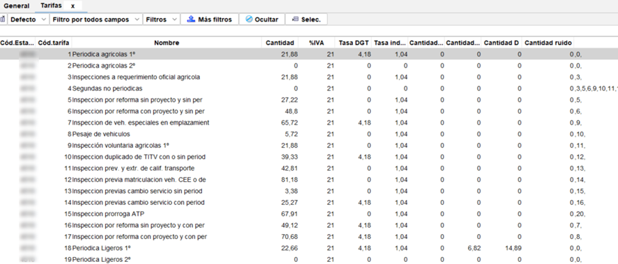
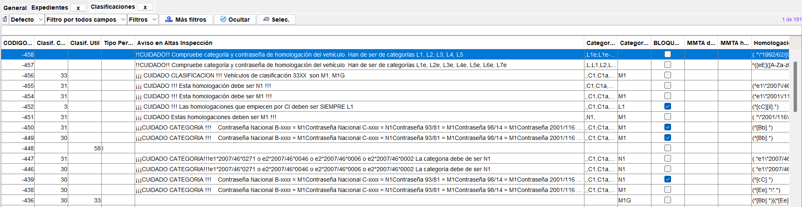
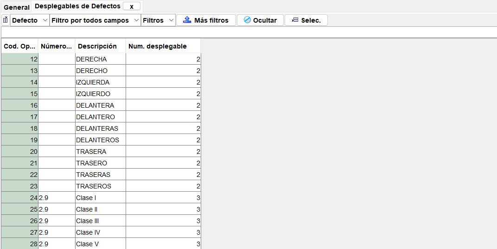
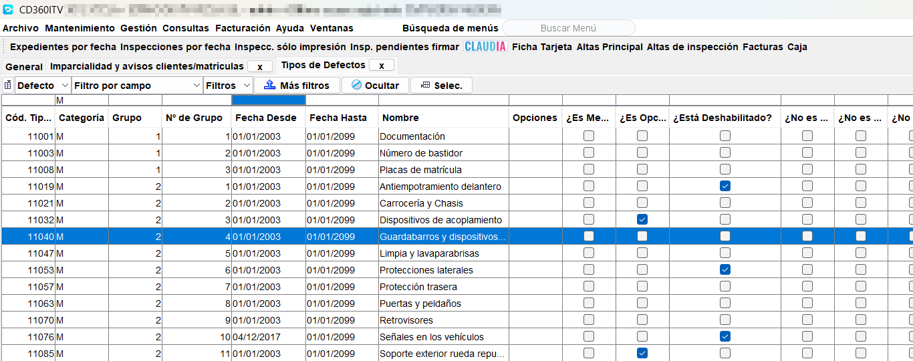
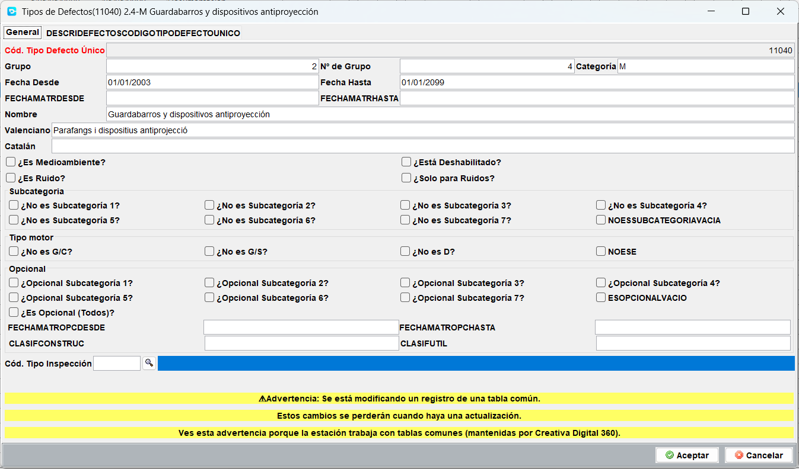
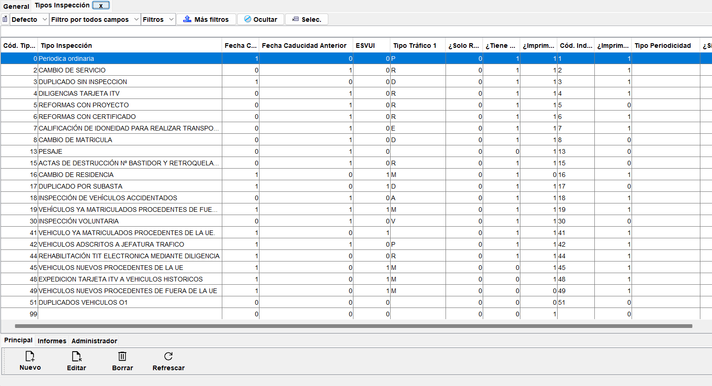
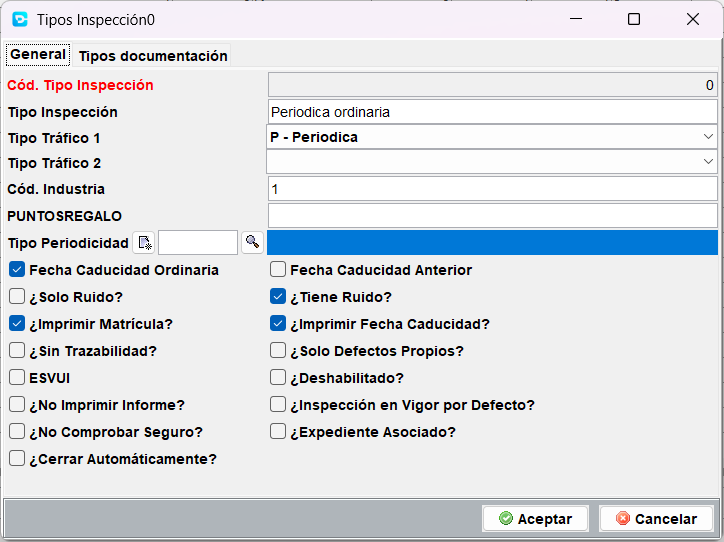

# Menú Mantenimiento

Desde este menú se accede a las tablas de datos principales del programa, ya sea para crear, mantener o eliminar los datos relacionados.

Las opciones de menú disponibles son:

- **Clientes**. Tabla con todos los clientes de la aplicación. Pueden ser del tipo titular, presencial o de facturación.
- **Matrículas**. Tabla con todos los registros de vehículos (matrículas) que han sido dados de alta en algún momento.
- **Tarifas**. Tabla de tarifas a aplicar durante un alta de una inspección.
- **Maestras**. Conjunto de tablas principales de la aplicación.
- **Auxiliares**. COnjunto de tablas auxilires con datos menos relevantes.
- **Gestión de usuarios**. Acceso a otros datos adicionales de usuario del programa que no están contemplados en el menú de seguridad. Gestión de firmas de usuarios entre otros.
- **Reconocer matrícula**. Opción no utilizada.
- **Equipos y líneas**. Tablas de configuración de la estación en cuanto a las Lineas, fases y equipos asociados a cada una de ellas.
- **Taxis**. Opciones relativas a la inspección de taxis. Operativa unicamente para Valencia. Resto de comunidades, solamente es administrativa.
- **Gestión regalos-puntos**. Opción obsoleta.
- Prestamos de expedientes. Relación de expedientes prestados a otras estaciones.
- **Expedientes solicitados**. Relación de expedientes solicitados a otras estaciones.
- **Maquinas**. Tabla de configuración de las maquinas (equipos de pruebas de línea) de cada línea la estación.

!!! Alert "Aviso"

    Según la configuración de perfil y permisos de cada usuario, pueden mostrarse todos los menús o ver un listado parcial solamente.

## Clientes

<!-- https://github.com/eduardo-cd360/cd360-itv-manual/tree/main/docs/guia-de-inicio/interfaz-de-usuario/images/menu-mantenimiento-clientes_tabla-de-clientes.png -->

Tabla de gestión de clientes.

Para mostrar los clientes disponibles, se debe establecer el filtrado previo por alguno de los campos disponibles.
Una vez obtenido el listado, se puede utilizar el filtro dinámico bien por todos los campos o por campo o bien el avanzado, para selecciones múltiples dentro de la misma columna.

Las operaciones que pueden realizarse son:

- **Nuevo**: Crear un nuevo cliente. Esta operación se realiza de forma automática du-rante el alta de una inspección.
- **Editar**: Carga la ficha del cliente para modificar la información existente.
- **Borrar**: Borra el registro o registros seleccionados. Solo será borrado si no tiene in-formación relacionada como matriculas o inspecciones.
- **Refrescar**: Actualiza la información de la tabla.
- **Cambio CP**: Modifica el Código postal del cliente en su ficha y en todos los registros relacionados.
- **Cambio DNI**: Modifica el DNI del cliente en su ficha y en todos los registros rela-cionados.
- **Cambiar ID**: Modifica el nº de cliente en su ficha y en todos los registros relaciona-dos.
- **Mover datos a otro cliente [administradores]**: Asigna todos los registros relacio-nados con su ficha a la ficha de otro cliente. Permite corregir situaciones con clien-tes duplicados.
- **Canjear Puntos**: Realiza la operación de canje usando la tarjeta de puntos asignada.
- **Documento RGPD**: Imprime el documento RGPD que firma el cliente la primera vez que es dado de alta.
- **Listado**: Genera una impresión por pantalla del contenido de la tabla. Está forma-teado en A4 para su impresión en papel.
- **Generador Consultas [administradores]**: Utilidad avanzada para mostrar informa-ción mediante consultas SQL.

## Matrículas

Tabla de gestión de matrículas, en donde se pueden realizar operaciones de mantenimiento relacionadas con estas.

Cada registro de matrícula contiene toda la información relativa a las características del vehículo.

Un cambio de estas características durante una inspección, altera la información que con-tiene su registro en esta tabla, para que en la siguiente inspección y sucesivas se utilicen los datos actualizados.

<!-- https://github.com/eduardo-cd360/cd360-itv-manual/tree/main/docs/guia-de-inicio/interfaz-de-usuario/images/menu-mantenimiento-matriculas_tabla%20de%20matriculas.png -->

Las operaciones permitidas en esta pantalla son:

- **Nuevo**: Crea un nuevo registro de matrícula. Este proceso se realiza de forma au-tomática desde el alta de una inspección
- **Editar**: Permite editar los datos relativos a la matrícula seleccionada.
- **Borrar**: Borra el registro o registros seleccionados, siempre y cuando no tengan in-formación asociada.
- **Refrescar**: Actualiza la información de la tabla.
- **Avisos**: Asocia un texto a la matrícula. Cuando se realiza un alta de inspección y se introduce una matrícula con avisos, una alerta es mostrada con este aviso.
- **Listado**: Vista por pantalla con formato A4 para impresión en papel.
- **Generador Consultas [administradores]**: Utilidad avanzada para mostrar informa-ción mediante consultas SQL.

## Tarifas

Listado de tarifas de aplicación en la ITV.

<!-- https://github.com/eduardo-cd360/cd360-itv-manual/tree/main/docs/guia-de-inicio/interfaz-de-usuario/images/menu-mantenimiento-tarifas_lista-de-tarifas.png -->

Listado de tarifas

Se pueden dar de alta nuevas tarifas, modificar las existentes o eliminarlas.

Las tarifas están compuestas por una parte relativa a los precios de cada uno de los con-ceptos de una inspección como prueba de seguridad, gases, ruidos, etc.. y los diferentes impuestos y tasas, y por otra parte una serie de reglas que permiten ajustar la tarifa a los tipos de inspección y características del vehículo.

<!-- https://github.com/eduardo-cd360/cd360-itv-manual/tree/main/docs/guia-de-inicio/interfaz-de-usuario/images/menu-mantenimiento-tarifas_formato-tarifas.png -->

Las tarifas pueden ser activadas o desactivadas, según la conveniencia de la estación o bien eliminadas si no son empleadas en ninguna inspección.

## Maestras
Conjunto de tablas principales de la aplicación.

### Clasificaciones
La pantalla de clasificaciones permite definir reglas de validación que se aplican durante el proceso de alta de una inspección.

La finalidad de estas reglas es mostrar un aviso al usuario o incluso bloquear el proceso de alta cuando se detecta una incongruencia en los datos introducidos.

Cada regla está compuesta por una serie de condiciones que deben cumplirse, relacionadas con los datos del vehículo o del cliente, y una acción a realizar cuando se cumplen dichas condiciones.

Como dar de alta una nueva regla:
1. Pulsar el botón Nuevo.
2. Usar uno o varios de los campos de la parte superior para definir las condiciones que deben cumplirse.
3. Seleccionar la acción a realizar cuando se cumplen las condiciones entre las siguientes:
   - **Tipo periodicidad**: Seleccionar una periodicidad que será usada cuando se cumplan las condiciones.
   - **Categoría texto**: Seleccionar una categoría de la lista desplegable. Será usada en sustitución de la que se introdujo/seleccionó durante el alta.
   - **Bloquear Alta**: Si se marca, se impedirá terminar el proceso de alta de la inspección.
   - **Aviso en altas de inspección**: Muestra un mensaje de aviso al usuario.
4. Guardar la regla.

<!--- Tarea mejora:
- Añadir un campo para dar nombre a la regla. Opcional dar nombre, pero puede ayudar a identificarla. Ejemplo: Detección vehículos contraseña de homologación inválida Fabricante X.
- Tipo periodicidad en vez de Tipo Periodicidad
- [ ] BLOQUEARALTASN por [ ] Bloquear alta y situarlo después del mensaje de aviso
- Añadir una chuleta sobre el uso de los patrones --->

### Clasificación por construcción
Pantalla de definición de clasificaciones por construcción en base al real Decreto 2822/1998 y sus posteriores modificaciones Reglamento General de Vehículos. Anexo II Apartado B.

!!! Nota

    Estas clasificaciones no deben ser modificadas salvo que se disponga de la información oficial actualizada.

### Clasificación por utilización
Pantalla de definición de clasificaciones por utilización en base al real Decreto 2822/1998 y sus posteriores modificaciones Reglamento General de Vehículos. Anexo II Apartado C.

!!! Nota

    Estas clasificaciones no deben ser modificadas salvo que se disponga de la información oficial actualizada.

### Documentación
Pantalla de definición de tipos de documentación que pueden ser solicitados durante el proceso de alta de una inspección no periódica.

Los tipos de documentación se asocian a los tipos de reforma que dispone el programa y que a su vez están relacionados con los tipos de inspección no periódica.

!!! Nota

    Accede a los tipos de reforma desde el menú `Mantenimiento > Maestras > Tipos de reforma` y asocia los tipos de documentación necesarios.

### Alcance segundas inspecciones
Pantalla de definición de los alcances que deben aplicarse en las segundas inspecciones por cada uno de los defectos detectados en la inspección inicial o anteriores.

Para cada defecto, se puede definir un alcance distinto, permitiendo así ajustar el proceso de alta de segundas inspecciones y la trazabilidad de la inspección que tiene que realizar el inspector.

Los defectos se deben especificar como "grupo.código-de-defecto" separados por comas, como se puede ver en el ejemplo de la imagen anterior.

### Desplegables de defectos

Pantalla de definición de los textos que se muestran en los desplegables que hay en la pantalla de defectos de la tablet del inspector (ITVAndroid)durante el proceso de inspección.

Cada registro deberá tener una descripción (se mostrará en el desplegable de la tablet del inspector) y asignarse a un nº de desplegable.

Existen 3 desplegables, siendo los dos primeros de uso general y el tercero específico para un defecto. Este solo aparece cuando coincide con el defecto especificado.

#### Como crear un nuevo elemento

1. Pulsar el botón Nuevo.
2. Introducir el nº de desplegable (1, 2 o 3).
3. Introducir la descripción del elemento.
4. Introducir el defecto asociado (solo para el desplegable 3).
5. Guardar el registro.

### Imparcialidad y avisos clientes/matrículas
En esta pantalla se definen los textos que se mostraran como avisos durante el proceso de alta de una inspección.

Estos avisos se muestran cuando se da de alta una inspección y el cliente, la matrícula o el bastidor tienen asociado un aviso.

El aviso puede ser de dos tipos:
- **Por Imparcialidad**: Aviso que indica que el cliente o vehículo no pueden ser inspeccionados en esta estación por motivos de imparcialidad. En este caso será bloqueada la posibilidad de continuar con el alta. Opción `[ ] BLOQUEARALTA` activada.
- **Aviso**: Aviso informativo que se muestra al usuario. No bloquea el proceso de alta. Opción `[ ] BLOQUEARALTA` desactivada.

[!Pantalla de imparcialidad y avisos](images/menu-mantenimiento-maestras_imparcialidad-y-avisos.png)

Esta pantalla por tanto permite gestionar los avisos asociados a clientes y matrículas. En caso de queramos impedir que un cliente o vehículo sea inspeccionado en nuestra estación, se debe crear un aviso de tipo "Por Imparcialidad" marcando la opción `[ ] BLOQUEARALTA`.

### Tipos de defectos
Pantalla de definición de los tipos de defectos que pueden ser asignados a la trazabilidad de una inspección en base a las diferentes categorías de vehículos.

Esta tabla está basada en el ultimo manual de ITV publicado por el Ministerio de Industria, Energía y Turismo. Contiene los grupos de defectos, códigos, descripciones y categorías a las que se aplican.

Cada defecto puede tener los siguientes estados:
- **Desactivado**: El defecto no estará disponible para ser asignado en la trazabilidad de una inspección.
- **Obligatorio**: El defecto estará disponible y se asignará de forma automática en la trazabilidad cuando se cumplan las condiciones definidas en sus atributos.
- **Opcional**: El defecto estará disponible para ser asignado de forma manual por el inspector durante la inspección.

### Tipos de inspección
Pantalla de definición de los tipos de inspección disponibles en la aplicación. Estos tipos de inspección son los que se pueden seleccionar durante el proceso de alta de una inspección y son específicos para cada comunidad autónoma.

Cada tipo de inspección tiene una serie de atributos o parámetros y una serie de documentación asignada que definen su comportamiento durante el proceso de alta y en la aplicación en general.

La creación de nuevos tipos de inspección debe realizarse siguiendo las directrices oficiales de cada comunidad autónoma, o bien por necesidades específicas de la estación. En este ultimo caso, el nuevo tipo de inspección debe estar basado en otro ya existente, para asegurar que todos los parámetros necesarios están correctamente definidos.

La pantalla que define un nuevo tipo de inspección es la siguiente:

En ella se pueden ver dos secciones principales:
- **Generales**: Serie de atributos que definen el comportamiento del tipo de inspección.
- **Documentación asociada**: Tipos de documentación que deben ser solicitados durante el proceso de alta de una inspección de este tipo.

General

- **Cód. tipo inspección**: Código identificativo del tipo de inspección. Es automático, pero puede modificarse si es necesario.
- **Tipo de inspección**: Descripción del tipo de inspección.
- **Tipo trafico 1**: Se especifica uno de los códigos de tráfico disponibles a elegir entre:
  - P: Periódica.
  - A: Inspección vehículos accidentados.
  - B: Rehabilitación.
  - R: Reformas.
  - C: Cambio de residencia o de servicio.
  - D: Duplicado.
  - E: Escolar.
  - V: Voluntaria.
  - G: Seguridad.
  - Z: Taxímetros.
  - M: Previas matriculaciones.
- **Tipo trafico 2**: Se especifica uno de los códigos de tráfico disponibles (ver lista anterior).
- **Cod. Industria**: Código asignado por la administración para este tipo de inspección. Debe coincidir con el código oficial.
- **PuntosRegalo**: Número de puntos de regalo asignados a este tipo de inspección. Estos puntos se acumulan en la tarjeta de puntos del cliente. Debe estar habilitada la opción de tarjeta de puntos en la configuración de la estación.
- **Tipo periodicidad**: Tipo de periodicidad asignada a este tipo de inspección. Esta periodicidad se usará para calcular la fecha de la siguiente inspección periódica. Si se especifica este valor, tendrá prioridad sobre la periodicidad que se calcule mediante las reglas de clasificación.
- **Fecha caducidad ordinaria**: Al dar el alta se rellena este campo con la fecha de caducidad ordinaria calculada en base a la periodicidad asignada.
- **Fecha de caducidad anterior**: Al dar el alta se rellena este campo con la fecha de caducidad anterior informada por la DGT o en su defecto con la fecha de la última inspección periódica realizada en la estación.
- **Solo ruidos**: Si se marca esta opción, la inspección será considerada como una inspección de ruidos, y por tanto solo se realizarán las pruebas de ruidos. La trazabilidad solo contendrá los defectos relacionados con ruidos. <u>Solo aplicable para la comunidad de Valencia</u>.
- **Tiene ruido**: Activa la tarifa de ruidos en la inspección. Si la tarifa (Mantenimiento > Tarifas) no tiene definido un importe para ruidos, no se aplicará.
- **Imprimir matrícula**: Si se marca esta opción, la matrícula del vehículo será impresa en el informe de inspección.
- **Imprimir fecha caducidad**: Si se marca esta opción, la fecha de caducidad de la inspección será impresa en el informe de inspección.
- **Sin trazabilidad**: Si se marca esta opción, la inspección no tendrá trazabilidad de defectos. Util para inspecciones no periódicas en las que no se requiera registrar defectos y no pasa el vehículo por la zona de inspección. Cuando se marca esta opción, el resultado de la inspección puede ser cambiado manualmente por el usuario, ya que no hay defectos que condicionen el resultado. Se puede editar el resultado desde Inspecciones por fecha > Editar inspección.
- **Solo defectos propios**: Usado para tipos de inspecciones que tienen marcado "Solo ruidos" y/o que tienen el "tipo trafico 1" o "tipo trafico 2" como "Z" Taximetro.
- **ESVUI**: Si se marca esta opción, la inspección será considerada como una inspección VUI (Vehículo Usado de Importación) a efectos de listados.
- **Deshabilitado**: Si se marca esta opción, el tipo de inspección no estará disponible para ser seleccionado durante el proceso de alta de una inspección.
-  **No imprimir informe**: Si se marca esta opción, no se generará informe.
-  **Inspección en vigor por defecto**: La inspección tendrá solamente la trazabilidad justa. Desmarcado, se considerará que la inspección periódica no está en vigor y se añadirán todos los defectos correspondientes.
-  **No comprobar seguro**: Si se marca esta opción, no se comprobará la vigencia del seguro del vehículo durante el proceso de alta de la inspección.
-  **Expediente asociado**: Al dar de alta una inspección de este tipo, se se iniciará automáticamente la creación de expediente y quedará vinculado a la inspección.
-  **Cerrar automáticamente**: Marcado cierra la inspección con resultado favorable nada más finalizar el proceso de alta. Se usa en tipos de inspección similares a las diligencias administrativas.

Tipos documentación

Si se desea, se puede agregar documentación que debe ser solicitada durante el proceso de alta de una inspección de este tipo. Generalmente se usa para inspecciones no periódicas.
Toda la documentación se encuentra definida en el menú `Mantenimiento > Maestras > Documentación` y se asocia aquí a los tipos de inspección.

Mas tarde, en el expediente de la inspección, se podrá marcar la documentación que ha sido entregada por el cliente, relativa tanto al tipo de inspección como a los tipos de reforma asociados.

## Auxiliares
Conjunto de tablas auxiliares con datos menos relevantes.
